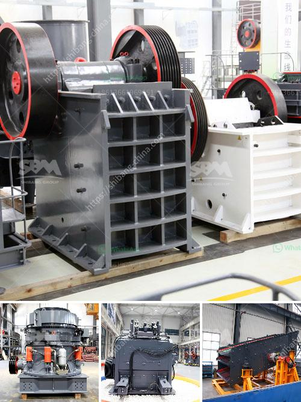

<h3>أسعار معدات التكسير والفحص جنوب أفريقيا</h3>
تعد معدات التكسير والفحص من أهم المعدات التي تستخدم في صناعة التعدين والبناء. تعتمد جودة هذه المعدات على تقنيات التصنيع والعلامة التجارية والأداء العام. تعد جنوب أفريقيا واحدة من أكبر الدول المنتجة للمعادن في العالم، مما جعلها واحدة من أهم أسواق المعدات في هذا القطاع.

تتوفر في جنوب أفريقيا مجموعة واسعة من معدات التكسير والفحص بأسعار مختلفة تتراوح بين 200-400 دولار. وفقًا للعلامة التجارية والجودة والمواصفات المطلوبة، ستكون الأسعار متفاوتة. يتوفر في السوق معدات مختلفة مثل الكسارات الفكية، وكسارات الصدم، والكسارات المخروطية، والشاشات الاهتزازية وما إلى ذلك.

تعد معدات التكسير والفحص سلعًا رأس مالية مهمة وتحتاج إلى استثمار كبير. عادة ما تكون الأسعار الأعلى للمعدات ذات الأداء العالي والجودة العالية، بينما الأسعار الأقل تكون للمعدات ذات الأداء المنخفض والجودة المنخفضة. يعتمد اختيار المعدات على حجم المشروع ومتطلبات الإنتاج.

يمكن العثور على مصنعين وموردين معدات التكسير والفحص في جنوب أفريقيا من خلال مواقع الإنترنت أو من خلال البحث عن المعارض والمؤتمرات المتخصصة في هذا القطاع. يوفر الاستفسار المسبق عن الأسعار والمواصفات وخدمة العملاء فرصًا جيدة للتفاوض والحصول على صفقات جيدة.

يعتبر قطاع التعدين والبناء في جنوب أفريقيا تحديدًا من القطاعات المزدهرة والناجحة، مما يجعل الطلب على معدات التكسير والفحص مستدامًا. يلعب قطاع التعدين دورًا حيويًا في اقتصاد البلاد ويسهم في توفير فرص العمل وتنمية البنية التحتية.

باختصار، توجد مجموعة واسعة من معدات التكسير والفحص في جنوب أفريقيا بأسعار تتراوح بين 200-400 دولار. تتوفر هذه المعدات بأحجام وأوزان مختلفة وتعتمد الأسعار على الجودة والأداء. قطاع التعدين والبناء في جنوب أفريقيا يعتبر من أهم القطاعات الاقتصادية، مما يجعل الطلب على معدات التكسير والفحص مستدامًا ومتزايدًا.
<h3>Contact us</h3><ul><li><strong>Whatsapp:&nbsp;<a href="https://wa.me/8613661969651">+8613661969651</a></strong></li><li><a href="https://swt.shibang-china.com/?git&amp;zhl&amp;أسعار معدات التكسير والفحص جنوب أفريقيا"><strong>Online Service(chat now)</strong></a></li></ul><h3>Related</h3><ul><li><a href='مطحنة الكرة مع محول mercadolibre.md'>مطحنة الكرة مع محول mercadolibre</a></li><li><a href='كسارة الحجر Kyc.md'>كسارة الحجر Kyc</a></li><li><a href='سعر كسارة الفك.md'>سعر كسارة الفك</a></li><li><a href='آلة تكسير الفحم.md'>آلة تكسير الفحم</a></li><li><a href='نوع من مطحنة الكرة.md'>نوع من مطحنة الكرة</a></li></ul>