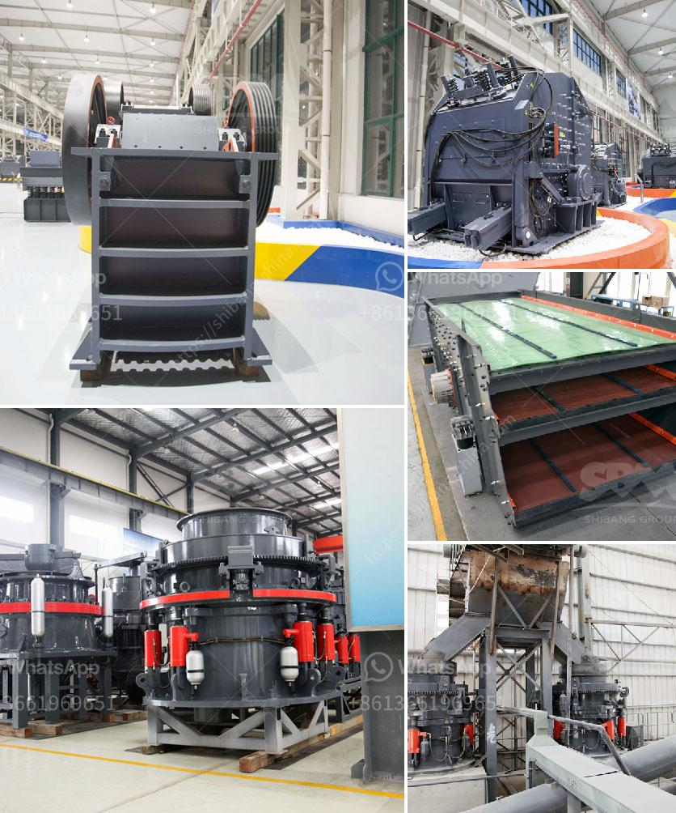

<h3>أسعار معدات المحجر</h3>
تعتبر معدات المحجر من أهم الأدوات اللازمة لعملية استخراج الصخور والمواد الخام من المحاجر وتكسيرها وفحصها. تتفاوت أسعار هذه المعدات بناءً على الحجم والتكنولوجيا المستخدمة والقدرة الإنتاجية والمواصفات الفنية.

تشمل معدات المحاجر والكسارات عادة الكسارات الفكية، والكسارات الصدمية، والكسارات المخروطية، والغرابيل، ووحدات التغذية والنقالات. يتم استخدام هذه المعدات لكسر وفحص الصخور الكبيرة قبل نقلها إلى مكان المعالجة النهائية.

تبدأ أسعار معدات المحجر من عدة آلاف من الدولارات وتتجاوز الملايين للمعدات الكبيرة والأكثر تطورًا. على سبيل المثال، يمكن أن تتراوح أسعار الكسارات الفكية البسيطة بين 20000 دولار و 50000 دولار، بينما تصل أسعار الكسارات الصدمية الكبيرة التي تستخدم في تكسير الصخور الصلبة إلى أكثر من مليون دولار.

بالنسبة للغرابيل ووحدات التغذية، فإن أسعارها تختلف أيضًا وتعتمد على السعة الإنتاجية المطلوبة والمواصفات الفنية المراد تلبيتها. قد تتراوح أسعار الغرابيل الأساسية بين 5000 دولار إلى 30000 دولار. أما وحدات التغذية فيمكن أن تتراوح أسعارها بين 10000 دولار إلى 60000 دولار، اعتمادًا على قدرتها وتقنيتها.

النقالات تعتبر معدات أساسية في المحاجر، حيث تساعد على نقل المواد الخام من مكان الاستخراج إلى محطة المعالجة النهائية. تختلف أسعار النقالات بناءً على القدرة الإنتاجية والتصميم والوظائف الإضافية التي توفرها. على سبيل المثال، قد يتراوح سعر الناقلة النقالة من 20000 دولار إلى 100000 دولار.

في النهاية، يجب أن نلاحظ أن هذه الأسعار هي مجرد تقديرات تقريبية ويمكن أن تتغير بناءً على العلامة التجارية والبائع والمواصفات المحددة. من الأفضل أن يطلب المهتمون بشراء معدات المحجر عروضًا من الشركات المصنعة المختلفة ويقارنوها بعناية قبل اتخاذ القرار النهائي.
<h3>Contact us</h3><ul><li><strong>Whatsapp:&nbsp;<a href="https://wa.me/8613661969651">+8613661969651</a></strong></li><li><a href="https://swt.shibang-china.com/?git&amp;zhl&amp;أسعار معدات المحجر"><strong>Online Service(chat now)</strong></a></li></ul><h3>Related</h3><ul><li><a href='سحق وفحص خام المنجنيز.md'>سحق وفحص خام المنجنيز</a></li><li><a href='آلة طحن الجير.md'>آلة طحن الجير</a></li><li><a href='تكلفة بناء مصنع كربونات الكالسيوم.md'>تكلفة بناء مصنع كربونات الكالسيوم</a></li><li><a href='مطحنة رايموند مستخدمة في إندونيسيا.md'>مطحنة رايموند مستخدمة في إندونيسيا</a></li><li><a href='مطحنة طحن دقيقة للبيع.md'>مطحنة طحن دقيقة للبيع</a></li></ul>