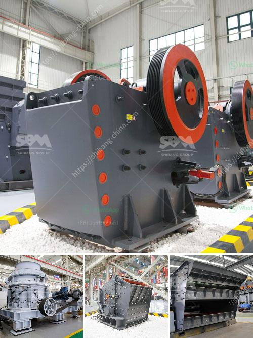

<h3>أسعار وحدات طحن الكلنكر</h3>
تُعتبر وحدات طحن الكلنكر من الأجزاء الرئيسية في صناعة الأسمنت. وحدة طحن الكلنكر تُستخدم لطحن الكلنكر الصلب إلى مسحوق ناعم يُعرف بالإسمنت النهائي. تتوفر هذه الوحدات في العديد من الأحجام والطاقات الإنتاجية المختلفة، وتتفاوت أسعارها بناءً على هذه العوامل وعلى معايير أخرى.

1. القدرة الإنتاجية: تختلف أسعار الوحدات الصغيرة التي تنتج أقل قدرة بين 200-500 طن يوميًا في العادة عن أسعار الوحدات الأكبر التي تنتج بين 1000-5000 طن يوميًا. قد تكون تكلفة وحدة طحن الكلنكر ذات القدرة الإنتاجية الأعلى أعلى نظرًا للمزايا الإضافية التي توفرها.

2. التكنولوجيا المستخدمة: تستخدم الوحدات الحديثة تكنولوجيا أكثر تطورًا وكفاءة، مما يؤدي إلى تكلفة أعلى. وفي المقابل، الوحدات التي تستخدم تكنولوجيا أقدم عادةً ما تكون أرخص في السعر.

3. تكاليف الصيانة والتشغيل: يُعتبر تكلفة صيانة واستبدال الأجزاء البالية في وحدة طحن الكلنكر عاملاً مهماً في تحديد السعر. تتطلب الوحدات ذات التكنولوجيا الحديثة صيانة أقل، التي يمكن أن تنخفض مع مرور الوقت.

4. تكلفة المواد الأولية: تكون تكلفة المواد الأولية التي تستخدم في وحدة طحن الكلنكر أحد العوامل المؤثرة في تحديد سعر الوحدة. تعتبر التقلبات في أسعار الكلنكر أحد العوامل التي تؤثر بشكل كبير على تكلفة الإنتاج وبالتالي على أسعار الوحدات.

استخدام وحدات طحن الكلنكر في صناعة الأسمنت يعتبر جزءًا أساسيًا في عملية الإنتاج. يطلب من المستثمرين والشركات النظر في العوامل المذكورة أعلاه عند اتخاذ قرار بشأن التكنولوجيا والسعة وتكلفة وحدة الطحن. يُنصح بالعمل على دراسة صارمة وتقييم العوامل المختلفة قبل اتخاذ القرار النهائي.

في النهاية، يجب أن يتم اختيار وحدة طحن الكلنكر التي تتناسب مع احتياجات الإنتاج والمتطلبات المالية للشركة المعنية. إذا تم تحديد هذه النقاط بشكل جيد، يمكن أن تكون وحدة طحن الكلنكر استثمارًا ناجحًا وفعالًا للشركة الصناعية في طويل الأجل.
<h3>Contact us</h3><ul><li><strong>Whatsapp:&nbsp;<a href="https://wa.me/8613661969651">+8613661969651</a></strong></li><li><a href="https://swt.shibang-china.com/?git&amp;zhl&amp;أسعار وحدات طحن الكلنكر"><strong>Online Service(chat now)</strong></a></li></ul><h3>Related</h3><ul><li><a href='سيور ناقلة معدنية في الألواح.md'>سيور ناقلة معدنية في الألواح</a></li><li><a href='قائمة أسعار معدات كسارة الحجر الثقيلة.md'>قائمة أسعار معدات كسارة الحجر الثقيلة</a></li><li><a href='مطحنة تشانغفا للطحن.md'>مطحنة تشانغفا للطحن</a></li><li><a href='سعر مطحنة الكرة في باكستان.md'>سعر مطحنة الكرة في باكستان</a></li><li><a href='أكبر كسارة صخور.md'>أكبر كسارة صخور</a></li></ul>