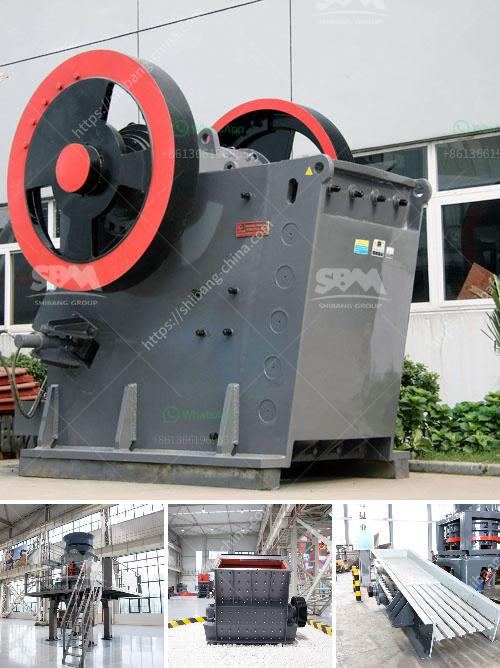

<h3>أصغر كسارة فك محمولة للبيع في جنوب أفريقيا</h3>
تنشأ الحاجة اليومية لكسارات الفك المحمولة في مختلف الصناعات والتطبيقات في جميع أنحاء العالم، ولا يختلف الأمر في جنوب أفريقيا. تعد الكسارات الفك المحمولة حلاً مثاليًا للمشاريع التي تتطلب تكسير المواد في مواقع متنقلة أو غير متوفرة بسهولة.

واحدة من أصغر الكسارات الفك المحمولة المتاحة في جنوب أفريقيا هي نموذج XYZ. يتميز هذا الطراز بتصميمه الصغير الحجم والخفيف الوزن، مما يجعله سهل التركيب والتشغيل. تتراوح قوته من 200 إلى 400 طن في الساعة، مما يجعله مناسبًا للمشاريع ذات الحجم المتوسط والصغير.

بفضل حجمه الصغير، يتميز هذا النموذج بسهولة النقل والتنقل. يمكنه التحرك بسهولة بين المواقع دون الحاجة إلى تفكيكها أو نقلها بواسطة معدات ثقيلة. هذه الميزة تساعد على توفير الوقت والمال، وتقليل التكاليف اللازمة لنقل الكسارة وإعادة تركيبها في كل مرة.

تم تجهيز هذا الطراز بمحرك قوي يعمل بالديزل، مما يضمن أداءً فعالًا وموثوقًا على الصعيدين القوة والاقتصاد. تعمل الكسارة بواسطة نظام هيدروليكي ذكي يتيح التحكم الدقيق في عملية التكسير وضبط حجم الخرج. تتميز الكسارة أيضًا بمجموعة متنوعة من الميزات الأمانية، مثل نظام مانع للتجميد والتحرك العشوائي لحماية المشغلين من الإصابة.

بالإضافة إلى ميزاتها الاقتصادية والعملية، فإن هذا الطراز الصغير الحجم يتطابق مع المعايير البيئية العالمية. يتم تجهيز الكسارة بنظام لتصفية وتنقية الغبار، مما يضمن إزالة الجسيمات الصغيرة والملوثات من الهواء، وبالتالي تحسين جودة الهواء والحفاظ على البيئة المحيطة.

بسبب مزاياها ومرونتها، يثق المشترون في هذا النموذج من الكسارات الفك المحمولة لتلبية احتياجاتهم المتنوعة في مشاريع البناء والتشييد والتعدين والصناعات الأخرى. كما يوفر هذا النموذج أداءً فعالًا وثابتًا بتكلفة معقولة، مما يجعله خيارًا مثاليًا للمشترون في جنوب أفريقيا الذين يبحثون عن الكسارات ذات الحجم الصغير المحمولة لتلبية احتياجاتهم.
<h3>Contact us</h3><ul><li><strong>Whatsapp:&nbsp;<a href="https://wa.me/8613661969651">+8613661969651</a></strong></li><li><a href="https://swt.shibang-china.com/?git&amp;zhl&amp;أصغر كسارة فك محمولة للبيع في جنوب أفريقيا"><strong>Online Service(chat now)</strong></a></li></ul><h3>Related</h3><ul><li><a href='رمل صناعي للبناء.md'>رمل صناعي للبناء</a></li><li><a href='آلات إنتاج مسحوق كربونات الكالسيوم.md'>آلات إنتاج مسحوق كربونات الكالسيوم</a></li><li><a href='كسارة سريلانكا.md'>كسارة سريلانكا</a></li><li><a href='مطحنة الهامر 20 طن شبكة الشاشة.md'>مطحنة الهامر 20 طن شبكة الشاشة</a></li><li><a href='كاولين مورد كسارة محمولة في أنغولا.md'>كاولين مورد كسارة محمولة في أنغولا</a></li></ul>