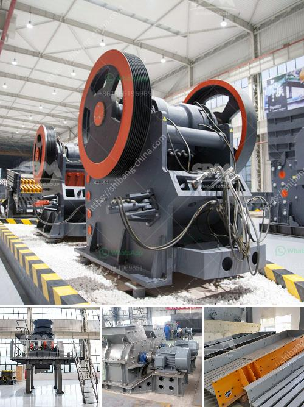

<h3>أعمال التعدين والاستغلال في جنوب أفريقيا</h3>
تعتبر جنوب أفريقيا واحدة من الدول الرئيسية في أعمال التعدين والاستغلال في العالم. فهي تحتوي على موارد طبيعية غنية ومتنوعة تتضمن الذهب والماس والفحم والثروة الحجرية والألمنيوم والنيكل والفوسفات واليورانيوم.

تاريخ التعدين في جنوب أفريقيا يعود إلى العصور القديمة، حيث استخدم السكان الأصليين الموارد المعدنية لصنع الأدوات والأسلحة. ومع وصول المستعمرين الأوروبيين في القرن السابع عشر، تزايد الاستغلال التجاري للموارد المعدنية في البلاد.

على مر العقود، نما قطاع التعدين في جنوب أفريقيا وأصبح محركًا اقتصاديًا هامًا. حتى اليوم، تساهم أعمال التعدين في توفير فرص عمل للآلاف من العاملين وتسهم في نمو الاقتصاد الوطني وزيادة الناتج المحلي الإجمالي.

تعتبر صناعة التعدين في جنوب أفريقيا من التحديات الكبيرة التي تواجهها الدولة. فهناك عدة عوامل تؤثر على هذا القطاع بما في ذلك التنافس العالمي، القوانين والتشريعات، والتغيرات في أسعار المواد الخام. على الرغم من ذلك، لا زالت جنوب أفريقيا تواجه التحديات وتستفيد من فوائد القطاع على نحو جيد.

تعتبر صناعة الذهب أكبر قطاع في مجال التعدين في جنوب أفريقيا. حيث تحتل البلاد المرتبة الثانية في إنتاج الذهب في العالم بعد الصين. كما تنتج أيضًا كميات كبيرة من الألمنيوم والفحم، مما يجعلها من اللاعبين الرئيسيين في صناعة الألمنيوم والفحم العالمية.

علاوة على ذلك، تستغل جنوب أفريقيا كميات كبيرة من المواد الخام الأخرى مثل النحاس والنيكل واليورانيوم. وبالإضافة إلى ذلك، تحتل البلاد مرتبة مهمة في صناعة الألماس حيث تعد أحد أكبر منتجي الألماس في العالم.

على الرغم من الاعتماد الكبير على صناعة التعدين في جنوب أفريقيا، إلا أن هناك قضايا بيئية تشكل تحديًا لاستدامة القطاع. فمعالجة النفايات وإدارة استهلاك المياه والحفاظ على توازن النظام البيئي هي جميعها أمور تتطلب اهتمامًا كبيرًا.

باختصار، يعتبر قطاع التعدين والاستغلال في جنوب أفريقيا أحد القوى الاقتصادية الرئيسية في البلاد. بوجود موارد طبيعية غنية ومتنوعة وعلى الرغم من التحديات المختلفة، فإن هذا القطاع لا يزال يعمل على تحقيق النمو الاقتصادي وتوفير فرص العمل للمجالس المحلية.
<h3>Contact us</h3><ul><li><strong>Whatsapp:&nbsp;<a href="https://wa.me/8613661969651">+8613661969651</a></strong></li><li><a href="https://swt.shibang-china.com/?git&amp;zhl&amp;أعمال التعدين والاستغلال في جنوب أفريقيا"><strong>Online Service(chat now)</strong></a></li></ul><h3>Related</h3><ul><li><a href='مطحنة ريموند ميكرو بلفرايزر.md'>مطحنة ريموند ميكرو بلفرايزر</a></li><li><a href='تكلفة تركيب السيور الناقلة.md'>تكلفة تركيب السيور الناقلة</a></li><li><a href='كسارة الفك في نيبال للبيع.md'>كسارة الفك في نيبال للبيع</a></li><li><a href='تعدين الجبس والكروم والحجر الجيري.md'>تعدين الجبس والكروم والحجر الجيري</a></li><li><a href='كسارة الصخور.md'>كسارة الصخور</a></li></ul>