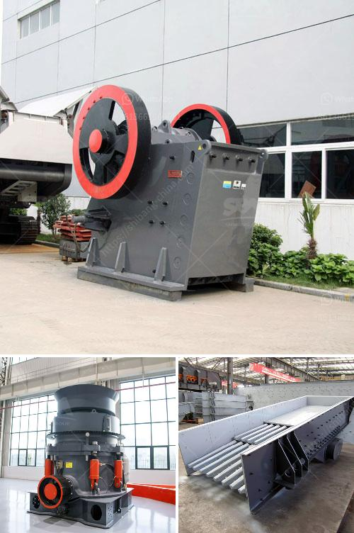

<h3>أعمال المحاجر في جنوب أفريقيا</h3>
تعد المحاجر من الأماكن التي تتم فيها استخراج الصخور والمواد الخام الأخرى التي تستخدم في العديد من الصناعات. تعتبر جنوب أفريقيا واحدة من أكبر دول المحاجر في العالم، حيث توفر مجموعة متنوعة من الموارد الطبيعية والصخور النادرة. وفي هذه المقالة، سنستكشف أعمال المحاجر في جنوب أفريقيا، والتحديات التي تواجهها والفرص المتاحة في هذا القطاع الحيوي.

تضم جنوب أفريقيا العديد من المحاجر المنتشرة في أنحاء البلاد، مثل محاجر الذهب والألماس والفوسفات واليورانيوم والكروم والمنجنيز والفحم والحجر الجيري والجرانيت والرخام وغيرها. تساهم هذه الموارد الطبيعية في تعزيز النمو الاقتصادي وتوفير فرص العمل للسكان المحليين.

ومع ذلك، تواجه أعمال المحاجر في جنوب أفريقيا تحديات عديدة. أحد التحديات الرئيسية هي الصعوبات البيئية والبيئية التي يجب التعامل معها أثناء استخراج المواد الخام. قد يتسبب استخراج ومعالجة المحاجر في تلوث الهواء والمياه، وتخريب المناظر الطبيعية، وتهديد التنوع البيولوجي. لذا، يجب على الشركات المعنية اتباع ممارسات استدامة بيئية للحد من التأثيرات السلبية على البيئة والمجتمع المحلي.

بالإضافة إلى ذلك، تواجه أعمال المحاجر تحديات اقتصادية واجتماعية. نتيجة للتقلبات في أسعار المعادن الثمينة والمواد الخام الأخرى، قد تعاني الشركات المحلية من صعوبات مالية. بالإضافة إلى ذلك، يعاني العديد من العمال في المحاجر من ظروف عمل غير آمنة ورواتب منخفضة، وهذا يعود إلى تشريعات العمل الضعيفة وعدم تحقيق تنظيم العمل الجيد. لذا، يجب على الحكومة والشركات العمل على تحسين ظروف العمل وضمان العدالة والأمان للعمال.

على الرغم من التحديات، توفر أعمال المحاجر في جنوب أفريقيا فرصًا كبيرة للنمو والتنمية. يجب تعزيز الشراكات بين القطاع الخاص والحكومة والمجتمع المحلي لتعظيم الفوائد الاقتصادية والاجتماعية لهذا القطاع. يمكن تحقيق ذلك من خلال توفير التدريب المهني وتقديم الدعم المالي وتشجيع الاستثمارات في تحسين البنية التحتية وتعزيز الابتكار والتكنولوجيا في مجال استخراج المحاجر.

باختصار، تواجه أعمال المحاجر في جنوب أفريقيا تحديات بيئية واقتصادية واجتماعية، ولكنها توفر أيضًا فرصًا كبيرة للنمو والتنمية. من خلال اتباع ممارسات استدامة بيئية، وتحسين ظروف العمل، وتعزيز الشراكات بين القطاع الخاص والحكومة والمجتمع المحلي، يمكن تحويل هذا القطاع إلى محرك للتنمية الاقتصادية المستدامة في جنوب أفريقيا.
<h3>Contact us</h3><ul><li><strong>Whatsapp:&nbsp;<a href="https://wa.me/8613661969651">+8613661969651</a></strong></li><li><a href="https://swt.shibang-china.com/?git&amp;zhl&amp;أعمال المحاجر في جنوب أفريقيا"><strong>Online Service(chat now)</strong></a></li></ul><h3>Related</h3><ul><li><a href='سعر حزام النقل.md'>سعر حزام النقل</a></li><li><a href='كسارة الفحم 10 مم.md'>كسارة الفحم 10 مم</a></li><li><a href='كسارات الحجر المستعملة في كوريا الجنوبية.md'>كسارات الحجر المستعملة في كوريا الجنوبية</a></li><li><a href='تصميم كسارة الحجر في الفلبين.md'>تصميم كسارة الحجر في الفلبين</a></li><li><a href='كم تكلف مصنع التكسير.md'>كم تكلف مصنع التكسير</a></li></ul>