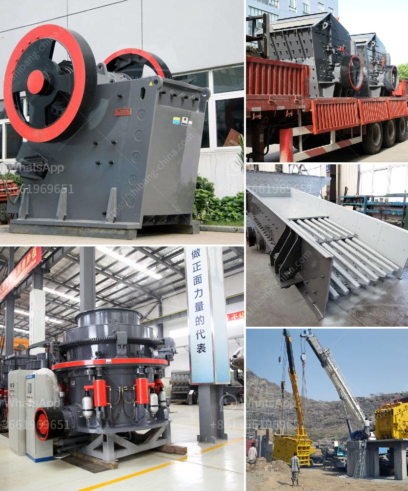

<h3>أعمال تكسير الصخور في باكستان</h3>
تعتبر أعمال تكسير الصخور من العمليات الحديثة التي تستخدم في صناعة البناء والتشييد والهندسة المدنية. وتهدف هذه العمليات إلى تحويل الصخور الصلبة إلى قطع صغيرة تسهل عملية صناعة المواد الإنشائية مثل الحصى والرمل والأسمنت.

تعتبر باكستان واحدة من الدول التي تعتمد بشكل كبير على أعمال تكسير الصخور في صناعتها. تتمتع البلاد بموارد طبيعية غنية من الصخور مثل الجرانيت والرخام والحجر الجيري، مما يجعلها محطة وجهة مثالية لهذه الأعمال.

تستخدم عمليات تكسير الصخور في العديد من القطاعات في باكستان، بما في ذلك البناء العام والمشاريع الكبيرة مثل الطرق والجسور. تعتبر هذه العمليات حلاً فعالاً لتحقيق المشاريع بأسرع وقت وبتكاليف أقل.

أحد الاستخدامات الشائعة لأعمال تكسير الصخور في باكستان هو في إنتاج الحصى والرمل، حيث يتم تكسير الصخور إلى جزيئات صغيرة لتكون المواد الإنشائية الأساسية في العديد من المشاريع. يعد الحصى والرمل أساسيات في بناء الطرق والأبنية والمنشآت الصناعية.

بالإضافة إلى ذلك، تستخدم عمليات تكسير الصخور في تصنيع الحجارة الزخرفية مثل الجرانيت والرخام. فإن تحويل الصخور الصلبة إلى قطع صغيرة يتيح إمكانية تشكيلها وتصميمها بسهولة واستخدامها في العديد من التطبيقات العمارية.

تعتبر عمليات تكسير الصخور أيضاً ضرورية في العديد من المشاريع الكبيرة مثل إنشاء السدود والمياه الجوفية. فتحويل الصخور الكبيرة إلى قطع صغيرة يسهل عملية الحفر والنقل ويجعلها أكثر فعالية.

يجب أن نؤكد على أن أعمال تكسير الصخور يجب أن تتم بكفاءة وفقًا للمعايير البيئية والصحية. يتطلب الأمر تحليل مستمر لتأثيراتها على البيئة والسكان المحليين، وضمان تطبيق الإجراءات اللازمة للحفاظ على البيئة والصحة العامة.

في الختام، تُعَد أعمال تكسير الصخور أحد العمليات الحديثة والمهمة في صناعة البناء والتشييد في باكستان. وبفضل الاعتماد على هذه العمليات، تتمكن البلاد من استخدام مواردها الطبيعية بكفاءة وتحقيق التنمية الشاملة. ومع الالتزام الدائم بالمعايير البيئية والصحية، يمكننا الاستفادة من فوائد تكسير الصخور دون التأثير السلبي على البيئة والمجتمع.
<h3>Contact us</h3><ul><li><strong>Whatsapp:&nbsp;<a href="https://wa.me/8613661969651">+8613661969651</a></strong></li><li><a href="https://swt.shibang-china.com/?git&amp;zhl&amp;أعمال تكسير الصخور في باكستان"><strong>Online Service(chat now)</strong></a></li></ul><h3>Related</h3><ul><li><a href='خط تكسير الحجر.md'>خط تكسير الحجر</a></li><li><a href='آلة كسارة الرمل.md'>آلة كسارة الرمل</a></li><li><a href='مطحنة رايموند في بورور.md'>مطحنة رايموند في بورور</a></li><li><a href='تصميم محطة كسارة الحجر.md'>تصميم محطة كسارة الحجر</a></li><li><a href='كسارة متنقلة لخام الحديد.md'>كسارة متنقلة لخام الحديد</a></li></ul>