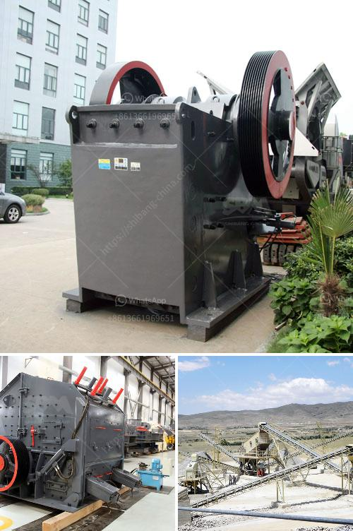

<h3>أفضل آلات الكسارة</h3>
في السنوات الأخيرة، شهدت صناعة الكسارات تطورًا كبيرًا بسبب التقدم التكنولوجي والحاجة المتزايدة إلى تكسير وسحق المواد الصلبة وتقليل حجمها. توفر آلة الكسارة حلاً فعالًا وميسور التكلفة لصناعة التعدين والبناء والهدم. في هذه المقالة ، سنناقش أفضل آلات الكسارة التي تتوفر بين 200 و 400 طن في الساعة.

واحدة من أفضل آلات الكسارة في هذه الفئة هي كسارة الفك. تعتبر كسارة الفك القياسية من بين أكثر الآلات استخدامًا في صناعة التكسير. تتميز ببناء متين وقوة كسر عالية، مما يجعلها مناسبة للعديد من المواد الصلبة مثل الحجر والخرسانة والطوب. بفضل حجم الفك الكبير والقوة التي تعمل بها، يمكنها كسر المواد الكبيرة بكفاءة عالية. تتوفر كسارات الفك بمختلف الأحجام والقدرات حسب متطلبات المشروع.

علاوة على ذلك، تعتبر كسارات المخروط أيضًا مثالية للتطبيقات التي تتطلب تكسيرًا دقيقًا ومنتجًا عالي الجودة. توفر آلات الكسارة هذه مزايا عديدة بفضل تصميمها الفريد، حيث توفر تدفقًا سلسًا للمواد، وتحقق انخفاضًا في الاهتزاز، وتوفر توزيعًا متساويًا للمواد المكسورة. من خلال تعديل حجم فتحة المخرج، يمكن لكسارات المخروط التكيف مع متطلبات التكسير المحددة.

بالإضافة إلى كسارة الفك وكسارة المخروط، هناك أقراص الصدم الأفقية وكسارات الأسطوانة التي تستخدم على نطاق واسع أيضًا في صناعة التكسير. تعمل أقراص الصدم الأفقية بواسطة ضرب المواد بقوة عالية ، مما يسبب تكسيرها وسحقها. من جانبها، تستخدم كسارات الأسطوانة أسطوانتين تدوران في الاتجاهين المعاكسين لتكسير المواد بفعالية عالية.

باختصار، هذه الآلات الكسارة بسعة تتراوح بين 200 و 400 طن في الساعة تعتبر الاختيار الأفضل للشركات التي تعمل في صناعة التعدين والبناء. تمتاز هذه الآلات بالكفاءة العالية، والأداء الموثوق، والتشغيل السهل والصيانة المنخفضة، وتوفر حلولًا فعالة لتحطيم وسحق المواد الصلبة بكفاءة. ولكن يجب أن يتم اختيار آلة الكسارة المناسبة وفقًا لمتطلبات وظروف المشروع بشكل فردي.
<h3>Contact us</h3><ul><li><strong>Whatsapp:&nbsp;<a href="https://wa.me/8613661969651">+8613661969651</a></strong></li><li><a href="https://swt.shibang-china.com/?git&amp;zhl&amp;أفضل آلات الكسارة"><strong>Online Service(chat now)</strong></a></li></ul><h3>Related</h3><ul><li><a href='مطاحن الكرة للأسمنت.md'>مطاحن الكرة للأسمنت</a></li><li><a href='شركات آلات مصانع الحجر في سالم تاميل نادو.md'>شركات آلات مصانع الحجر في سالم تاميل نادو</a></li><li><a href='آلة كسارة صخور صغيرة.md'>آلة كسارة صخور صغيرة</a></li><li><a href='كيف يعمل مطحنة الطحن.md'>كيف يعمل مطحنة الطحن</a></li><li><a href='عملية تصنيع هيدروتون الحصى الطيني.md'>عملية تصنيع هيدروتون الحصى الطيني</a></li></ul>