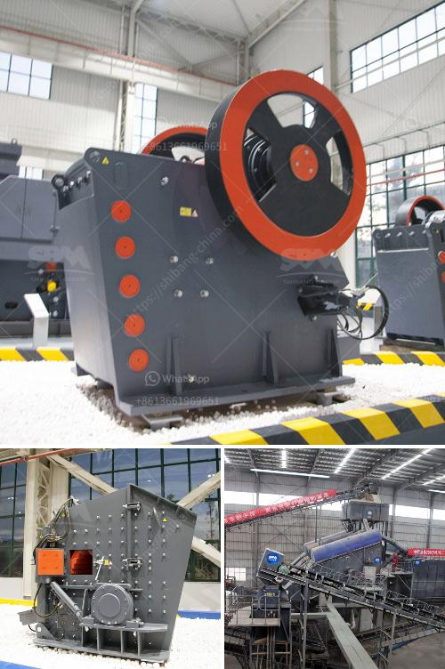

<h3>أفضل آلة سحق الكوارتز في الهند</h3>
تعتبر الهند واحدة من أكبر الدول المنتجة للكوارتز في العالم، حيث تتميز بامتلاكها موارد ضخمة من هذه المادة الصخرية. ومن المعروف أن الكوارتز يستخدم في العديد من الصناعات مثل صناعة الزجاج، وصناعة السيراميك، وصناعة الإلكترونيات، وغيرها الكثير.

توجد العديد من الآلات المتخصصة في سحق الكوارتز في الهند، ولكن يمكن القول بأن الآلة المعروفة باسم كسارة الفك هي واحدة من أفضل الآلات المستخدمة في هذا المجال. تتميز كسارة الفك بقدرتها على سحق الكوارتز بكفاءة عالية، وأداء ممتاز، وتكاليف تشغيل منخفضة، مما يجعلها خيارًا مثاليًا للمستخدمين.

تتكون كسارة الفك من مجموعة من الأجزاء التي تعمل معًا لسحق الكوارتز. يتم إدخال الكوارتز في فتحة الدخول الخاصة بها، حيث تمتص الماكينة الصخور وتقوم بسحقها إلى حجم أصغر. تعمل شفرات الطحن الموجودة داخل الكسارة على ضغط الكوارتز وتحويله إلى حجم الجسيمات المطلوب. تتميز هذه الآلة بسرعة الأداء وكفاءة الحجم، حيث يمكن سحق الكميات الكبيرة من الكوارتز في وقت قصير.

تتوفر كسارات الفك في الهند بتشكيلات مختلفة، بما في ذلك الحجم والموديلات المختلفة. يتم اختيار النموذج المناسب وفقًا لاحتياجات المستخدم وكمية الكوارتز التي يرغب في سحقها. كما يمكن للمستخدم أيضًا اختيار الملحقات والمكونات الأخرى مثل أحواض التغذية والقواطع والشاشات وغيرها، لتلبية متطلباتهم الخاصة.

بشكل عام، توفر الهند العديد من المصانع والشركات المتخصصة في تصنيع آلات سحق الكوارتز. تحظى هذه الآلات بشهرة كبيرة بسبب جودتها العالية وكفاءتها في سحق الكوارتز. يمكن للمستخدمين الاعتماد على هذه الآلات للحصول على أفضل النتائج في عمليات سحق الكوارتز.

باختصار، تعد كسارة الفك هي أفضل آلة سحق الكوارتز في الهند، وتوفر الأداء العالي والكفاءة العالية في سحق الكوارتز. يجب على المستخدمين اختيار النموذج المناسب وفقًا لاحتياجاتهم الفردية، والاعتماد على الشركات الموثوقة والمتخصصة في تصنيع هذه الآلات.
<h3>Contact us</h3><ul><li><strong>Whatsapp:&nbsp;<a href="https://wa.me/8613661969651">+8613661969651</a></strong></li><li><a href="https://swt.shibang-china.com/?git&amp;zhl&amp;أفضل آلة سحق الكوارتز في الهند"><strong>Online Service(chat now)</strong></a></li></ul><h3>Related</h3><ul><li><a href='آلة صنع الدولوميت.md'>آلة صنع الدولوميت</a></li><li><a href='مطحنة MTM ترابيزيوم.md'>مطحنة MTM ترابيزيوم</a></li><li><a href='كسارة حجر الجرانيت المحمولة.md'>كسارة حجر الجرانيت المحمولة</a></li><li><a href='سعر كسارة الحجر في باكستان.md'>سعر كسارة الحجر في باكستان</a></li><li><a href='مطحنة الكرة الرطبة والجافة.md'>مطحنة الكرة الرطبة والجافة</a></li></ul>