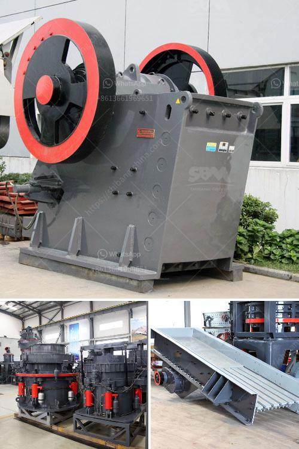

<h3>أفضل علامات تجارية للآلات في المحجر</h3>
يعتبر قطاع المحاجر من أهم القطاعات الصناعية التي تعتمد في عملها على استخدام الآلات والمعدات المتخصصة. وبوجود العديد من العلامات التجارية المتميزة في سوق المحاجر، فإن اختيار العلامة التجارية المناسبة يلعب دورًا حاسمًا في نجاح العمل وتحقيق الأرباح.

1- كاتربيلار (Caterpillar): تعتبر كاتربيلار من العلامات التجارية الرائدة في صناعة الآلات الثقيلة والمعدات. تتميز منتجاتها بالجودة العالية والأداء المتفوق والموثوقية، مما يجعلها خيارًا شعبيًا في قطاع المحاجر.

2- فولفو (Volvo): تعتبر فولفو من الشركات المشهورة عالميًا في تصنيع العتاد والمعدات الثقيلة. توفر فولفو مجموعة واسعة من المنتجات ذات الجودة العالية والتكنولوجيا المتقدمة، مما يجعلها من العلامات التجارية المفضلة لعديد من المشغلين في المحاجر.

3- كوماتسو (Komatsu): تعتبر كوماتسو من الشركات اليابانية المعروفة في صناعة المعدات الثقيلة. تتميز منتجاتها بالتكنولوجيا المتقدمة والأداء القوي، إضافة إلى توفر خدمة ما بعد البيع والصيانة الممتازة.

4- ساني (Sany): تعتبر ساني من العلامات التجارية الناشئة في قطاع المحاجر ولكنها تحظى بشهرة كبيرة في فترة قصيرة. تتميز منتجات ساني بالأداء القوي والتكنولوجيا المتطورة والتكلفة الاقتصادية المناسبة.

5- هيتاشي (Hitachi): تُعتبر هيتاشي أيضًا من العلامات التجارية العالمية المعروفة في صناعة المحاجر. تُقدم هيتاشي مجموعة واسعة من المنتجات المتميزة من حيث الأداء والجودة والكفاءة العالية.

مع العلم أن هناك العديد من العلامات التجارية الأخرى المتميزة في سوق المحاجر، ويجب على الشركات والمشغلين أخذ الوقت الكافي لاختيار العلامة التجارية المناسبة والتي تتناسب مع احتياجاتهم ومتطلبات العمل في المحاجر.

باختصار، يجب البحث والتحقق من سمعة العلامات التجارية، ومراجعة تجارب المستخدمين الآخرين، والتحقق من المواصفات الفنية والكفاءة، ومعرفة مستوى الدعم الفني وما بعد البيع المقدم من الشركة قبل اتخاذ قرار الشراء. بتلك الطريقة، يمكن للمشغلين في المحاجر الاستفادة القصوى من الآلات والمعدات التي تلبي احتياجاتهم وتعزز كفاءتهم في العمل.
<h3>Contact us</h3><ul><li><strong>Whatsapp:&nbsp;<a href="https://wa.me/8613661969651">+8613661969651</a></strong></li><li><a href="https://swt.shibang-china.com/?git&amp;zhl&amp;أفضل علامات تجارية للآلات في المحجر"><strong>Online Service(chat now)</strong></a></li></ul><h3>Related</h3><ul><li><a href='مطحنة فحم رولر.md'>مطحنة فحم رولر</a></li><li><a href='مطحنة معدنية إلى 300 ميكرون.md'>مطحنة معدنية إلى 300 ميكرون</a></li><li><a href='سعر مصنع الأسمنت على نطاق صغير في الهند.md'>سعر مصنع الأسمنت على نطاق صغير في الهند</a></li><li><a href='مصانع معالجة الذهب في الصين للبيع.md'>مصانع معالجة الذهب في الصين للبيع</a></li><li><a href='كسارة عينة صغيرة.md'>كسارة عينة صغيرة</a></li></ul>