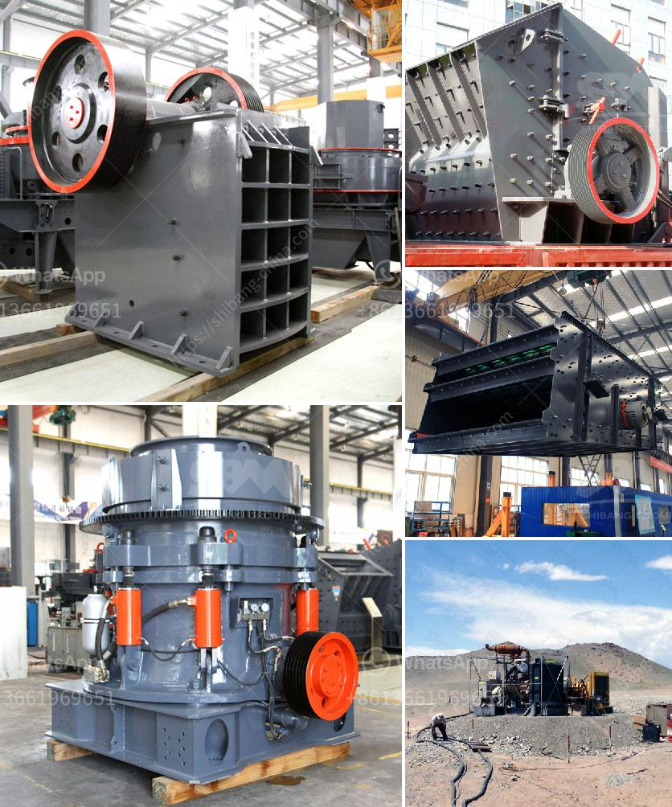

<h3>أفضل كسارة طين في الهند</h3>
تعد الهند واحدة من أكبر الدول الصناعية في العالم، ولديها العديد من الصناعات الناجحة في مجموعة متنوعة من القطاعات. تشتهر الهند بتصنيع العديد من المنتجات المختلفة، بما في ذلك معدات البناء والتعدين. واحدة من الأدوات الأساسية في هذه الصناعة هي كسارات الطين.

تلعب كسارات الطين دورًا حاسمًا في تكسير الحجارة والصخور الكبيرة إلى جزيئات صغيرة من الطين والحصى الضرورية لاستخدامها في مجالات مختلفة مثل البناء والطرق والمصانع والتعدين وغيرها. لذا، فإن اختيار الكسارة المثالية يعد أمرًا حاسمًا للغاية.

واحدة من أفضل الكسارات في الهند هي "كسارة الطين راجكوت". تأسست هذه الشركة عام 1982 وتعمل في مجال تصنيع الكسارات ومعدات التعدين. تتميز كسارات الطين راجكوت بأداء ممتاز وأداء عالي، وتتميز بجودة البناء التي تجعلها قوية ومتينة وقادرة على مقاومة الاستخدام المكثف. كما يتميز تصميمها بالسهولة في الصيانة والتشغيل، مما يجعلها مثالية للاستخدام في الصناعات المختلفة.

توفر "كسارة الطين راجكوت" أيضًا مجموعة واسعة من النماذج والأحجام التي تتناسب مع الاحتياجات المحددة للعملاء. فبغض النظر عن حجم المشروع أو الكمية المطلوبة، يمكن للشركة توفير الحل المثالي. بالإضافة إلى ذلك، تعمل الشركة على تطوير التكنولوجيا المتقدمة في صناعتها وتقديم حلول مبتكرة وفعالة من حيث التكلفة لعملائها.

من الجدير بالذكر أن "كسارة الطين راجكوت" ليست الكسارة الوحيدة المميزة في الهند. بالنظر إلى أهمية الصناعة، على المشترون البحث عن الشركة المثلى وفقًا لاحتياجاتهم المحددة. يجب أيضًا أخذ العوامل الأخرى في الاعتبار، مثل التكلفة والجودة والخدمة الما بعد البيع.

بشكل عام، تأخذ كسارات الطين في الهند مكانًا كبيرًا في صناعة التعدين والبناء، وتوفر منتجات عالية الجودة للعملاء. من بينها، تبرز "كسارة الطين راجكوت" كواحدة من الأكثر شهرة وتميزًا في السوق. ومع قدرتها على تلبية احتياجات العملاء وتقديم حلول مبتكرة، لا عجب في أنها تعتبر الخيار الأمثل للكثير من الأشخاص في الهند.
<h3>Contact us</h3><ul><li><strong>Whatsapp:&nbsp;<a href="https://wa.me/8613661969651">+8613661969651</a></strong></li><li><a href="https://swt.shibang-china.com/?git&amp;zhl&amp;أفضل كسارة طين في الهند"><strong>Online Service(chat now)</strong></a></li></ul><h3>Related</h3><ul><li><a href='استخدام آلة مطحنة الكرة في إندونيسيا.md'>استخدام آلة مطحنة الكرة في إندونيسيا</a></li><li><a href='سعر كسارة الخرسانة.md'>سعر كسارة الخرسانة</a></li><li><a href='آلة معالجة خام المنغنيز بسعر.md'>آلة معالجة خام المنغنيز بسعر</a></li><li><a href='موردي مطحنة ريموند.md'>موردي مطحنة ريموند</a></li><li><a href='شركة مصنعة مشهورة للكسارة والطاحونة في فرنسا.md'>شركة مصنعة مشهورة للكسارة والطاحونة في فرنسا</a></li></ul>