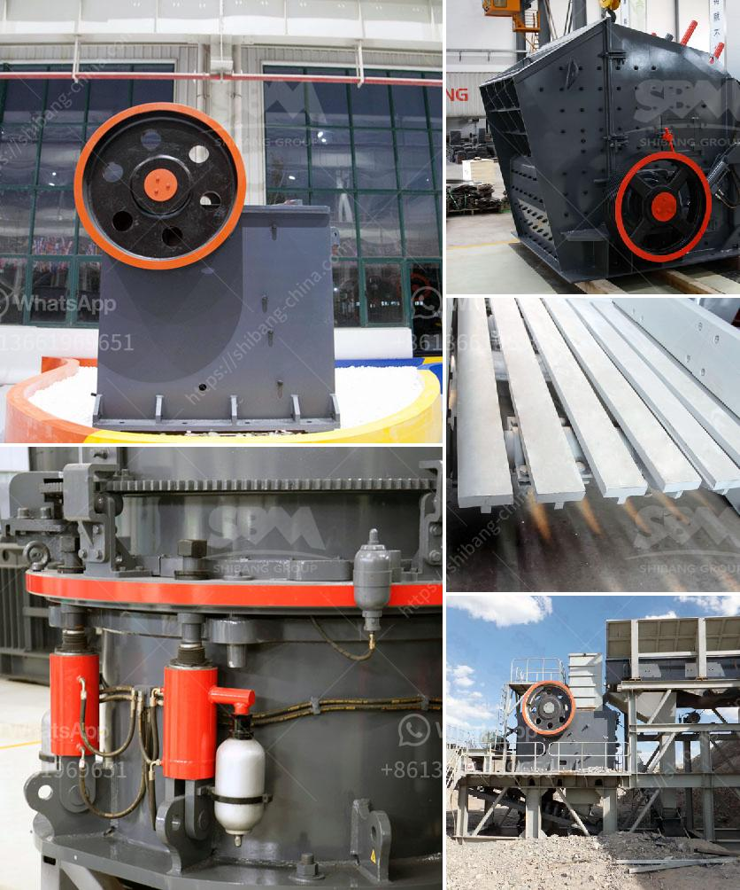

<h3>أفضل كسارة لمسحوق الكوارتز</h3>
تمثل الكسارات المستخدمة في صناعة مسحوق الكوارتز عنصرًا أساسيًا لتحويل قطع الكوارتز الخام إلى مسحوق دقيق. هذا المسحوق المصنع يستخدم في العديد من التطبيقات المختلفة مثل صناعة الزجاج والسيراميك والبلاط وصناعة الدهانات. إن اختيار الكسارة المناسبة لهذا الغرض أمر حاسم لتحقيق جودة المنتج النهائي.

واحدة من أفضل الكسارات المستخدمة لمسحوق الكوارتز هي كسارة الفك المتنقلة. تعتبر الكسارة المتنقلة مثالية للمواقع التي تحتوي على مصادر مختلفة من الكوارتز، حيث يمكن نقلها بسهولة من موقع إلى آخر. تأتي هذه الكسارة بتصميم قوي ومتين وتضم مخروطًا محوريًا محمولًا يعمل على مسحوق الكوارتز.

تتميز كسارة الفك المتنقلة ببنية بسيطة وعملية سهلة الاستخدام. توفر هذه الكسارة تجربة سهلة للمشغل وتتطلب صيانة أقل. يمكنها سحق قطع الكوارتز الخام بفعالية ودقة عالية للحصول على مسحوق الكوارتز المطلوب.

بالإضافة إلى ذلك، تُعتبر الكسارة المخروطية أيضًا أحد الخيارات الممتازة لمسحوق الكوارتز. تمتاز الكسارة المخروطية بأنها تعمل بطريقة مستقرة وموثوقة، كما أنها توفر نتائج دقيقة ومتميزة. تتحمل الكسارة المخروطية الظروف القاسية والعمل الشاق لفترات طويلة دون حدوث أعطال. تعمل الكسارة المخروطية بمحركات قوية وتمتاز بفعالية في استهلاك الطاقة.

علاوة على ذلك، تعتبر الكسارة الصدمية مثالية أيضًا لتصنيع مسحوق الكوارتز. تتميز الكسارة الصدمية بقدرتها على تكسير قطع الكوارتز بفعالية وسرعة عالية. يمكن أن تعمل الكسارة الصدمية على تحقيق نسبة كبيرة من تقليل الحجم في وقت قصير، مما يجعلها خيارًا مثاليًا لإنتاج كميات كبيرة من مسحوق الكوارتز.

في النهاية، يجب أن يتم اختيار الكسارة المثالية بناءًا على احتياجات ومتطلبات الإنتاج المحددة. يجب أن تتوفر الكسارة على الوظائف والميزات المناسبة لتصنيع مسحوق الكوارتز عالي الجودة. كما يجب النظر في جودة المواد التي تم استخدامها في تصنيع الكسارة واعتمادها على معايير الجودة المعترف بها. استشر خبراء في الصناعة لمساعدتك في اختيار الكسارة المثالية لمسحوق الكوارتز الخاص بك.
<h3>Contact us</h3><ul><li><strong>Whatsapp:&nbsp;<a href="https://wa.me/8613661969651">+8613661969651</a></strong></li><li><a href="https://swt.shibang-china.com/?git&amp;zhl&amp;أفضل كسارة لمسحوق الكوارتز"><strong>Online Service(chat now)</strong></a></li></ul><h3>Related</h3><ul><li><a href='مصنع كربونات الكالسيوم المرسبة.md'>مصنع كربونات الكالسيوم المرسبة</a></li><li><a href='تصنيع محطم المحمولة في ألمانيا.md'>تصنيع محطم المحمولة في ألمانيا</a></li><li><a href='تقرير جدوى المشروع حول كسارة الحجر.md'>تقرير جدوى المشروع حول كسارة الحجر</a></li><li><a href='آلات تصنيع كتل الجبس في إيطاليا.md'>آلات تصنيع كتل الجبس في إيطاليا</a></li><li><a href='كسارة الحجر للبيع في باكستان.md'>كسارة الحجر للبيع في باكستان</a></li></ul>