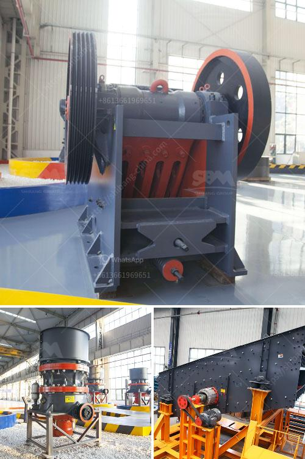

<h3>أفضل كسارة مخروط</h3>
تعتبر الكسارة المخروطية أحد الأدوات الأساسية في صناعة التعدين والبناء، حيث تستخدم لسحق المواد الصلبة إلى حجم أصغر. ومن بين أفضل كسارات المخروط في السوق حاليًا نجد كسارة مخروط الهيدروليكية. 

كسارة المخروطية الهيدروليكية تتميز بأداء عالٍ وقدرة تحمل فائقة. تتمتع الكسارة بنظام هيدروليكي قوي يضمن الاستفادة الكاملة من الطاقة وتحقيق السحق الفعال. كما تتميز بتصميم متقدم وهيكل متين يتحمل الضغوط العالية ويقاوم التآكل. تتميز هذه الكسارة أيضًا بنظام ضبط الفجوة الهيدروليكية الدقيقة، مما يساعد على تحقيق حجم السحق المطلوب وتحسين كفاءة الإنتاج.

تتوفر كسارة المخروط الهيدروليكية بمجموعة واسعة من القدرات والأحجام، بدءًا من 200 إلى 400 طن في الساعة. يمكن استخدامها في عدة تطبيقات، مثل سحق الحصى والصخور والخامات المعدنية والخرسانة المسلحة وغيرها. تعتبر الأداة المثالية لعمليات سحق المتوسطة إلى الكبيرة وتلبية احتياجات الإنتاج المتنوعة.

إحدى مزايا كسارة المخروط الهيدروليكية هي توافر تقنية القفل الهيدروليكي المتقدمة. تساعد هذه التقنية على تأمين الأداة أثناء عملية السحق، وتخفض من وقت التوقف غير المخطط له. يُعتبر هذا النظام مهمًا للمشروعات الكبيرة حيث يعتمد على الأدوات المتطورة ويتطلب سرعة وفاعلية في تشغيل الآلات.

من الجدير بالذكر أن كسارة المخروط الهيدروليكية غالبًا ما تعمل بالاهتزاز الميكانيكي، وهي طريقة من الطرق التقليدية التي تعمل على تأمين سحق المواد بشكل أكثر تساوٍ وفعالية. تهتز الجزء العلوي من الكسارة بتردد واهتزاز متواصل، مما يساعد على تحقيق سحق الخامات بشكل سريع وفعال.

باختصار، كسارة المخروط الهيدروليكية بحجم 200-400 طن في الساعة هي الأداة المثالية لمشروع التعدين أو البناء الكبيرة. تمتاز بأداء قوي وهيكل قوي وتقنيات متقدمة تجعلها مثالية لسحق المواد الصلبة. من خلال استخدام كسارة المخروط الهيدروليكية، يمكن تحقيق الإنتاج الفعال وتحسين كفاءة العمل.
<h3>Contact us</h3><ul><li><strong>Whatsapp:&nbsp;<a href="https://wa.me/8613661969651">+8613661969651</a></strong></li><li><a href="https://swt.shibang-china.com/?git&amp;zhl&amp;أفضل كسارة مخروط"><strong>Online Service(chat now)</strong></a></li></ul><h3>Related</h3><ul><li><a href='كسارة حجر ألمانية.md'>كسارة حجر ألمانية</a></li><li><a href='خطة التحكم في تصنيع مطحنة الكرة.md'>خطة التحكم في تصنيع مطحنة الكرة</a></li><li><a href='مطاحن صناعية للفحم.md'>مطاحن صناعية للفحم</a></li><li><a href='حجم منتج التغذية لكسارات المخروط.md'>حجم منتج التغذية لكسارات المخروط</a></li><li><a href='مصنع إسمنت مربح للبيع في تاميل نادو.md'>مصنع إسمنت مربح للبيع في تاميل نادو</a></li></ul>