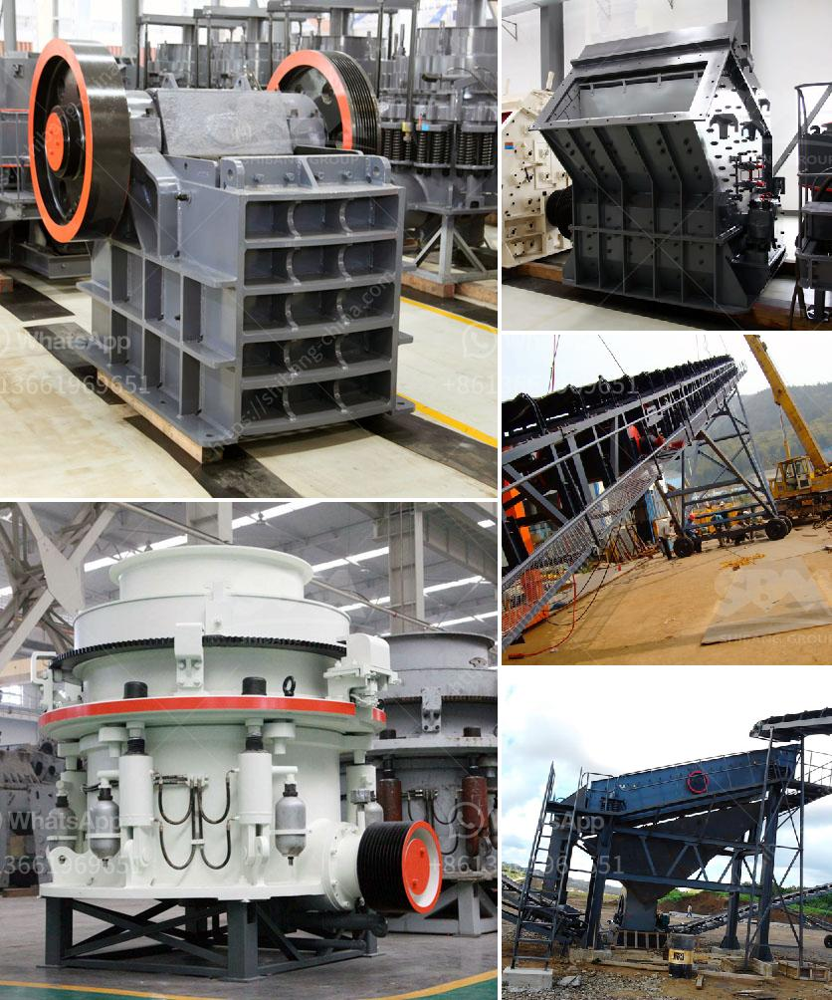

<h3>أفضل وسادات طحن للرخام في باكستان</h3>
تُعد السطوح المصقولة من الرخام إضافةً رائعةً لأي مساحة داخلية أو خارجية. فهي تضفي لمسةً فاخرةً وجمالية على الأرضيات والجدران والسلالم والكونترتوبات وغيرها من الأسطح المصنوعة من الرخام. ومع ذلك، قد يفقد الرخام توهجه وبريقه الأصلي مع مرور الوقت وتكون هناك حاجة لعملية طحن لاستعادتها.

تحتاج عملية طحن الرخام إلى وسادات طحن عالية الجودة وفعالة للحصول على نتائج مثالية. في هذه المقالة، سنلقي نظرة على أفضل وسادات طحن للرخام في باكستان.

تُعتبر شركة "إيتيماديا" من الشركات الرائدة في مجال تصنيع وسادات طحن الرخام في باكستان. تعتمد هذه الوسادات على تقنية متقدمة ومواد عالية الجودة لتوفير الدقة والكفاءة في عملية طحن الرخام. تستخدم وسادات "إيتيماديا" نظامًا فريدًا للتبريد لمنع الحرارة المفرطة خلال العملية وبالتالي الحفاظ على جودة الرخام.

تعتبر وسادات طحن الرخام من شركة "روكينج ورلد" ذات جودة عالية وتتميز بأداء ممتاز. تستخدم هذه الوسادات تقنية التصنيع المتقدمة وتعتمد على مواد متينة لطحن الرخام بسرعة وفعالية. توفر شركة "روكينج ورلد" وسادات طحن متنوعة بأحجام وخامات مختلفة، مما يسمح للعملاء باختيار الوسادات المناسبة حسب احتياجاتهم.

تمتاز وسادات طحن الرخام من شركة "رويال ماربل" بالمتانة والكفاءة. تستخدم هذه الوسادات تقنية الطحن الفائقة والمواد ذات الجودة العالية للتأكد من أن العملاء سيحصلون على نتائج مذهلة. تتوفر وسادات "رويال ماربل" بمجموعة متنوعة من الأحجام والأنواع لتناسب احتياجات العملاء بشكل دقيق.

تعتبر وسادات طحن الرخام من شركة "بايزن تولز" منتجات متميزة تحقق أفضل النتائج في عملية طحن الرخام. تم تصميم هذه الوسادات بعناية وفقًا لأعلى المواصفات وتستخدم مواد عالية الجودة لتحقيق الفعالية والمتانة في عمليات الطحن.

باختيار أحد هذه الوسادات المتخصصة لطحن الرخام، يمكن للعملاء في باكستان الحصول على سطوح رخامية خلابة بكل سهولة ويسر. نوصي دائمًا بالتحقق من توفر قطع الغيار والصيانة المستمرة لكي يبقى أداء الوسادات عالي الجودة على المدى الطويل. قبل استخدام أي وسادة للطحن، يجب على العملاء التأكد من أنها من مصدر موثوق وتلبي المعايير العالمية للجودة والأداء.

استخدام الوسادات المناسبة لطحن الرخام يعزز جمالها ويعيد إليها توهجها الأصلي. توفر الشركات المذكورة أعلاه وسادات طحن عالية الجودة للعملاء في باكستان، مما يجعل هذه العملية سهلة وفعالة.
<h3>Contact us</h3><ul><li><strong>Whatsapp:&nbsp;<a href="https://wa.me/8613661969651">+8613661969651</a></strong></li><li><a href="https://swt.shibang-china.com/?git&amp;zhl&amp;أفضل وسادات طحن للرخام في باكستان"><strong>Online Service(chat now)</strong></a></li></ul><h3>Related</h3><ul><li><a href='معدات المحجر المملكة المتحدة.md'>معدات المحجر المملكة المتحدة</a></li><li><a href='أنا أبحث عن كسارة في ماليزيا.md'>أنا أبحث عن كسارة في ماليزيا</a></li><li><a href='معدات تعدين مستعملة للبيع في غانا.md'>معدات تعدين مستعملة للبيع في غانا</a></li><li><a href='مصنع تحسين الكروميت في ماليزيا.md'>مصنع تحسين الكروميت في ماليزيا</a></li><li><a href='مصانع تحسين الكوارتز في الهند.md'>مصانع تحسين الكوارتز في الهند</a></li></ul>