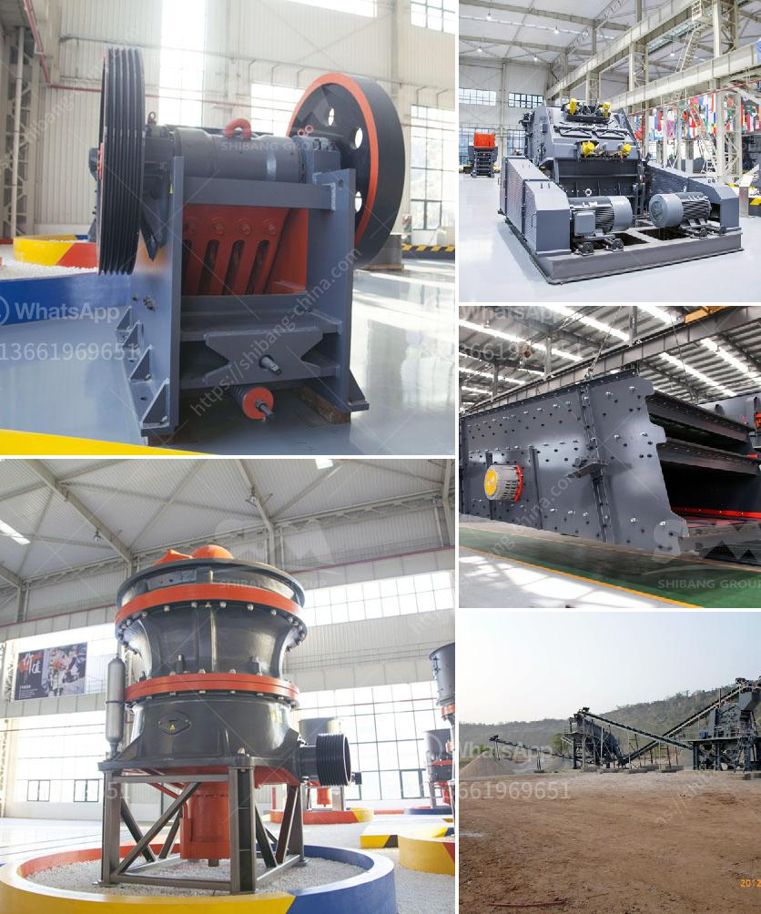

<h3>أفكار مشروع مصفاة النحاس صغيرة المقياس</h3>
تعتبر مصفاة النحاس صغيرة المقياس فكرة مشروع مثيرة ومبتكرة في قطاع الصناعة. يتضمن هذا المشروع إنشاء مصنع صغير يقوم بتحويل خام النحاس إلى منتجات نحاسية ذات جودة عالية وقيمة تجارية.

تشمل الأفكار لهذا المشروع عدة جوانب. أولاً وقبل كل شيء، يجب إجراء دراسة جدوى دقيقة لتحديد الطلب والعرض في السوق المحلية والعالمية للمنتجات النحاسية. يجب أيضًا تحديد الاستثمار المطلوب، مثل شراء المعدات والأجهزة وتأجير المساحة والحصول على التراخيص والأذونات اللازمة.

بعد ذلك، يجب توفير المعدات والتقنيات اللازمة لمعالجة وتكرير خام النحاس. من بين هذه المعدات: الكسارات والمطاحن والفاصل المغناطيسي وأفران التحميص والأجهزة الأخرى ذات الصلة. يجب توفير كل هذه المعدات بجودة عالية لضمان إنتاجية فعالة ومنتجات نحاسية ذات جودة عالية.

بالإضافة إلى ذلك، يجب أن يكون للمشروع إدارة فنية قوية ومهارات تشغيلية جيدة. يجب أن يكون لديك موظفون ذوي خبرة في صناعة النحاس والإدارة المالية والتسويق. يجب أن تتخذ إجراءات صارمة للحفاظ على جودة المنتجات والسيطرة على عملية الإنتاج بأكملها.

بالإضافة إلى الإنتاج، يجب أن يتضمن المشروع أيضًا استراتيجية تسويقية فعالة. يجب عليك الترويج لمنتجاتك وتوسيع قاعدة العملاء. يمكنك استهداف الشركات الصناعية الأخرى التي تحتاج إلى مواد نحاسية لإنتاج منتجاتها. يمكنك أيضًا الاستهداف المباشر للعملاء الذين يحتاجون إلى منتجات نحاسية صغيرة مثل الأسلاك والأنابيب والمجوهرات والهدايا ومقوَّظات النهاية.

بالنظر إلى الاستدامة والمسؤولية البيئية، يجب أن يتم الالتزام بمعايير صارمة لحماية البيئة واتخاذ إجراءات فعالة للحد من التلوث الناجم عن عملية التكرير والإنتاج. يجب أيضًا اعتبار تكنولوجيا تدوير المياه وتحسين كفاءة استهلاك الطاقة.

في الختام، فكرة مشروع مصفاة النحاس صغيرة المقياس هي فرصة مثيرة للاستفادة من الطلب المتزايد على المنتجات النحاسية وتحقيق أرباح مجزية. يتطلب النجاح في هذا المشروع التخطيط والدراسة والتنفيذ الجيد، بالإضافة إلى استراتيجية تسويقية قوية والالتزام بالأعمال البيئية المستدامة.
<h3>Contact us</h3><ul><li><strong>Whatsapp:&nbsp;<a href="https://wa.me/8613661969651">+8613661969651</a></strong></li><li><a href="https://swt.shibang-china.com/?git&amp;zhl&amp;أفكار مشروع مصفاة النحاس صغيرة المقياس"><strong>Online Service(chat now)</strong></a></li></ul><h3>Related</h3><ul><li><a href='مصنعو الكرات في بنغالور.md'>مصنعو الكرات في بنغالور</a></li><li><a href='كسارة حجر مستعملة في أونتاريو.md'>كسارة حجر مستعملة في أونتاريو</a></li><li><a href='التكلفة المقدرة لإنشاء محجر.md'>التكلفة المقدرة لإنشاء محجر</a></li><li><a href='كسارة الصخور بوسطن.md'>كسارة الصخور بوسطن</a></li><li><a href='كسارات الحجر والرمل المحمولة على نطاق صغير.md'>كسارات الحجر والرمل المحمولة على نطاق صغير</a></li></ul>