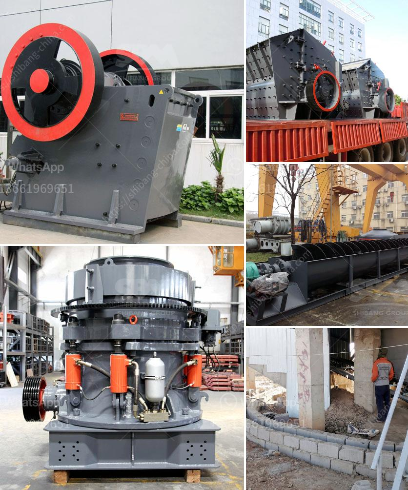

<h3>أكبر كسارة صخور</h3>
كسارة الصخور هي آلة تستخدم لكسر الصخور الكبيرة إلى قطع صغيرة أو الغبار. وتستخدم هذه الكسارات بشكل شائع في صناعات مختلفة مثل البناء والتعدين والتشييد. تختلف حجم الكسارات من صغيرة ومتنقلة إلى ضخمة وثابتة.

تعتبر أكبر كسارة صخور في العالم "كسارة بيليتونغ" التي تقع في مقاطعة كوماتيبو في جنوب أفريقيا. تم تشييد هذه الكسارة في عام 2007 وتعتبر الكسارة الأم ويتبعها عدة كسارات أخرى. تم بناء هذه الكسارة بواسطة شركة بايلير الألمانية ، وقد تم تصميمها لتكون قادرة على كسر الصخور الضخمة بطريقة فعالة.

تم تجهيز "كسارة بيليتونغ" بمحرك ضخم يعمل بقوة 9,000 حصان ، وتزن حوالي 500 طن. تعمل الكسارة بشكل سلس وفعال لكسر الصخور التي يصل حجمها إلى 1.5 متر في القطر. بالإضافة إلى ذلك ، تم تزويد الكسارة بمعدات خاصة لفحص الصخور المكسورة وفصل الغبار والحصى والركام عن بعضها البعض.

تعتبر "كسارة بيليتونغ" سبباً رئيسيًا ومهمًا لاستمرار عمليات التعدين والبناء في المنطقة. فهي تقوم بكسر الصخور لتسهيل عمليات حفر الآبار والتنقيب عن المعادن واستخلاص الحجر الجيري والرخام والجرانيت وغيرها من المواد القيمة. كما يتم استخدام الحصى والركام الناتج من الكسارة في مجالات مثل البناء والطرق والسدود.

على الرغم من أن "كسارة بيليتونغ" هي أكبر كسارة صخور في العالم ، إلا أنها تعمل بشكل آمن وبيئي. تطبق الكسارة إجراءات صارمة لمعالجة الغبار والضوضاء المتولدة من عملية التكسير. تحرص الشركة المشغلة للكسارة على الالتزام بالمعايير البيئية وسلامة العملاء والعاملين.

في الختام ، يمكن القول إن "كسارة بيليتونغ" هي أحدث وأكبر ابتكار في مجال تكسير الصخور. وبفضل القدرات الكبيرة والميزات الحديثة لهذه الكسارة ، تلعب دورًا هامًا في صناعة البناء والتعدين وتلبية احتياجات المشاريع الكبيرة. كما أنها تحقق التوازن بين الإنتاجية والسلامة والاحترام للبيئة.
<h3>Contact us</h3><ul><li><strong>Whatsapp:&nbsp;<a href="https://wa.me/8613661969651">+8613661969651</a></strong></li><li><a href="https://swt.shibang-china.com/?git&amp;zhl&amp;أكبر كسارة صخور"><strong>Online Service(chat now)</strong></a></li></ul><h3>Related</h3><ul><li><a href='أسعار كسارة الحجر.md'>أسعار كسارة الحجر</a></li><li><a href='آلة صنع الحجر الخرساني في جنوب أفريقيا.md'>آلة صنع الحجر الخرساني في جنوب أفريقيا</a></li><li><a href='آلة كسارة محمولة.md'>آلة كسارة محمولة</a></li><li><a href='مطحنة طحن كربونات الكالسيوم.md'>مطحنة طحن كربونات الكالسيوم</a></li><li><a href='آلة سحق كبيرة.md'>آلة سحق كبيرة</a></li></ul>