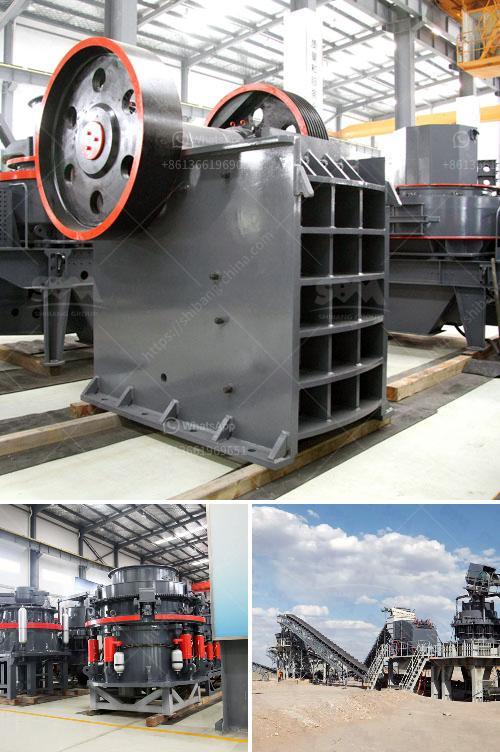

<h3>أكبر معدات تحسين خام الحديد في الصين</h3>
تعتبر صناعة الحديد من أهم الصناعات الأساسية في العالم، حيث يتم استخدامه في تصنيع العديد من المنتجات والمواد الأخرى. وتعد الصين من أكبر الدول المنتجة للحديد في العالم، حيث تتمتع بمعدات تحسين خام الحديد متطورة وضخمة.

تعتبر معدات تحسين خام الحديد في الصين من أكبر المعدات المستخدمة في العالم، حيث تستخدم في عملية تكرير الخام الحديدي للحصول على مستوى عالٍ من النقاوة والجودة. وتعتمد هذه المعدات على التكنولوجيا الحديثة والمتطورة لضمان الحد الأقصى من الكفاءة والإنتاجية.

أحد أكبر معدات تحسين خام الحديد في الصين هو الفرن العمودي العالي (Blast Furnace). يعد هذا الفرن الأساسي في صناعة الحديد الصينية، حيث يتم فيه ذوبان خام الحديد والسخان بواسطة الهواء الساخن المدخل من الجزء السفلي للفرن. ويتم إزالة الشوائب والشوائب الأخرى من الخام، مما يؤدي إلى حصول على حديد نقي بنسبة عالية.

بالإضافة إلى ذلك، تستخدم الصين أيضًا معدات الإعصار والروافع والغرابيل والفاصل المغناطيسي ومعدات أخرى عديدة في تحسين خام الحديد. تم تطوير هذه المعدات لتحسين جودة وإنتاجية عملية صناعة الحديد.

وتعمل الصين على تحديث وتطوير معدات تحسين خام الحديد باستمرار، حيث تقوم بالاستفادة من التكنولوجيا الحديثة والبحث والتطوير لتحسين كفاءة العمليات وتوفير المهارات والتقنيات الحديثة للعمال. وبفضل هذه التحسينات المستمرة، أصبحت صناعة الحديد في الصين من أكبر الصناعات المتقدمة والمتطورة في العالم.

باختصار، تتمتع الصين بأكبر معدات تحسين خام الحديد في العالم، حيث تستخدم التكنولوجيا الحديثة والمتطورة لضمان الحد الأقصى من الكفاءة والإنتاجية. وتعمل الصين باستمرار على تحديث وتطوير هذه المعدات لمواكبة التقدم التكنولوجي وتلبية الطلب المتزايد على الحديد في العالم.
<h3>Contact us</h3><ul><li><strong>Whatsapp:&nbsp;<a href="https://wa.me/8613661969651">+8613661969651</a></strong></li><li><a href="https://swt.shibang-china.com/?git&amp;zhl&amp;أكبر معدات تحسين خام الحديد في الصين"><strong>Online Service(chat now)</strong></a></li></ul><h3>Related</h3><ul><li><a href='مخطط تخطيطي لمطحنة الأسطوانات.md'>مخطط تخطيطي لمطحنة الأسطوانات</a></li><li><a href='آلة سحق الطين.md'>آلة سحق الطين</a></li><li><a href='مطحنة طحن عمودية.md'>مطحنة طحن عمودية</a></li><li><a href='مطاحن تحضير الدولوميت.md'>مطاحن تحضير الدولوميت</a></li><li><a href='مورد آلة طحن الكرة في إندونيسيا.md'>مورد آلة طحن الكرة في إندونيسيا</a></li></ul>