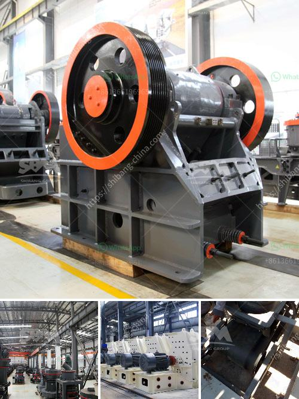

<h3>أنا أبحث عن كسارة في ماليزيا</h3>
تعد الكسارات من أهم المعدات اللازمة في صناعة البناء والتشييد، حيث تقوم بتكسير الصخور والأحجار الكبيرة لتمكين استخدامها في إنشاء المباني والطرق والأعمال الإنشائية الأخرى. وبناءً على ذلك، أنا أبحث عن كسارة في ماليزيا.

ماليزيا دولة جميلة توفر العديد من الفرص الاقتصادية والصناعية. تعرف بتنوع طبيعتها وجمال مناظرها الطبيعية، وهي تحظى بالكثير من الاستثمارات في مجال البناء والإنشاء. ومن أجل تلبية الطلب المتزايد على المواد الإنشائية، يتطلب الأمر العثور على كسارة تلبي الاحتياجات المحددة.

أولاً وقبل كل شيء، تحتاج الكسارة إلى أن تكون قادرة على تكسير الصخور والأحجار بكفاءة وسرعة. أيضًا، يجب أن تكون لديها قدرة عالية على التحمل لتحمل الاستخدام المكثف وتلبية الطلب المتزايد. بالإضافة إلى ذلك، فإن الكسارة يجب أن تكون ذات كفاءة عالية في استهلاك الطاقة وتقليل الهدر والتلوث البيئي.

مع توفر العديد من الكسارات في ماليزيا، يتعين علي أن أراعي أيضًا عدة عوامل قبل الاختيار. أهم هذه العوامل هي التكلفة والموثوقية. يجب أن تكون التكلفة متوافقة مع ميزانيتي المحددة، وتتضمن تكاليف الشراء والصيانة والتشغيل. من ناحية أخرى، يجب أن أضمن أن الكسارة التي أختارها موثوقة وتعمل بفاعلية عالية دون أية مشاكل فنية.

بالإضافة إلى ذلك، يجب أن أبحث عن شركة موثوقة وذات سمعة جيدة توفر أفضل جودة للمنتجات والخدمات. بحثًا عن توصيات وآراء العملاء السابقين يمكنني الحصول على فكرة أفضل عن المصنع وجودته. علاوة على ذلك، من الضروري أن أتأكد من أن المصنع يلتزم بالمعايير البيئية والصحية لضمان عدم تلويث البيئة المحيطة.

في النهاية، يجب علي أن أكون على استعداد لقطع الشوط الأخير في أبحاثي. علي أن أقوم بزيارة المصانع والتفاوض على شروط العقد ومعاينة الكسارة المختارة بنفسي. يجب أن أتأكد من ملائمة الكسارة للاستخدام الذي أنوي القيام به والتأكد من وجود ضمانات صحيحة وخدمة ما بعد البيع.

في المجموع، البحث عن كسارة في ماليزيا هو عمل مهم يتطلب الكثير من البحث ومراعاة العديد من العوامل. يجب أن أسعى للحصول على كسارة عالية الجودة وقادرة على تلبية الاحتياجات المحددة، بأسعار معقولة ومعايير صحية وبيئية مراعاة. ومع هذا الجهد المنصوص عليه، سأتمكن من العثور على الكسارة المناسبة وبدء مشروع البناء الناجح في ماليزيا.
<h3>Contact us</h3><ul><li><strong>Whatsapp:&nbsp;<a href="https://wa.me/8613661969651">+8613661969651</a></strong></li><li><a href="https://swt.shibang-china.com/?git&amp;zhl&amp;أنا أبحث عن كسارة في ماليزيا"><strong>Online Service(chat now)</strong></a></li></ul><h3>Related</h3><ul><li><a href='كسارة الحجر للبيع في الإمارات.md'>كسارة الحجر للبيع في الإمارات</a></li><li><a href='كسارة السيليكون الوافر.md'>كسارة السيليكون الوافر</a></li><li><a href='مطحنة كرات مخروطية للبيع.md'>مطحنة كرات مخروطية للبيع</a></li><li><a href='كسارة أولية مستخدمة في جنوب أفريقيا.md'>كسارة أولية مستخدمة في جنوب أفريقيا</a></li><li><a href='مصنع سحق وطحن.md'>مصنع سحق وطحن</a></li></ul>