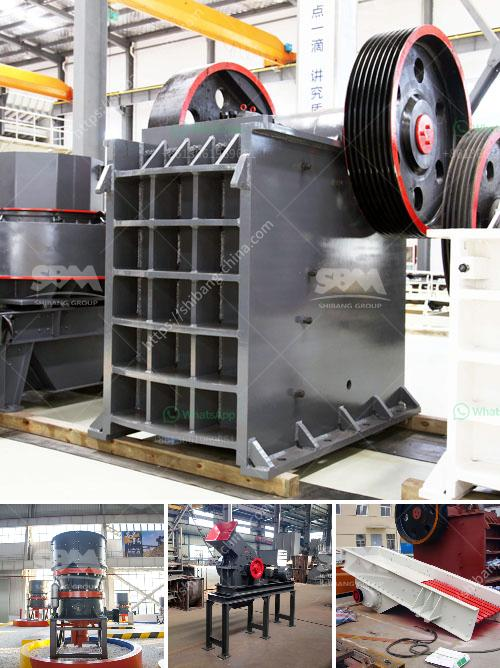

<h3>أنظمة التحكم في كسارة الحجر المحمولة</h3>
تعد الكسارات المحمولة أدوات هامة في صناعة التعدين والبناء، حيث تهدف إلى تكسير وفصل الصخور والحجارة بأحجام مختلفة لإنتاج مواد قابلة للتصنيع وإعادة التدوير. تم تطوير أنظمة التحكم في كسارة الحجر المحمولة لتحسين كفاءة وأمان العمليات وتحقيق أداء متفوق.

تتكون أنظمة التحكم في الكسارة المحمولة من مجموعة من الأجهزة والبرامج التي تعمل معًا للتحكم في عملية التكسير ومراقبتها. يتم استخدام أجهزة الاستشعار والمستشعرات لقياس ومراقبة العوامل المهمة مثل الحجم وسرعة التغذية وضغط الكسارة وقوة التكسير. تقوم هذه الأجهزة بتحويل القراءات إلى إشارات إلكترونية يمكن معالجتها وفهمها بواسطة البرامج.

تعمل البرامج على تحليل هذه الإشارات واتخاذ القرارات المناسبة لضبط عملية التكسير. يمكن ضبط الوظائف والمعلمات الضرورية مثل سرعة الحزام الناقل وتوقيت التكسير وتدفق المواد بشكل دقيق وفقًا لاحتياجات العملية. وبالتالي، يتم تحقيق كفاءة عالية وإنتاجية محسنة للكسارة.

بفضل أنظمة التحكم المتطورة، يمكن أيضًا تحقيق مستويات عالية من الأمان والحماية للعاملين والمعدات. يتم رصد مجموعة متنوعة من المؤشرات مثل درجات الحرارة وضغط الزيت وتيار الكهرباء لتحديد أي مشاكل محتملة في الكسارة قبل حدوث أي أضرار صعبة اصلاحها. عندما يتم اكتشاف مشكلة، يتم تنبيه المشغل ويتم إيقاف الكسارة تلقائيًا لمنع حدوث أي تلف إضافي.

إضافة إلى ذلك، تتيح أجهزة التحكم تخزين وتحليل البيانات لتوفير تقارير دورية عن أداء الكسارة. يمكن استخدام هذه التقارير لتحسين تشغيل الكسارة وتكوين الصيانة والإصلاح اللازمين. تعتبر عمليات التشغيل الفعالة والصيانة الدورية وسيلة فعالة لتقليل تكاليف التشغيل وتحسين عمر الخدمة الميكانيكية للكسارة.

باستخدام أنظمة التحكم في كسارة الحجر المحمولة، تحقق الصناعات العديد من المزايا التنافسية مثل زيادة الإنتاجية وتحسين الجودة وتقليل التكاليف. يتم تحسين الأداء ويسهل التحكم في عملية التكسير، مما يزيد من رضا العميل ويرفع سمعة الشركة في السوق. إنها تقنية مبتكرة تؤثر بشكل كبير على صناعة التعدين والبناء.
<h3>Contact us</h3><ul><li><strong>Whatsapp:&nbsp;<a href="https://wa.me/8613661969651">+8613661969651</a></strong></li><li><a href="https://swt.shibang-china.com/?git&amp;zhl&amp;أنظمة التحكم في كسارة الحجر المحمولة"><strong>Online Service(chat now)</strong></a></li></ul><h3>Related</h3><ul><li><a href='مصنع محطم للبيع في الإمارات.md'>مصنع محطم للبيع في الإمارات</a></li><li><a href='كسارات الفك مسحوق كربيد التنجستن.md'>كسارات الفك مسحوق كربيد التنجستن</a></li><li><a href='معدات جص صنع الجدار الخرساني في ألمانيا.md'>معدات جص صنع الجدار الخرساني في ألمانيا</a></li><li><a href='سعر آلة سحق خام النحاس.md'>سعر آلة سحق خام النحاس</a></li><li><a href='آلات ومعدات تعدين واستغلال المحاجر.md'>آلات ومعدات تعدين واستغلال المحاجر</a></li></ul>