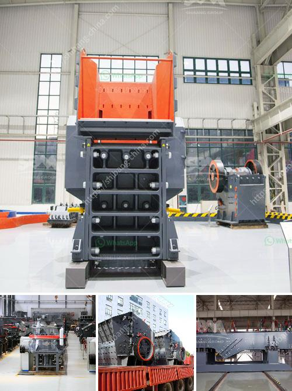

<h3>أنواع الجبس</h3>
الجبس هو مادة بناء متعددة الاستخدامات تستخدم في العديد من التطبيقات المختلفة. يتم استخراجه من المعدن الطبيعي ويتم استخدامه في صناعة البناء والديكور والطب والصناعات الأخرى.

هناك عدة أنواع من الجبس المتاحة، حيث يختلف كل منها في خواصه واستخداماته. سنستعرض في هذه المقالة بعض الأنواع الرئيسية للجبس.

يعد جبس البناء النوع الأكثر شيوعًا واستخدامًا في صناعة البناء. يتم استخدامه لإنشاء الجدران الداخلية والأسقف والأعمدة في المباني. يتم تطبيقه في صورة لوحات جبسية مسطحة ويتم تنصيبها على هياكل من الخشب أو الصلب. يتميز جبس البناء بخاصية السهولة في التشكيل والتعديل، كما أنه يوفر عزلًا جيدًا للصوت والحرارة.

يعتبر جبس الديكور هو الشكل الأكثر تعقيدًا وتنوعًا من الجبس. يتم استخدامه لإضافة عناصر زخرفية وتفاصيل جمالية إلى المباني والمساكن. يتم استخدام قوالب خاصة لتشكيل جبس الديكور، حيث يمكن تصنيع أشكال مفصلة ومعقدة مثل الأعمدة والقواعد والأعمال الفنية المحترفة في الجدران والأسقف.

تستخدم صناعة الطب جبسًا خاصًا يستخدم لتثبيت الكسور وتسوية العظام المكسورة. يتم تشكيل جبس الطب وتطبيقه على الأنعطافات المصابة واستخدامه لتأمين الجزء المكسور من الجسم. يتميز جبس الطب بقوته واستقراره، كما أنه يتحلل ببطء عند تعرضه للعرق ورطوبة الجسم.

جبس الأسقف يستخدم لتشكيل السقف المعلق في المباني. يتم تصنيعه على شكل ورقة مسطحة ويتم تعليقها من السقف بواسطة أطراف معدنية. يوفر جبس الأسقف سطحًا عاديًا وناعمًا يمكن صبه وطلاؤه بسهولة، كما أنه يوفر أيضًا خاصية عزل الصوت وامتصاص الصدى.

باختصار، الجبس له استخدامات متنوعة ويتوفر في العديد من الأنواع المتنوعة المناسبة لكل استخدام. من خلال استخدام الجبس المناسب، يمكن للمهنيين في مجال البناء والديكور والطب تحقيق نتائج مثالية.
<h3>Contact us</h3><ul><li><strong>Whatsapp:&nbsp;<a href="https://wa.me/8613661969651">+8613661969651</a></strong></li><li><a href="https://swt.shibang-china.com/?git&amp;zhl&amp;أنواع الجبس"><strong>Online Service(chat now)</strong></a></li></ul><h3>Related</h3><ul><li><a href='كسارة الحجر ديربان.md'>كسارة الحجر ديربان</a></li><li><a href='كرات المطحنة للتعدين.md'>كرات المطحنة للتعدين</a></li><li><a href='كسارة الحجر في الكاميرون.md'>كسارة الحجر في الكاميرون</a></li><li><a href='مطحنة الدولوميت بحجم 13x18 للبيع.md'>مطحنة الدولوميت بحجم 13x18 للبيع</a></li><li><a href='معدات فحص الرمال للبيع في جنوب أفريقيا.md'>معدات فحص الرمال للبيع في جنوب أفريقيا</a></li></ul>