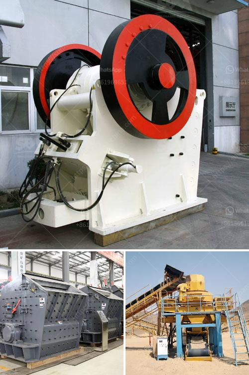

<h3>أنواع السيور الناقلة</h3>
تعتبر السيور الناقلة أحد الأدوات الهامة في مجال النقل والتصنيع، حيث تستخدم لنقل المواد بكفاءة وسرعة عالية. تُستخدم السيور الناقلة في العديد من الصناعات المختلفة مثل التعدين والبناء وتصنيع المواد الغذائية والمستحضرات الصيدلانية وغيرها.

تتوفر العديد من أنواع السيور الناقلة، حيث يتم اختيار نوع السير الناقل وفقًا لنوع المادة التي سيتم نقلها. وفيما يلي بعض الأنواع الشائعة للسيور الناقلة:

1- السيور الناقلة البلاستيكية: تصنع من المواد البلاستيكية مثل البولي فينيل كلورايد (PVC) والبولي يوريثان (PU) ويتم استخدامها في العديد من الصناعات. تُستخدم هذه السيور البلاستيكية لنقل المواد الخفيفة والتي تتطلب سطحًا ناعمًا لمنع تلف المواد المنتقلة.

2- السيور الناقلة المطاطية: تصنع من المطاط الطبيعي أو الاصطناعي وتستخدم بشكل عام في صناعة التعدين. تتميز هذه السيور بمرونتها ومقاومتها للتلف والتأثيرات البيئية المختلفة.

3- سيور النقل السلسلة: يتم استخدامها عندما يكون هناك حاجة لنقل الأحمال الثقيلة والأجسام الكبيرة. تتكون من سلاسل متصلة تعمل على نقل المواد من مكان إلى آخر. تستخدم عادة في صناعة السيارات والتعدين والتصنيع الثقيل.

4- السيور الناقلة الفلينية: تصنع من الفلين وتستخدم في العديد من الصناعات بما في ذلك الغذاء والمنسوجات. تتميز بمرونتها وخفة وزنها ومقاومتها للتآكل والحرارة.

5- السيور الناقلة الصلبة: تتميز بقوتها ومتانتها، وتستخدم في نقل المواد الثقيلة في صناعة البناء والتعدين.

بصفة عامة، تعتبر السيور الناقلة وسيلة فعالة واقتصادية لنقل المواد في العديد من الصناعات. وتتوفر السيور بمختلف الأحجام والمواد والتصاميم، مما يسمح بتلبية متطلبات النقل المختلفة. التحسينات التكنولوجية في تصنيع السيور الناقلة تجعلها تدعم عمليات الإنتاج بشكل أكثر كفاءة، مما يعزز الإنتاجية ويقلل من التكاليف.

باختصار، تُعد السيور الناقلة جزءًا أساسيًا من صناعة النقل والتصنيع، فهي توفر طرقاً فعالة وسلسة لنقل المواد بهدف ضمان سلاسة العمليات الإنتاجية وزيادة الإنتاجية.
<h3>Contact us</h3><ul><li><strong>Whatsapp:&nbsp;<a href="https://wa.me/8613661969651">+8613661969651</a></strong></li><li><a href="https://swt.shibang-china.com/?git&amp;zhl&amp;أنواع السيور الناقلة"><strong>Online Service(chat now)</strong></a></li></ul><h3>Related</h3><ul><li><a href='كسارة مخروطية hp300.md'>كسارة مخروطية hp300</a></li><li><a href='مصنع كسارة الفك.md'>مصنع كسارة الفك</a></li><li><a href='صيانة محطة توليد الفحم بصيغة PDF.md'>صيانة محطة توليد الفحم بصيغة PDF</a></li><li><a href='كسارة للبيع بسعر دبي.md'>كسارة للبيع بسعر دبي</a></li><li><a href='مصنع تكسير الخرسانة في دبي.md'>مصنع تكسير الخرسانة في دبي</a></li></ul>