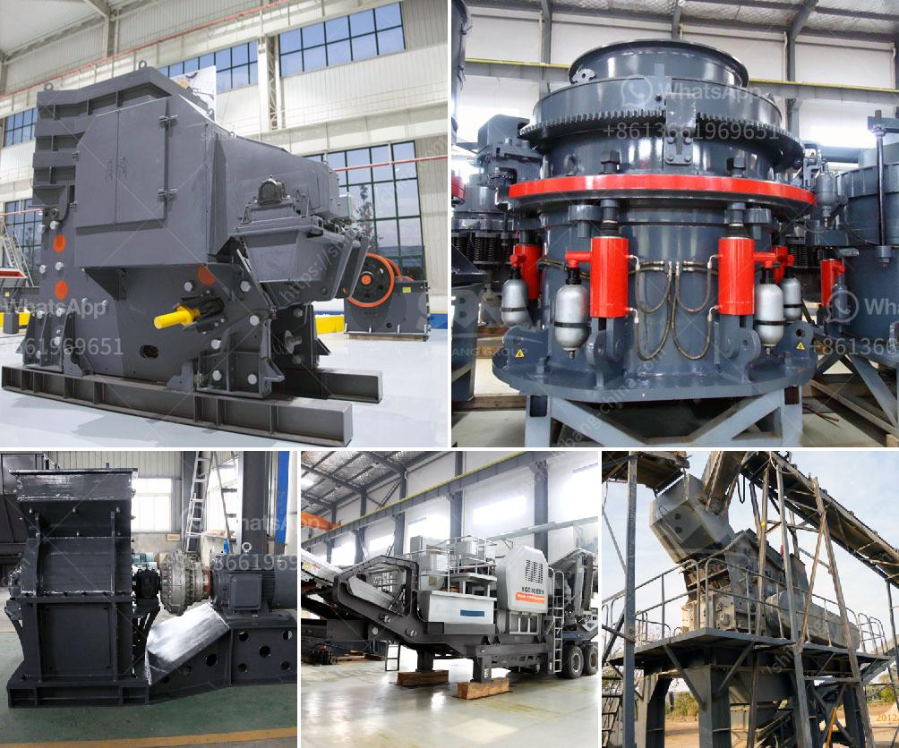

<h3>أنواع الكسارات المستخدمة في التعدين pdf</h3>
الكسارات هي أدوات أساسية في صناعة التعدين، حيث تستخدم لسحق الصخور والخامات الصلبة للحصول على حجم صغير يسهل معالجتها وتصفيتها. تتوفر العديد من أنواع الكسارات التي تستخدم في الصناعة، وسنتطرق في هذه المقالة إلى بعضها الرئيسية.

1- كسارات الفك: تُعتبر الكسارات الفكية من أكثر الكسارات شيوعًا في التعدين. تتألف من مجموعة من الفكين المتحركين والثابتين، حيث تتم عملية التكسير عن طريق ضغط الصخرة بين الفكين، مما يؤدي إلى تكسيرها إلى قطع صغيرة. يتم استخدام كسارات الفك في الغالب للصخور الصلبة والخامات الكبيرة.

2- كسارات المخروط: تعتبر الكسارات المخروطية من الكسارات الشائعة أيضًا. تتألف من جزء ثابت وجزء متحرك، حيث يتم تكسير الخام بواسطة ضغطه بين السطح الداخلي للجزء المتحرك والجزء الثابت. تستخدم هذه الكسارات عادة للصخور الصلبة والخامات ذات الكثافة العالية.

3- كسارات الصدم: تعتبر كسارات الصدم مناسبة لسحق الصخور التي تكون هشة أو غير متجانسة. تستخدم القوة الصدمية لتكسير الصخور عن طريق ضربها بقوة عالية باستخدام مطرقة دورانية ثقيلة. تجعل سرعة الدوران وشكل الخراطيم تأثيرًا على حجم الجسيمات المكسورة.

4- كسارات الأسطوانة: تستخدم عادة لسحق الخامات الصلبة والطينية، وهي تتكون من اسطوانتين معدنيتين تدور حول محور مشترك. يتم تكسير الصخور بواسطة الضغط الذي تولده الأسطوانة المتحركة على الصخرة الموجودة بينها وبين الأسطوانة الثابتة.

هذه بعض الأنواع الشائعة للكسارات المستخدمة في التعدين. يجب أن يتم اختيار نوع الكسارة المناسب وفقًا لنوع الخام واحتياجات عملية التعدين المحددة. من خلال استخدام الكسارات المناسبة، يمكن تحقيق أداء مثالي في عمليات التكسير والحصول على جودة منتج نهائية عالية المستوى.
<h3>Contact us</h3><ul><li><strong>Whatsapp:&nbsp;<a href="https://wa.me/8613661969651">+8613661969651</a></strong></li><li><a href="https://swt.shibang-china.com/?git&amp;zhl&amp;أنواع الكسارات المستخدمة في التعدين pdf"><strong>Online Service(chat now)</strong></a></li></ul><h3>Related</h3><ul><li><a href='قائمة بشركات تصنيع مصنع كسارة الحجر.md'>قائمة بشركات تصنيع مصنع كسارة الحجر</a></li><li><a href='آلة تصنيع الكرة الجبسية.md'>آلة تصنيع الكرة الجبسية</a></li><li><a href='استئجار سير ناقل.md'>استئجار سير ناقل</a></li><li><a href='مصنع كسارة المطرقة.md'>مصنع كسارة المطرقة</a></li><li><a href='آلات صنع الألواح الجبسية من تركيا.md'>آلات صنع الألواح الجبسية من تركيا</a></li></ul>