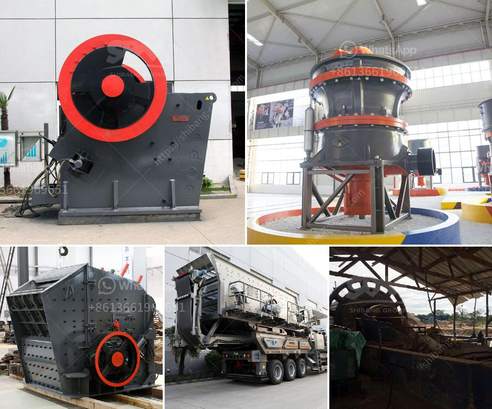

<h3>أنواع كسارات الحجر الجيري</h3>
تُعتبر كسارات الحجر الجيري من أكثر المعدات استخدامًا وطلبًا في صناعة البناء والهندسة المدنية. تُستخدم هذه الكسارات في سحق الحجر الجيري، الذي يُستخدم في العديد من التطبيقات مثل صناعة الأسمنت والطرق والبناء والتشييد والتعدين. وتتنوع أنواع كسارات الحجر الجيري بحسب نوع الآلة ووظيفتها والحجم المطلوب للحصى النهائي. سنستعرض في هذه المقالة بعضًا من الأنواع الرئيسية لكسارات الحجر الجيري.

تُعتبر كسارة الفك من أكثر الكسارات شيوعًا واستخدامًا في صناعة البناء والتعدين. تعمل هذه الكسارة عن طريق ضغط الحجر الجيري بين لوحتين صلبتين، مما يؤدي إلى تحطيمه إلى أجزاء صغيرة. تستخدم كسارات الفك عادةً لسحق الحجارة الكبيرة إلى أحجام أصغر، وتتوفر بمختلف الموديلات والسعات والأحجام المناسبة للاحتياجات المختلفة.

تعتبر كسارة الصدم من الأنواع الأكثر شيوعًا لسحق الحجارة والتي تسمح بانتاج الركام بحجم وشكل معين. تعمل كسارة الصدم عن طريق توجيه الحجارة نحو قطعة صلبة ثابتة، مما يؤدي إلى تحطيمها وتفتيتها. تتوفر كسارات الصدم عادةً بمختلف الأحجام والقدرات ويمكن تعديلها لإنتاج مواد ذات أحجام مختلفة.

تُستخدم كسارة المخروط عادةً لسحق الحجر الجيري الصلب والمتوسط الثبات. تعمل هذه الكسارة عن طريق الضغط والطحن بين غطاء الكسارة والجدران الداخلية، مما يؤدي إلى تكسير الحجم الكبير للحجر الجيري إلى أجزاء أصغر وأكثر تجانسًا.

تعتبر كسارة الأسطوانة من الأنواع الفعالة في سحق الحجر الجيري، وتعمل عن طريق الضغط بين أسطوانتين صلبتين. تتميز الكسارة بالقدرة على سحق الحجر الجيري إلى حجم معين مع الحفاظ على تجانس المنتج النهائي.

تعد هذه الأنواع فقط مقتصرة على أنواع كسارات الحجر الجيري الشائعة وهناك أنواع أخرى مثل كسارة الطواحين وكسارة المطرقة وغيرها. ومن الجدير بالذكر أنه يجب اختيار النوع المناسب من كسارات الحجر الجيري بناءً على الاحتياجات ومتطلبات العمل والمواد المستخدمة.
<h3>Contact us</h3><ul><li><strong>Whatsapp:&nbsp;<a href="https://wa.me/8613661969651">+8613661969651</a></strong></li><li><a href="https://swt.shibang-china.com/?git&amp;zhl&amp;أنواع كسارات الحجر الجيري"><strong>Online Service(chat now)</strong></a></li></ul><h3>Related</h3><ul><li><a href='كسارة في أنتيوكيا، كولومبيا.md'>كسارة في أنتيوكيا، كولومبيا</a></li><li><a href='مصنع غسيل الرمل للبيع.md'>مصنع غسيل الرمل للبيع</a></li><li><a href='كسارة للجرانيت.md'>كسارة للجرانيت</a></li><li><a href='مصنع معدات التعدين للذهب.md'>مصنع معدات التعدين للذهب</a></li><li><a href='شركة تصنيع معدات كسارة الحجر في ألمانيا.md'>شركة تصنيع معدات كسارة الحجر في ألمانيا</a></li></ul>