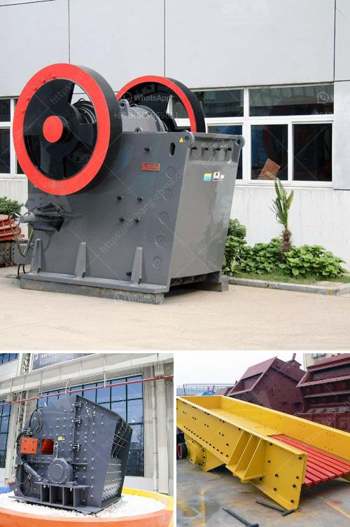

<h3>أنواع كسارات الفحم المستخدمة في الصناعة</h3>
تعد صناعة الفحم من الصناعات الحيوية والتي توفر الطاقة للعديد من الدول والشركات حول العالم. وتعتبر كسارات الفحم جزءًا هامًا في عملية استخراج الفحم وتحضيره للاستخدام في الصناعة.

توجد العديد من أنواع كسارات الفحم المستخدمة في الصناعة، ومن بينها: الكسارة الفكية وكسارة الأسطوانة وكسارة الصدم وكسارة المخروط وغيرها. تعتمد اختيار الكسارة المناسبة على عوامل مثل حجم الفحم ونسبة الرطوبة ومقاومة الكسر المطلوبة.

1. الكسارة الفكية: تستخدم هذه الكسارة في سحق الفحم بواسطة الضغط بين الفك المتحرك والثابت. تتميز الكسارة الفكية ببنية بسيطة وسهولة التشغيل والصيانة، وتستخدم لفحص الفحم الخام الذي يكون فيه حجم الجسيمات كبيرًا.

2. كسارة الأسطوانة: تستخدم كسارة الأسطوانة في سحق الفحم بواسطة الضغط بين اسطوانتين ملساء تدوران في اتجاهات متعاكستين. تستخدم هذه الكسارة في سحق الفحم الخام وتقليل حجم الجسيمات المطلوبة للصناعة.

3. كسارة الصدم: تعمل عن طريق الصدم بين قطعة الفحم وأداة الضرب المتحركة. تستخدم هذه الكسارة في سحق الفحم الصلب والمتوسط الصلابة.

4. كسارة المخروط: تستخدم في سحق الفحم بواسطة الضغط بين الجزء المتحرك والثابت من المخروط. تستخدم هذه الكسارة في سحق الفحم ذو الجودة العالية والصلابة العالية.

علاوة على ذلك، توجد أنواع أخرى من كسارات الفحم مثل كسارة الأثر وكسارة الخرسانة وكسارة الحجر الجيري التي يمكن استخدامها أيضًا في صناعة الفحم.

باختصار، توجد العديد من أنواع كسارات الفحم المستخدمة في الصناعة وتختلف حسب المتطلبات والشروط المحددة لكل مرحلة في عملية استخراج الفحم وتحضيره. يجب على الشركات اختيار النوع المناسب الذي يتناسب مع احتياجاتها والجودة المطلوبة للإنتاج النهائي.
<h3>Contact us</h3><ul><li><strong>Whatsapp:&nbsp;<a href="https://wa.me/8613661969651">+8613661969651</a></strong></li><li><a href="https://swt.shibang-china.com/?git&amp;zhl&amp;أنواع كسارات الفحم المستخدمة في الصناعة"><strong>Online Service(chat now)</strong></a></li></ul><h3>Related</h3><ul><li><a href='سعر محطم محمول.md'>سعر محطم محمول</a></li><li><a href='آلة كسارة صغيرة للبيع في زيمبابوي.md'>آلة كسارة صغيرة للبيع في زيمبابوي</a></li><li><a href='مطحنة نيجيريا.md'>مطحنة نيجيريا</a></li><li><a href='كسارات الحجر الرئيسية.md'>كسارات الحجر الرئيسية</a></li><li><a href='كسارة الصخور للبيع في الفلبين.md'>كسارة الصخور للبيع في الفلبين</a></li></ul>