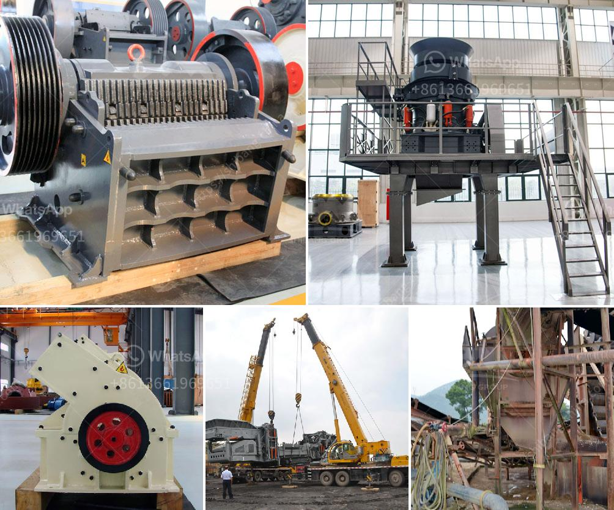

<h3>أنواع كسارة الحصى</h3>
تعدّ كسارة الحصى من الأدوات الرئيسية في عمليات تكسير وطحن الحصى والصخور الصلبة. تستخدم هذه الكسارات في عدة صناعات مثل صناعة البناء والمناجم والطرق والسدود والإنشاءات العامة. تتوفر مجموعة واسعة من أنواع كسارة الحصى لتلبية احتياجات الصناعات المختلفة. سألقي الضوء على بعض أنواع الكسارات الشائعة:

تعتبر كسارة الفك من الأنواع الأكثر استخدامًا وشهرة في صناعة تكسير الحصى. تتكون من جزء ثابت وجزء متحرك، حيث يتم سحق المواد عن طريق تحريك الفك المتحرك للأمام وللخلف في حركة دورانية. تمتاز بأنها توفر نسبة تكسير عالية وإنتاجية كبيرة.

تستخدم كسارة الصدم في تكسير الحصى والصخور بفضل قدرتها على تكسير المواد بشكل سريع وفعال. تعمل عن طريق ضرب المواد بواسطة صفيحة الضربة المتحركة، مما ينتج عنه تكسير الحصى إلى قطع صغيرة. تعتبر كسارة الصدم من الأنواع الأكثر استخدامًا في صناعة البناء والطرق.

تمتاز كسارة المخروط بتشكيلها الهندسي الخاص، حيث يكون لديها قمة مدببة وقاعدة مسطحة. تستخدم لتكسير الصخور والحصى بفعالية، وتعمل عن طريق ضغط المواد بين قاعدة المخروط الثابتة والمخروط المتحرك الموجود فوقه.

تعتبر كسارة المطرقة مناسبة لتكسير الحصى الصلب والصخور ذات القوامة العالية. تتكون من جسم رئيسي ومطرقة تدور بسرعة عالية، حيث يتم ضرب المواد بالمطرقة لتتكسر إلى قطع صغيرة.

هي عبارة عن جهاز يتكون من أسطوانتين متوازيتين تدوران في اتجاهين معكوسين. تستخدم لتكسير الحصى الصلب والصخور الكبيرة إلى قطع صغيرة بفضل ضغط الأسطوانة على المواد.

هذه بعض الأنواع الشائعة لكسارة الحصى. يمكن اختيار نوع محدد وفقًا للمتطلبات ونوع المواد التي ستتم معالجتها. يجب دراسة هذه الاحتياجات والاعتماد على الخبرة والاستشارة المهنية لاختيار أنسب نوع لكسارة الحصى للحصول على أداء فعال ونتائج مرضية.
<h3>Contact us</h3><ul><li><strong>Whatsapp:&nbsp;<a href="https://wa.me/8613661969651">+8613661969651</a></strong></li><li><a href="https://swt.shibang-china.com/?git&amp;zhl&amp;أنواع كسارة الحصى"><strong>Online Service(chat now)</strong></a></li></ul><h3>Related</h3><ul><li><a href='آلة فحص في سنغافورة.md'>آلة فحص في سنغافورة</a></li><li><a href='سعر مصنع كسارة محمولة في نيجيريا.md'>سعر مصنع كسارة محمولة في نيجيريا</a></li><li><a href='مطحنة طحن عمودية.md'>مطحنة طحن عمودية</a></li><li><a href='سعات مطحنة الأسطوانة العمودية.md'>سعات مطحنة الأسطوانة العمودية</a></li><li><a href='كسارة صخور لخام الكروم أو الكروميت.md'>كسارة صخور لخام الكروم أو الكروميت</a></li></ul>