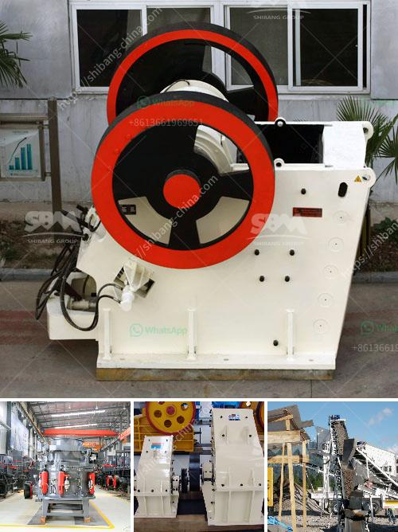

<h3>أهداف مطحنة الكرة</h3>
تعتبر مطحنة الكرة أحد المعدات الهامة في صناعة الطحن والمنتجات الكيميائية والمعادن. تهدف مطحنة الكرة إلى سحق المواد الخام إلى حجم أصغر، وتحويلها إلى مسحوق. تعد هذه العملية جزءًا أساسيًا في صناعات مثل التعدين والهندسة الكيميائية والبناء وغيرها.

أحد الأهداف الرئيسية لمطحنة الكرة هو تحقيق الطحن الفعال والأمثل للمواد. فعملية الطحن المثالية تكون عندما يتم تحويل المواد الخام إلى حجم نهائي محدد ومناسب للاستخدام المطلوب. يتم ضبط سرعة دوران المطحنة وزمن الطحن وحجم الكرات المستخدمة لتحقيق هذا الهدف.

بجانب التحكم في حجم المنتج النهائي، تهدف مطحنة الكرة أيضًا إلى تحسين كفاءة عملية الطحن. يستخدم العديد من المعادن مثل الذهب والفضة والنحاس مطاحن الكرة لاستخلاص القيمة من الخام. تحسن الكفاءة العامة لعملية الطحن يعني زيادة الإنتاجية وتقليل التكاليف وتوفير الزمن والطاقة المطلوبة.

أهداف مطحنة الكرة تشمل أيضًا تحقيق درجة التفتيت المطلوبة. فبعض المواد مثل المعادن الثقيلة تحتاج إلى تفتيت دقيق لاستخلاص المعادن القيمة الموجودة فيها. يعمل نظام الكرات داخل المطحنة على سحق المواد بشكل فعال وتحقيق أعلى درجة تفتيت ممكنة.

نقطة أخرى هامة لمطحنة الكرة هي الحفاظ على جودة المنتج النهائي. يجب على المطحنة أن تكون قادرة على تقديم منتج بحجم وتفتيت ونسبة نهائية معينة ومتسقة. بفضل جودة المنتج المحققة من خلال مطحنة الكرة، يتم زيادة قيمة المنتج النهائي ورضا العملاء.

باختصار، يمكننا القول أن أهداف مطحنة الكرة تشمل تحقيق الطحن الفعال والأمثل، وتحسين كفاءة عملية الطحن، وتحقيق درجة التفتيت المطلوبة، والحفاظ على جودة المنتج النهائي. يعتبر تحقيق هذه الأهداف أمرًا حاسمًا لنجاح الصناعات التي تعتمد على عملية الطحن، وتؤثر بشكل مباشر على الإنتاجية وكفاءة استخلاص المواد القيمة من الخام.
<h3>Contact us</h3><ul><li><strong>Whatsapp:&nbsp;<a href="https://wa.me/8613661969651">+8613661969651</a></strong></li><li><a href="https://swt.shibang-china.com/?git&amp;zhl&amp;أهداف مطحنة الكرة"><strong>Online Service(chat now)</strong></a></li></ul><h3>Related</h3><ul><li><a href='شركة تصنيع مطحنة ريموند في جنوب أفريقيا.md'>شركة تصنيع مطحنة ريموند في جنوب أفريقيا</a></li><li><a href='آلات معالجة الكاولين للبيع.md'>آلات معالجة الكاولين للبيع</a></li><li><a href='مصنع غسيل الكروم للبيع في جنوب أفريقيا.md'>مصنع غسيل الكروم للبيع في جنوب أفريقيا</a></li><li><a href='مطحنة الكرة لطحن الفلسبار.md'>مطحنة الكرة لطحن الفلسبار</a></li><li><a href='كسارات محمولة.md'>كسارات محمولة</a></li></ul>