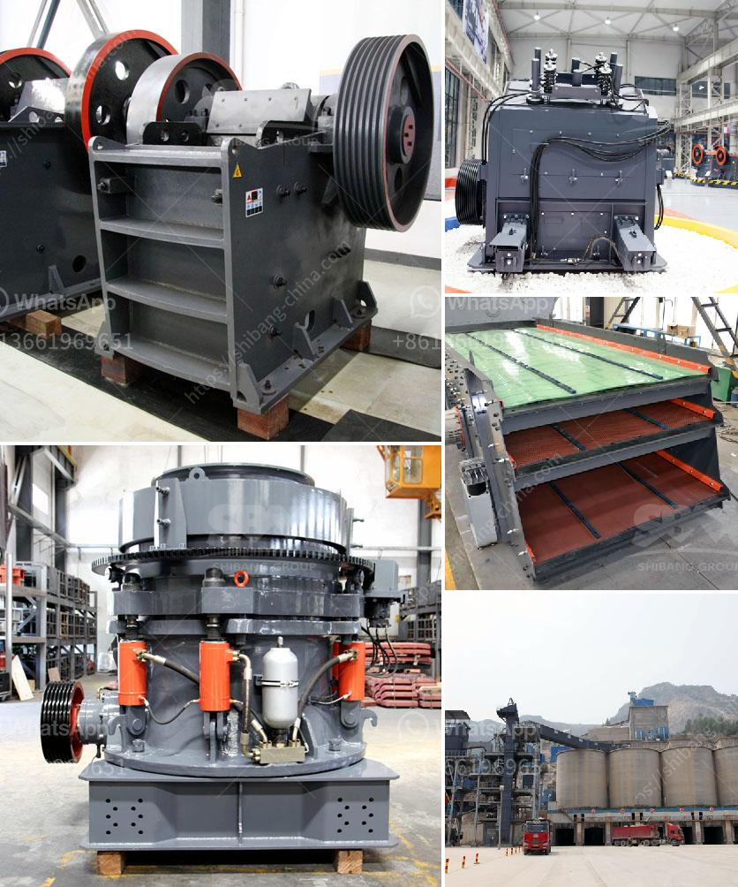

<h3>إجراء إنتاج الأسمنت في المطحنة العمودية</h3>
تُعتبر الأسمنت من أهم المواد الإنشائية المستخدمة في العديد من الصناعات، مثل البناء والهندسة المدنية. وتعتبر المطاحن العمودية واحدة من أحدث التقنيات المستخدمة في إنتاج الأسمنت، إذ تتميز بالعديد من المميزات التي تجعلها خيارًا مثاليًا للصناعات المختلفة.

تتكون المطاحن العمودية من هيكل عمودي وطاحونة دوارة تسمى طاحونة الأسطوانة. وتعمل المطاحن العمودية عن طريق تغذية المواد الخام إلى الطاحونة، حيث تتم معالجة الخام بشكل ميكانيكي عن طريق ضغطه وطحنه بواسطة الأسطوانة الدوارة. ومن ثم، يتم طحن الخام إلى مسحوق ناعم يُعرف باسم الكلنكر.

إحدى المزايا الرئيسية للمطاحن العمودية هي قدرتها على توفير الطاقة وتقليل استهلاك الوقود. فعندما يتم تأريض الخام في المطحنة العمودية، يتم تدويره بسرعة عالية مما يؤدي إلى تعرض الخام للقوى الطاحنة. وبالتالي، يتم طحن الخام بشكل أفضل وأكثر كفاءة.

بالإضافة إلى ذلك، تُعتبر المطاحن العمودية مناسبة للمواد الخام ذات الرطوبة العالية والمواد اللاصقة. فعندما يتم تغذية هذه المواد إلى المطحنة، يتم جفاف الرطوبة من المواد ومنع التصاقها بجدران الطاحونة.

كما أن المطاحن العمودية توفر مساحة أقل وتكلفة أقل في التثبيت. فبفضل التصميم العمودي، يمكن تثبيت المطحنة بشكل أكثر انسجامًا في منطقة محدودة. ومن ثم، يمكن تحقيق توفير في التكاليف المرتبطة بالهندسة المدنية والتثبيت.

في الختام، يُعتبر إجراء إنتاج الأسمنت في المطحنة العمودية خيارًا مبتكرًا وفعالًا للصناعات المختلفة. فهو يعمل على تحقيق توفير في الطاقة والوقود، كما يمكنه طحن المواد الخام بشكل أفضل وتوفير مساحة وتكلفة أقل في التثبيت. وبالتالي، تُعتبر المطاحن العمودية خيارًا مثاليًا للشركات والمصانع التي تسعى لتحسين كفاءة إنتاج الأسمنت وتقليل تكاليف التشغيل.
<h3>Contact us</h3><ul><li><strong>Whatsapp:&nbsp;<a href="https://wa.me/8613661969651">+8613661969651</a></strong></li><li><a href="https://swt.shibang-china.com/?git&amp;zhl&amp;إجراء إنتاج الأسمنت في المطحنة العمودية"><strong>Online Service(chat now)</strong></a></li></ul><h3>Related</h3><ul><li><a href='كيفية صنع مسحوق الطين الأحمر للغراز.md'>كيفية صنع مسحوق الطين الأحمر للغراز</a></li><li><a href='كسارة الحجر للبيع.md'>كسارة الحجر للبيع</a></li><li><a href='سعر مطاحن الكرة.md'>سعر مطاحن الكرة</a></li><li><a href='مصانع المعالجة في الصين للحجر الجيري.md'>مصانع المعالجة في الصين للحجر الجيري</a></li><li><a href='سير الناقل في ميريدا.md'>سير الناقل في ميريدا</a></li></ul>