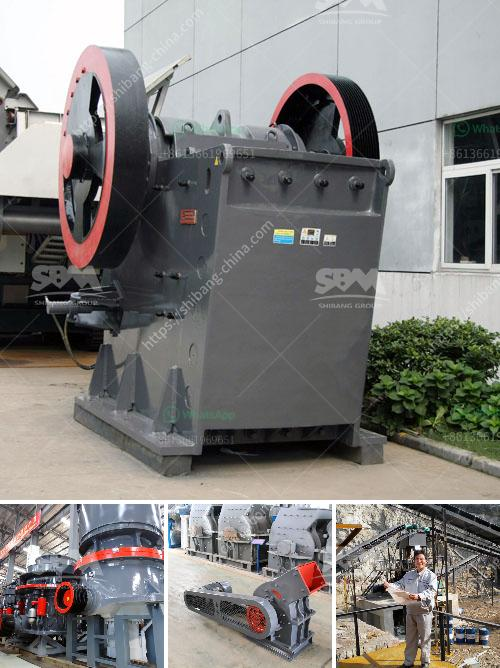

<h3>إجراء التعدين في محجر الحجر الجيري</h3>
يعتبر التعدين في محجر الحجر الجيري عملية مهمة وضرورية لاستخراج الحجر الجيري الذي يستخدم في العديد من الصناعات مثل البناء والصناعات الكيماوية والزراعة. يتم تحويل الأراضي الطبيعية إلى موقع تعدين لاستخراج الحجر الجيري بطرق متعددة وعمليات تتطلب تخطيط وتنفيذ دقيق.

أول خطوة في عملية التعدين هو تحديد الموقع المناسب لإنشاء المحجر. يجب أن يكون الموقع قريبًا من مصادر الحجر الجيري ويتميز بتربة صالحة للعمليات الاستخراجية. يتم دراسة الجغرافيا والمناخ والتضاريس والتربة قبل تحديد الموقع المثالي.

ثانيًا، يتم إجراء عمليات الحفر والتفتيت. يتم استخدام المعدات الثقيلة مثل الحفارات والمثاقب للحفر في الأرض وإعداد المنطقة لعملية التعدين. يتم تفتيت الصخور واستخراج الحجارة الكبيرة باستخدام المطارق الهيدروليكية والمكابس الكبيرة.

ثالثًا، يتم نقل الحجر الجيري إلى مكان المعالجة. يتم استخدام الحفارات والجرارات وناقلات الحجارة لنقل الحجارة إلى وحدة المعالجة حيث يتم إزالة الشوائب والتلوث من الحجر الجيري.

رابعًا، يتم تكسير الحجارة الكبيرة إلى حجم صغير أو متوسط باستخدام المطارق الكبيرة أو الكسارات الحجرية. يتم تقسيم الحجر الجيري إلى حصى وحصوات ورقاقات صغيرة لاستخدامها في الصناعات المختلفة.

أخيرًا، يتم نقل الحجر الجيري المعالج إلى الأسواق أو المصانع. يتم استخدام الشاحنات والشاحنات الكبيرة لنقل الحجر الجيري إلى وجهته المقصودة حيث يتم استخدامه في البناء أو الصناعات الأخرى.

يجب أن يتم إجراء التعدين في محجر الحجر الجيري بعناية وفقًا للمعايير البيئية والصحية. يجب أن تتخذ الشركات المشرفة على عمليات التعدين كافة التدابير اللازمة للحفاظ على البيئة والمحافظة على الحياة النباتية والحيوانية المحلية. يجب أن يتم استخدام التكنولوجيا الحديثة والمعدات الآمنة لتحقيق أقصى استدامة في عمليات التعدين.

إن عملية التعدين في محجر الحجر الجيري تعتبر جزءًا أساسيًا من صناعة البناء والصناعات الأخرى. تعتمد جودة الحجر الجيري المستخدمة في هذه الصناعات على عمليات التعدين الصحيحة والفعالة. يجب أن يتم تنفيذ عمليات التعدين بمهارة وحذر للحفاظ على التوازن البيئي وتحقيق أقصى استفادة من هذه الموارد الطبيعية الثمينة.
<h3>Contact us</h3><ul><li><strong>Whatsapp:&nbsp;<a href="https://wa.me/8613661969651">+8613661969651</a></strong></li><li><a href="https://swt.shibang-china.com/?git&amp;zhl&amp;إجراء التعدين في محجر الحجر الجيري"><strong>Online Service(chat now)</strong></a></li></ul><h3>Related</h3><ul><li><a href='شراء مطحنة الكرة في بيرو.md'>شراء مطحنة الكرة في بيرو</a></li><li><a href='مطحنة ريموند للبنتونيت.md'>مطحنة ريموند للبنتونيت</a></li><li><a href='نوع مطحنة طاحونة عمودية في ماليزيا.md'>نوع مطحنة طاحونة عمودية في ماليزيا</a></li><li><a href='كسارة الحجر المحجر.md'>كسارة الحجر المحجر</a></li><li><a href='تأجير حزام الناقل في أيرلندا.md'>تأجير حزام الناقل في أيرلندا</a></li></ul>