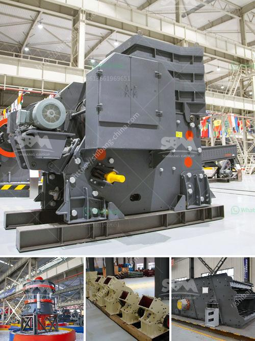

<h3>إجراء بدء التشغيل لمطحنة الكرة</h3>
تُعتبر مطاحن الكرة أحد أشهر وسائل تكسير المواد الصلبة في العديد من الصناعات. وتُستخدم بشكل خاص في صناعة تصنيع الأسمنت والمواد الكيميائية والألغام والسيراميك. يتم استخدام هذا الجهاز لطحن المواد الخام إلى حجم أصغر، وذلك بواسطة كرات فولاذية تدور داخل المطحنة.

يُعد بدء التشغيل لمطحنة الكرة من أهم الخطوات التي يجب اتباعها لضمان تشغيل آمن وفعال للجهاز. وفيما يلي نقدم لكم إجراءات بدء التشغيل الأساسية لمطحنة الكرة:

1- التحقق من الإعدادات الأولية: قبل بدء تشغيل المطحنة، يجب التأكد من أن جميع إعدادات المطحنة معدة بشكل صحيح. يشمل ذلك التحقق من صحة تركيب وتشغيل المحركات والمكونات الأخرى المتصلة بالجهاز، بالإضافة إلى فحص المواد الصلبة الموجودة داخل المطحنة للتأكد من نظافتها وعدم وجود أي مواد غريبة تؤثر على الأداء.

2- التشحيم الجيد: يجب تأكيد أن أجزاء المطحنة مزودة بكمية كافية من الزيت أو الشحوم التي تحتاجها للتشغيل الفعال. وينبغي توزيع المواد التشحيم بطريقة صحيحة بحيث تصل إلى كافة المناطق التي تحتاجها لتفادي الاحتكاك غير المرغوب فيه ومنع البليع من الحدوث.

3- التحقق من الجهد الكهربائي: يجب أن يتم التحقق من جهد التشغيل المناسب للمطحنة، وذلك بمراجعة البيانات الفنية المرفقة مع الجهاز. يُنصح بفحص الأسلاك الكهربائية والوقاية اللازمة للتأكد من أنها تلبي المعايير اللازمة لتشغيل المطحنة بأمان.

4- اختبار الجهاز بحمولة خفيفة: قبل تحميل المطحنة بالمواد الصلبة، يجب تشغيل الجهاز بحمولة خفيفة لفترة قصيرة، وذلك للتأكد من أنه يعمل كما هو متوقع وأن جميع الأجزاء تعمل بشكل سليم. يُنصح باختبار الجهاز لمدة 15-30 دقيقة ومراقبة درجة الحرارة والضوضاء والاهتزازات لتأكيد صحة عمل المطحنة.

5- تحميل المادة الصلبة: بعد التأكد من أن المطحنة تعمل بشكل جيد، يمكن تحميل المواد الصلبة المراد طحنها في المطحنة. يجب الانتباه إلى كمية المواد المحملة داخل المطحنة للتأكد من أنها ضمن الحدود المسموح بها، وعدم تحميل المطحنة بكميات كبيرة قد تؤدي إلى تلف المعدات أو التأثير على أداء المطحنة.

في الختام، يعد بدء التشغيل لمطحنة الكرة خطوة حاسمة لتحقيق أداء فعال وآمن للجهاز. ينبغي اتباع الإجراءات المذكورة أعلاه والاهتمام الكبير بالتفاصيل الفنية لتجنب أي مشاكل قد تنشأ خلال التشغيل. إن احترافية التعامل مع هذا الجهاز ستؤدي إلى زيادة الإنتاجية وتحسين جودة المنتج النهائي.
<h3>Contact us</h3><ul><li><strong>Whatsapp:&nbsp;<a href="https://wa.me/8613661969651">+8613661969651</a></strong></li><li><a href="https://swt.shibang-china.com/?git&amp;zhl&amp;إجراء بدء التشغيل لمطحنة الكرة"><strong>Online Service(chat now)</strong></a></li></ul><h3>Related</h3><ul><li><a href='كسارات تأجير.md'>كسارات تأجير</a></li><li><a href='بيع آلة مطحنة الأسطوانة.md'>بيع آلة مطحنة الأسطوانة</a></li><li><a href='خط إنتاج مطحنة عمودية LM.md'>خط إنتاج مطحنة عمودية LM</a></li><li><a href='رسم تخطيطي لعملية إنتاج الأسمنت.md'>رسم تخطيطي لعملية إنتاج الأسمنت</a></li><li><a href='الكسارة المحمولة ١٥٠ طن في الساعة.md'>الكسارة المحمولة ١٥٠ طن في الساعة</a></li></ul>