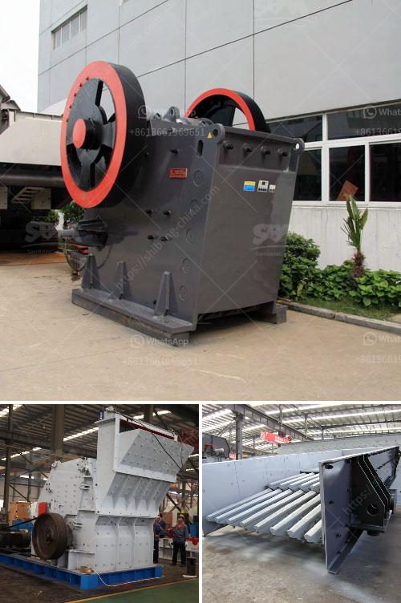

<h3>إجراءات تصحيحية لسيور النقل</h3>
تُعد سيور النقل أحد العناصر الرئيسية في صناعة النقل والتصنيع، حيث تستخدم في نقل المواد والمنتجات عبر مسافات طويلة. ولكن مع مرور الوقت، قد تتعرض السيور لأضرار واهتراء يؤثر على أدائها وقدرتها على العمل بشكل صحيح. لذا، يعد اتخاذ إجراءات تصحيحية للمحافظة على سلامة وأداء السيور مهما جدًا. فيما يلي بعض الإجراءات التصحيحية العامة التي يمكن اتخاذها:

1. فحص منتظم: يجب على العاملين فحص السيور بشكل منتظم للتأكد من عدم وجود تلف أو تآكل. ينبغي أن يتم فحص الأطراف والاستعانة بأدوات قياس للتحقق من مستوى التوتر والميلان وزاوية المسامير.

2. تشحيم: قد تحتاج السيور إلى التشحيم المناسب لتقليل الاحتكاك ومنع التعب والتآكل. يجب استخدام المواد المناسبة واتباع توصيات الشركة المصنعة.

3. اعتماد إجراءات السلامة: يجب على العاملين اتباع إجراءات السلامة المناسبة عند التعامل مع السيور، مثل وضع ملصقات تحذيرية واستخدام ملابس واقية والتدريب على كيفية التعامل الآمن.

4. توقيت السيور: يجب ضبط التوقيت المناسب للسيور بحيث تعمل بشكل متزامن وتقوم بنقل المواد بدقة. يمكن ضبط التوقيت عن طريق التحكم بسرعة السيور وتعديل وضع الأسطوانات.

5. استبدال الأجزاء التالفة: في حالة وجود أي أجزاء تالفة أو متآكلة، يجب استبدالها على الفور لضمان استمرارية الأداء العالي للسيور. قد يتطلب الأمر الاستعانة بفنيين مؤهلين للقيام بذلك.

6. التنظيف الدوري: ينبغي تنظيف السيور بانتظام لإزالة الأوساخ والرواسب والشوائب التي يمكن أن تؤثر على أدائها. يمكن استخدام فرشاة أو أداة تنظيف لهذا الغرض.

7. التحقق من توازن السيور: يجب التحقق من توازن السيور بانتظام للتأكد من توزيع العبئة على الأسطوانات بشكل صحيح. يمكن استخدام أجهزة القياس المتخصصة لضبط التوازن إن لزم الأمر.

في النهاية، يجب أن يتم اتخاذ الإجراءات التصحيحية المناسبة للحفاظ على سلامة وأداء سيور النقل. ينبغي على العاملين مراقبة السيور بشكل دوري والاستعانة بخبراء مؤهلين عند الحاجة. باستخدام الإجراءات المناسبة، يمكن ضمان استمرارية الأداء العالي للسيور وتحقيق الكفاءة في عملية النقل والتصنيع.
<h3>Contact us</h3><ul><li><strong>Whatsapp:&nbsp;<a href="https://wa.me/8613661969651">+8613661969651</a></strong></li><li><a href="https://swt.shibang-china.com/?git&amp;zhl&amp;إجراءات تصحيحية لسيور النقل"><strong>Online Service(chat now)</strong></a></li></ul><h3>Related</h3><ul><li><a href='أفضل كسارة طين في الهند.md'>أفضل كسارة طين في الهند</a></li><li><a href='آلات كسارة الحجر الكوارتز.md'>آلات كسارة الحجر الكوارتز</a></li><li><a href='كسارة الإسمنت في تركيا.md'>كسارة الإسمنت في تركيا</a></li><li><a href='كسارات متنقلة في الولايات المتحدة المتحدة.md'>كسارات متنقلة في الولايات المتحدة المتحدة</a></li><li><a href='مصنع كامل لكسارة الحجر الجرانيت.md'>مصنع كامل لكسارة الحجر الجرانيت</a></li></ul>