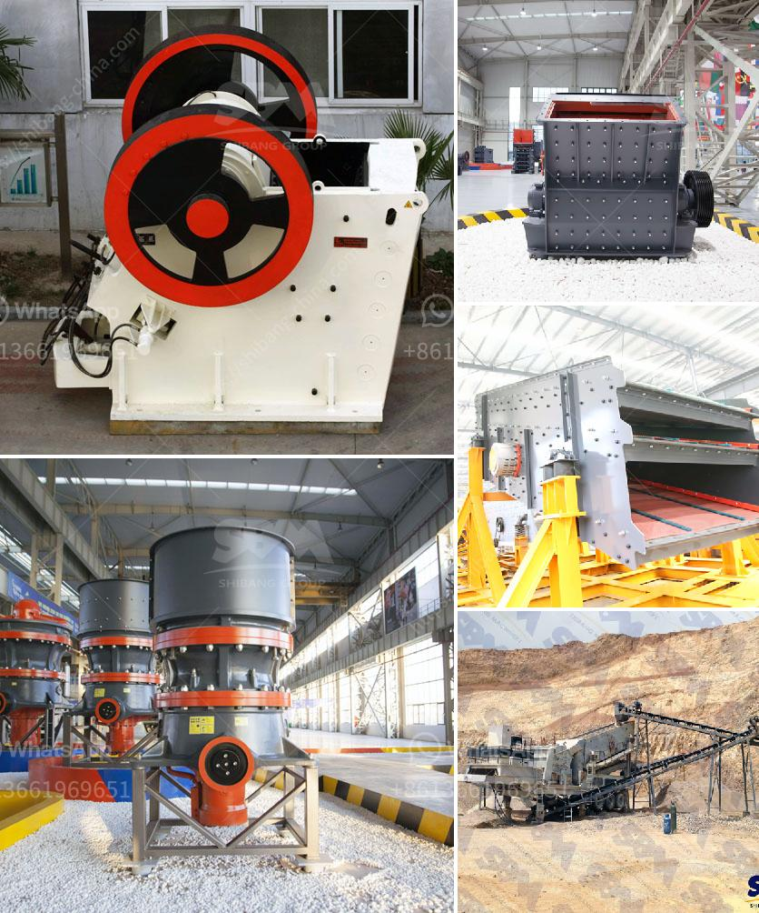

<h3>إجراءات مكتبية لمصنع كسارة الحجر في مدى</h3>
يعد مصنع كسارة الحجر من أهم المشاريع الصناعية في مجال استخراج الحجر وتجهيزه للاستخدام في العديد من الصناعات. ولضمان نجاح وفعالية عمل المصنع، يتطلب التركيز والتنظيم الجيدين للإجراءات المكتبية المتعلقة به. في هذه المقالة، سنستعرض بعض الإجراءات المكتبية الضرورية لتحقيق هذا الهدف.

1- تحديد الأهداف ووضع الخطط: يجب أن يتم تحديد أهداف المصنع بوضوح ودقة، سواء كانت أهداف قصيرة المدى أو طويلة المدى. كما يجب وضع خطط مفصلة لتحقيق هذه الأهداف، مع تحديد المهام والمسؤوليات لكل فرد.

2- الإدارة المالية: يجب وضع نظام حسابي فعال لمتابعة الإيرادات والمصروفات والأرباح والخسائر. يجب أن يتم تحديد الميزانية الشهرية ومراقبتها بدقة، مع اتخاذ إجراءات لتحسين الأداء المالي إذا لزم الأمر.

3- إدارة المخزون: يجب أن يتم تصنيف وتنظيم المخزون بشكل جيد لتجنب فقدان الحجر أو هدره. يجب على العاملين في المصنع أن يكونوا قادرين على تحديد الاحتياجات وتوفير الحجر المطلوب في الوقت المناسب.

4- إدارة الموظفين: يجب وضع سياسات وإجراءات للتوظيف والتدريب وتقييم أداء الموظفين. يجب أن يتم توفير بيئة عمل مناسبة ومحفزة للموظفين، وتعزيز العمل الجماعي والتواصل الجيد بينهم.

5- السلامة والصحة المهنية: يجب توفير بيئة عمل آمنة وصحية للعاملين بالمصنع. يجب وضع سياسات وإجراءات للمحافظة على السلامة، بما في ذلك التدريب المستمر للموظفين على استخدام واقيات السلامة والمعدات اللازمة.

6- التسويق والعلاقات العامة: يجب وضع استراتيجية تسويقية فعالة للمصنع، بما في ذلك تحديد العملاء المستهدفين ووضع خطة للترويج لمنتجات المصنع. يجب أيضًا العمل على بناء علاقات جيدة مع العملاء والموردين والمجتمع المحلي.

7- التكنولوجيا والابتكار: يجب متابعة التطورات التكنولوجية في مجال صناعة استخراج الحجر والاستفادة منها في تحسين عمل المصنع. يجب أن يتم تشجيع الابتكار والإبداع بين الموظفين وتبني أفكار جديدة تعزز الإنتاجية والجودة.

إن إدارة المصنع في المدى بين 200-400 كلمة تتطلب الاهتمام بالتفاصيل وتحديد الأهداف ووضع الخطط اللازمة لتحقيقها. يجب أن يكون هناك تنظيم جيد للإجراءات المكتبية المتعلقة بالإدارة المالية وإدارة المخزون وإدارة الموظفين والسلامة والصحة المهنية والتسويق والعلاقات العامة، بالإضافة إلى متابعة التطورات التكنولوجية والابتكار. يجب أن تكون هذه الإجراءات متكاملة بشكل جيد لتحقيق أقصى قدر من الكفاءة والنجاح لمصنع كسارة الحجر.
<h3>Contact us</h3><ul><li><strong>Whatsapp:&nbsp;<a href="https://wa.me/8613661969651">+8613661969651</a></strong></li><li><a href="https://swt.shibang-china.com/?git&amp;zhl&amp;إجراءات مكتبية لمصنع كسارة الحجر في مدى"><strong>Online Service(chat now)</strong></a></li></ul><h3>Related</h3><ul><li><a href='موردين مطاحن الطحن في ججرانوالا.md'>موردين مطاحن الطحن في ججرانوالا</a></li><li><a href='مطاحن الكرة المستخدمة في بيرو.md'>مطاحن الكرة المستخدمة في بيرو</a></li><li><a href='كسارة مخروطية في الشرق الأوسط.md'>كسارة مخروطية في الشرق الأوسط</a></li><li><a href='مصنع كسارة الدولوميت في ناجبور.md'>مصنع كسارة الدولوميت في ناجبور</a></li><li><a href='سعر كسارة الحجر المحمولة في الفلبين.md'>سعر كسارة الحجر المحمولة في الفلبين</a></li></ul>