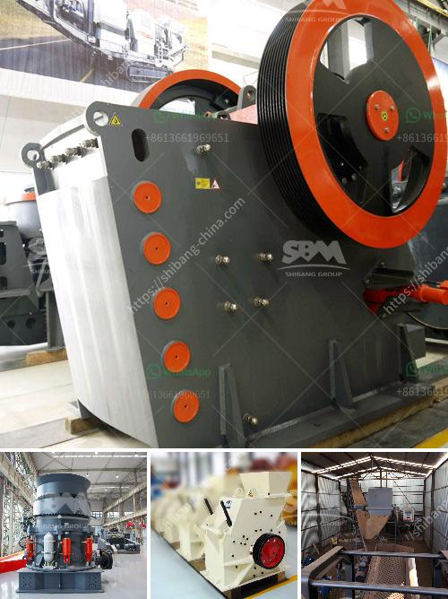

<h3>إجمالي الطاقة لكسارة الفك 500 طن في الساعة</h3>
تعد كسارة الفك طراز 500 طن في الساعة أحد الأجهزة المتقدمة في صناعة التعدين والبناء. تستخدم هذه الكسارة في سحق المواد الخام بكفاءة عالية وتحقيق إنتاجية كبيرة. إن إجمالي الطاقة اللازمة لهذا الجهاز لتشغيله والوصول إلى طاقته الإنتاجية القصوى يعتبر أمراً هاماً يجب أخذه في الاعتبار.

يعتمد إجمالي الطاقة لكسارة الفك 500 طن في الساعة على عدة عوامل، بما في ذلك قوة المحرك وسرعة الدوران ونسبة تحطيم المواد. قوة المحرك تؤثر بشكل كبير على قدرة الكسارة على سحق المواد. يتم قياس قدرة المحرك عادة بوحدة الواط أو كيلوواط. كلما كانت قوة المحرك أعلى، زادت قدرة الكسارة على سحق المواد بسرعة وفعالية أكبر.

بالإضافة إلى ذلك، تؤثر سرعة الدوران في إجمالي الطاقة للكسارة. كلما زادت سرعة الدوران، ازدادت سرعة سحق المواد وبالتالي زادت الطاقة المطلوبة لتشغيل الكسارة بكفاءة.

كما يلعب النسبة المئوية لتحطيم المواد دورًا هامًا في حساب إجمالي الطاقة. تحدد هذه النسبة مقدار التحطيم الذي يتم تنفيذه للمواد أثناء عملية السحق. عادة، يتطلب تحطيم المواد بنسبة أعلى كمية أكبر من الطاقة.

يتم قياس إجمالي الطاقة لكسارة الفك 500 طن في الساعة عادة بوحدة الكيلوواط ساعة. يتم استهلاك كمية محددة من الكهرباء لتشغيل المحرك والأجزاء الأخرى المتحركة في الكسارة. قد يؤدي تشغيل الكسارة بكامل طاقتها القصوى إلى ارتفاع استهلاك الطاقة الكهربائية.

من المهم أن يتم اختيار مصدر طاقة مناسب لتشغيل كسارة الفك 500 طن في الساعة بطريقة مستدامة. يجب اختيار محرك فعال من حيث استهلاك الطاقة وكفاءة التشغيل. ينبغي أيضاً مراعاة استخدام مصادر طاقة متجددة أو تقنيات توفير الطاقة لتقليل استهلاك الكهرباء وتحسين الكفاءة العامة للكسارة.

لخلاصة المقال، إجمالي الطاقة لكسارة الفك 500 طن في الساعة يتأثر بقوة المحرك وسرعة الدوران ونسبة تحطيم المواد. ولضمان تشغيل الكسارة بكفاءة، يجب اختيار مصدر طاقة مناسب واستخدام تقنيات توفير الطاقة المستدامة.
<h3>Contact us</h3><ul><li><strong>Whatsapp:&nbsp;<a href="https://wa.me/8613661969651">+8613661969651</a></strong></li><li><a href="https://swt.shibang-china.com/?git&amp;zhl&amp;إجمالي الطاقة لكسارة الفك 500 طن في الساعة"><strong>Online Service(chat now)</strong></a></li></ul><h3>Related</h3><ul><li><a href='سيور ناقلة معدنية في الألواح.md'>سيور ناقلة معدنية في الألواح</a></li><li><a href='معدات تعدين كاثود النحاس.md'>معدات تعدين كاثود النحاس</a></li><li><a href='مزايا وعيوب مطحنة الطحن.md'>مزايا وعيوب مطحنة الطحن</a></li><li><a href='الحجر الجيري اللازم لإنتاج طن واحد من الأسمنت.md'>الحجر الجيري اللازم لإنتاج طن واحد من الأسمنت</a></li><li><a href='معدات تعدين الذهب الطبيعي في الصين.md'>معدات تعدين الذهب الطبيعي في الصين</a></li></ul>