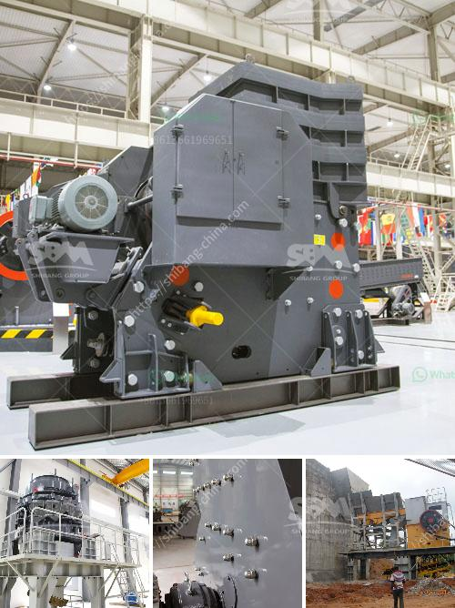

<h3>إعداد مصفاة الكروم</h3>
تعد مصفاة الكروم واحدة من المصانع الهامة في صناعة معالجة خامات الكروم وانتاج الكروم المكرر. يعتبر الكروم أحد المعادن الثمينة والمهمة في الصناعة بسبب خصائصه المميزة وتطبيقاته المتعددة. وتتم إعداد مصفاة الكروم من خلال عدة خطوات وعمليات، نتعرف فيما يلي على بعض هذه الخطوات:

1. سحق الخام: تبدأ عملية إعداد مصفاة الكروم بسحق الخام الى قطع صغيرة باستخدام كسارات ومطارق ضرب، لتسهيل العمليات اللاحقة.

2. طحن الخام: بعد سحق الخام، يجب طحنه إلى حجم أصغر لزيادة سطح التفاعل وسهولة استخلاص الكروم. يتم طحن الخام عن طريق آلات الطحن المختلفة مثل المطاحن والكرات الصلبة.

3. التخلص من الشوائب: بعد الطحن، يحتوي الخام على الشوائب والشوائب الأخرى مثل الطين والرمل. يتم إزالتها من خلال عمليات طحن إضافية أو بواسطة الطرق الكيميائية المناسبة.

4. تنقية الخام: تعتبر عملية التنقية أحد الخطوات الحاسمة في إعداد مصفاة الكروم. يتم فصل الكروم عن الشوائب الأخرى والعناصر الغريبة عن طريق استخدام مذيبات كيميائية مثل الأحماض. هذه العملية تتطلب الحذر الشديد والاحترافية لتجنب التسربات الكيميائية وتلوث المحيط المحيط.

5. تحويل الكروم إلى معدن: بعد تنقية الخام، يتم تحويل الكروم إلى معدن مستخدمًا تقنيات الانتاج المعدنية المختلفة. يمكن تحويل الكروم إلى شكل بارد لإنتاج ألواح وأسلاك أو تحويله إلى شكل ساخن لإنتاج قضبان وأنابيب.

6. معالجة النفايات: تعتبر عملية معالجة النفايات أحد الجوانب الهامة في إعداد مصفاة الكروم. يجب التخلص من النفايات الكيميائية بطرق مسؤولة وآمنة لتجنب التلوث البيئي. يتم غالبًا معالجة النفايات الكيميائية عبر عمليات إعادة التدوير أو التخلص المناسب.

باختصار، يتطلب إعداد مصفاة الكروم جهودًا كبيرة وعناية فائقة لضمان أداء تلك الخطوات بسلاسة وبطريقة آمنة وفعالة. تعد هذه المصفاة منشأة معقدة ومعتمدة على التكنولوجيا الحديثة والمعدات المتطورة لضمان الحصول على منتجات الكروم عالية الجودة، وتلبية احتياجات السوق المتنوعة.

باختصار، يلعب الكروم دورًا حيويًا في العديد من الصناعات مثل صناعة الفولاذ المقاوم للصدأ والطلاء والكتابة على الأنابيب. يساهم إعداد مصفاة الكروم في تلبية هذه الاحتياجات وتحسين جودة المنتجات المصنعة.
<h3>Contact us</h3><ul><li><strong>Whatsapp:&nbsp;<a href="https://wa.me/8613661969651">+8613661969651</a></strong></li><li><a href="https://swt.shibang-china.com/?git&amp;zhl&amp;إعداد مصفاة الكروم"><strong>Online Service(chat now)</strong></a></li></ul><h3>Related</h3><ul><li><a href='مصانع الكسارات تصنع.md'>مصانع الكسارات تصنع</a></li><li><a href='موردين لسحق الصخور في بريتوريا.md'>موردين لسحق الصخور في بريتوريا</a></li><li><a href='كسارة الحجر المحجر.md'>كسارة الحجر المحجر</a></li><li><a href='سعر كسارة المختبر المستخدمة.md'>سعر كسارة المختبر المستخدمة</a></li><li><a href='سعر آلة طحن الرخام.md'>سعر آلة طحن الرخام</a></li></ul>