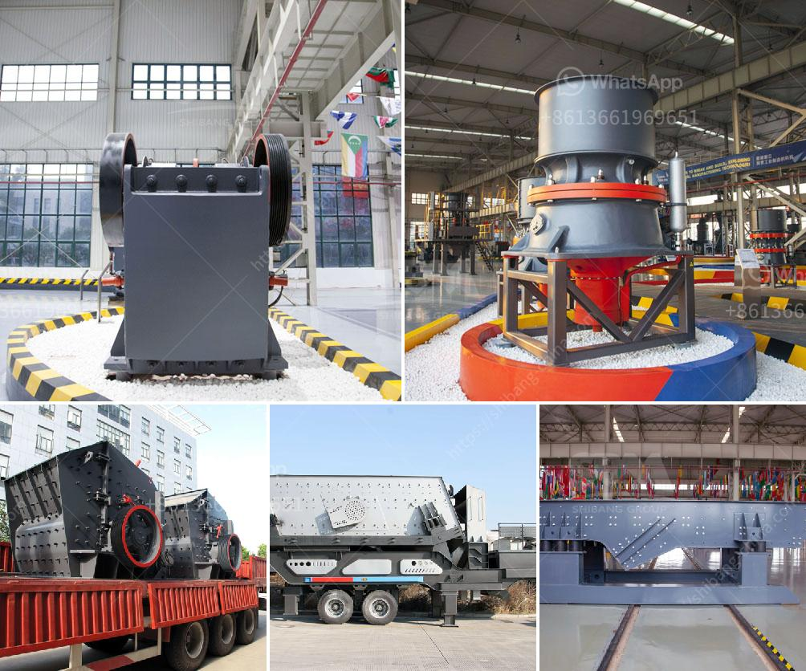

<h3>إعداد مصنع كسارة الحجر</h3>
تعتبر صناعة الحجر والركام من الصناعات الأساسية في قطاع البناء والتشييد. وتعد كسارات الحجر من أهم الآلات المستخدمة في هذه الصناعة، حيث تقوم بتكسير الحجارة الكبيرة إلى قطع صغيرة من الحجم المطلوب. ولإعداد مصنع كسارة الحجر، تحتاج إلى اتباع عدة خطوات.

الخطوة الأولى تتضمن اختيار الموقع المناسب لإقامة المصنع. يجب أن يكون الموقع قريبًا من مصادر التوريد للحجارة والركام، لتقليل التكلفة وزيادة الكفاءة في عملية توصيل المواد الخام. كما يجب أن يكون الموقع بعيدًا عن المناطق السكنية لتجنب الأضرار البيئية والازعاج للسكان.

الخطوة الثانية تتعلق بتحديد الطاقة الإنتاجية المطلوبة للمصنع. بناءً على الطلب في السوق وتوقعات النمو، يجب تحديد الطاقة الإنتاجية التي يمكن للمصنع توفيرها. يجب أن يتم اختيار المعدات المناسبة التي تستوعب الإنتاج المرجو.

الخطوة الثالثة هي شراء المعدات والآلات اللازمة لبدء العمل في المصنع. تشمل هذه المعدات كسارات الفك والصدم والمخروطية، وناقلات الحزام، وغرابيل الاهتزاز والأحجار، وماكينات التعبئة والتغليف وغيرها من المعدات المساعدة.

الخطوة الرابعة تتعلق بإنشاء المبنى والهياكل اللازمة للمصنع. يجب أن تتوافق هذه الهياكل مع الأنظمة البيئية والصحية والسلامة المعمول بها، وتكون مقاومة للظروف الجوية والعوامل الخارجية الأخرى.

الخطوة الخامسة تتضمن توظيف الفريق المؤهل لتشغيل وصيانة المصنع. يجب تدريب الموظفين على استخدام المعدات بطريقة صحيحة وآمنة، وأيضًا تعليمهم كيفية الحفاظ على المصنع وإجراء عمليات الصيانة الروتينية.

الخطوة الأخيرة هي البدء في الإنتاج وتسويق منتجات المصنع. يجب اتخاذ إجراءات ترويجية لجذب العملاء وزيادة المبيعات. يمكن أيضًا استكشاف فرص التصدير إلى أسواق أخرى.

في الختام، إعداد مصنع كسارة الحجر يتطلب التخطيط الجيد والاستعداد الكافي. تحقيق النجاح في هذا النوع من الصناعة يعتمد على الجودة والكفاءة والقدرة على تلبية متطلبات السوق. يجب الالتزام بالمعايير البيئية والصحية والسلامة للحفاظ على سمعة المصنع، وضمان المستقبل المستدام للأعمال.
<h3>Contact us</h3><ul><li><strong>Whatsapp:&nbsp;<a href="https://wa.me/8613661969651">+8613661969651</a></strong></li><li><a href="https://swt.shibang-china.com/?git&amp;zhl&amp;إعداد مصنع كسارة الحجر"><strong>Online Service(chat now)</strong></a></li></ul><h3>Related</h3><ul><li><a href='مصنع معالجة خام الذهب 200 طن في الساعة.md'>مصنع معالجة خام الذهب 200 طن في الساعة</a></li><li><a href='مكونات مطحنة الأسطوانة.md'>مكونات مطحنة الأسطوانة</a></li><li><a href='تعدين رمال النهر والحجر في صباح.md'>تعدين رمال النهر والحجر في صباح</a></li><li><a href='مصنع معالجة الحجر الجيري في الفلبين.md'>مصنع معالجة الحجر الجيري في الفلبين</a></li><li><a href='موردين لفات الناقل في جنوب أفريقيا.md'>موردين لفات الناقل في جنوب أفريقيا</a></li></ul>