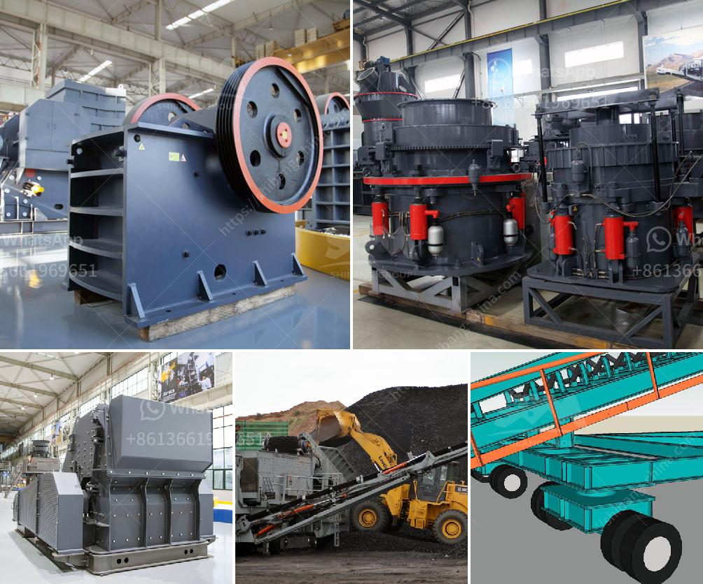

<h3>إعداد وحدة طحن الأسمنت بسعة 100 طن يوميًا</h3>
تعتبر وحدة طحن الأسمنت من المعدات الأساسية في صناعة الإسمنت، حيث تقوم بطحن وطحن الكلنكر وإضافة المواد الأخرى للحصول على مختلف أنواع الأسمنت. وتتميز وحدة طحن الأسمنت بقدرتها على طحن الكلنكر بأحجام مختلفة وتحقيق الطاقة الإنتاجية المستهدفة. في هذه المقالة، سنناقش إعداد وحدة طحن الأسمنت بسعة 100 طن يوميًا وما يتضمنه هذا الإعداد.

أولاً، يتطلب إعداد وحدة طحن الأسمنت بسعة 100 طن يوميًا دراسة دقيقة للسوق المحلية والعوامل الاقتصادية والتكنولوجية المتاحة. يجب معرفة حجم الطلب على الأسمنت في المنطقة والتأكد من قدرة الوحدة على تلبية هذا الطلب. كما يجب دراسة تكلفة إقامة الوحدة والعائد المالي المتوقع لها.

ثانيًا، يجب توجيه الاهتمام إلى اختيار المعدات المناسبة لوحدة طحن الأسمنت. يجب أن تتضمن الوحدة مطحنة الكرة لطحن الكلنكر، ومطاحن الأسمنت لطحن الكلنكر المطحون وإضافة المواد الأخرى للحصول على الأسمنت النهائي المطلوب. يجب أن تكون هذه المعدات عالية الجودة وموثوقة في الأداء من أجل تحقيق الإنتاجية المستهدفة.

ثالثًا، يجب توجيه الاهتمام إلى توفير المواد الخام اللازمة لوحدة طحن الأسمنت. تشمل هذه المواد الكلنكر والجبس والمواد الإضافية الأخرى. يجب تأمين هذه المواد بكميات كافية وذات جودة عالية من الموردين الموثوق بهم. كما يجب توفير نظام فعال لتخزين وتداول هذه المواد داخل الوحدة.

رابعًا، يجب أن يتم توجيه الاهتمام إلى توفير الطاقة اللازمة لتشغيل وحدة طحن الأسمنت. يجب توفير مصدر موثوق للكهرباء والوقود اللازم لتشغيل المعدات. يجب الاستفادة من أحدث التكنولوجيات والممارسات المستدامة لتحقيق أقصى استفادة من الطاقة وتقليل التأثير البيئي.

اختيار العمالة المدربة والمهرة وتقديم التدريب اللازم هو أيضًا جزء مهم من إعداد وحدة طحن الأسمنت. يجب أن تتوفر الكفاءة والخبرة اللازمة لتشغيل وصيانة المعدات بشكل صحيح وفعال.

باختصار، إعداد وحدة طحن الأسمنت بسعة 100 طن يوميًا يتطلب دراسة شاملة للسوق واختيار المعدات المناسبة وتوفير المواد الخام والطاقة والعمالة المهرة. يجب أن يتم كل هذا بناءً على دراسة جدوى متقنة لضمان نجاح وأرباح الوحدة في الوقت المحدد.
<h3>Contact us</h3><ul><li><strong>Whatsapp:&nbsp;<a href="https://wa.me/8613661969651">+8613661969651</a></strong></li><li><a href="https://swt.shibang-china.com/?git&amp;zhl&amp;إعداد وحدة طحن الأسمنت بسعة 100 طن يوميًا"><strong>Online Service(chat now)</strong></a></li></ul><h3>Related</h3><ul><li><a href='كسارة الفك تركيا.md'>كسارة الفك تركيا</a></li><li><a href='كيفية إعداد كسارة.md'>كيفية إعداد كسارة</a></li><li><a href='كم تكلف تراخيص التعدين على الذهب في نيجيريا.md'>كم تكلف تراخيص التعدين على الذهب في نيجيريا</a></li><li><a href='مطاحن الكرة للحجر الجيري في ماليزيا.md'>مطاحن الكرة للحجر الجيري في ماليزيا</a></li><li><a href='كسارة الفك في تايلاند.md'>كسارة الفك في تايلاند</a></li></ul>