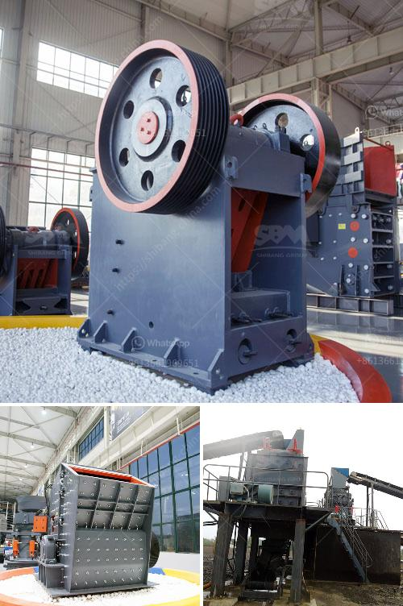

<h3>إعلانات الصحف لمصنع كسارة</h3>
تعد إعلانات الصحف وسيلة فعالة للتواصل مع الجمهور المستهدف ونشر المعلومات عن المنتجات والخدمات المقدمة من قبل المصانع والشركات. ومن بين هذه المصانع، نجد المصانع المتخصصة في تصنيع وتوريد الكسارات، وهي آلات تستخدم في صناعة البناء والتشييد. في هذه المقالة سوف نناقش أهمية إعلانات الصحف لمصنع كسارة وأثرها في جذب الزبائن وتعزيز العلامة التجارية.

إعلانات الصحف تعد واحدة من أقدم وسائل الإعلان المستخدمة ولا تزال لها شعبية كبيرة حتى اليوم. تتيح هذه الإعلانات للشركات والمصانع التواصل مع العملاء بشكل فعال ومباشر، حيث يمكنهم نشر المميزات والمزايا الفريدة للمنتجات والخدمات التي يقدمونها.

بالنسبة لمصنع الكسارة، يمكن استخدام إعلانات الصحف للترويج للكسارات المتوفرة والتأكيد على مواصفاتها وقدرتها على تحطيم وتكسير المواد الخام بفعالية عالية. يمكن للمصنع أيضًا استعراض قائمة العملاء الحاليين والسابقين الذين استفادوا من منتجاته، وهذا يشجع الزبائن الجدد على الثقة في قدرات المصنع وجودته.

كما يمكن لإعلانات الصحف أن تعزز العلامة التجارية للمصنع. عن طريق استخدام لغة وتصميم جذابين، يمكن للمميزات والمزايا المعلن عنها في الإعلانات أن تصبح جزءًا من هوية الشركة. تتيح هذه العناصر للعملاء المحتملين تذكر المصنع بسهولة وتميزه عن المنافسين.

بالإضافة إلى ذلك، يمكن لإعلانات الصحف أن تساعد في زيادة المبيعات وتعزيز الطلب على المنتجات. من خلال تقديم العروض الترويجية والخصومات الحصرية في الإعلانات، يكون للعملاء دافع إضافي لشراء منتجات المصنع والاستفادة من العروض المقدمة.

بالختام، إعلانات الصحف تلعب دوراً هاماً في نجاح المصانع والشركات المتخصصة في تصنيع وتوريد الكسارات. تعزز هذه الإعلانات الوعي بالعلامة التجارية وتوفر معلومات فعالة للعملاء المحتملين حول المنتجات والخدمات التي تقدمها المصانع. علاوة على ذلك، فإنها تعتبر أداة قوية لزيادة المبيعات وتعزيز الطلب على المنتجات. لذا، يجب على المصانع أن يستثمروا في إعلانات الصحف لتعزيز مكانتهم في السوق وجذب عملاء جدد.
<h3>Contact us</h3><ul><li><strong>Whatsapp:&nbsp;<a href="https://wa.me/8613661969651">+8613661969651</a></strong></li><li><a href="https://swt.shibang-china.com/?git&amp;zhl&amp;إعلانات الصحف لمصنع كسارة"><strong>Online Service(chat now)</strong></a></li></ul><h3>Related</h3><ul><li><a href='قائمة الشركات المحاجر في نيجيريا.md'>قائمة الشركات المحاجر في نيجيريا</a></li><li><a href='تركيب مصنع صنع الرمل الاصطناعي.md'>تركيب مصنع صنع الرمل الاصطناعي</a></li><li><a href='مصنع سحق صغير بسعة 5 طن في الساعة.md'>مصنع سحق صغير بسعة 5 طن في الساعة</a></li><li><a href='تكلفة كسارة السيليكا.md'>تكلفة كسارة السيليكا</a></li><li><a href='صور شاشات الاهتزاز.md'>صور شاشات الاهتزاز</a></li></ul>