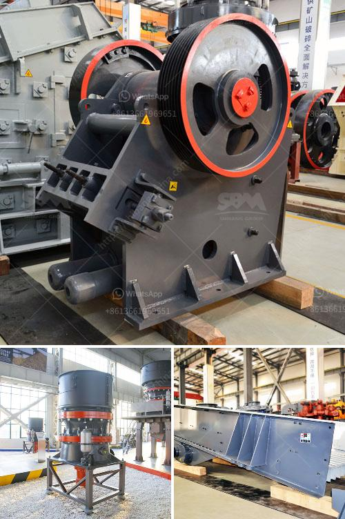

<h3>إغلاق محطة الكسارة</h3>
في الآونة الأخيرة، أثار قرار إغلاق محطة الكسارة الكثير من الجدل والتساؤلات. تعتبر محطة الكسارة واحدة من الموارد الهامة في مدينتنا، حيث تعد من العوامل الرئيسية لتوفير البناء والتشييد في المنطقة. ومع ذلك، يجب أن نأخذ بعين الاعتبار أن هناك أسباب قوية قد يكون لها تأثير إيجابي على قرار إغلاق هذه المحطة.

أولاً، قرار إغلاق محطة الكسارة يأتي استجابةً لمشكلة التلوث البيئي التي يعاني منها مجتمعنا. من خلال وقف أعمال التكسير وإنتاج الغبار والرواسب الصلبة، يتم الحد من تأثيرات الكسارة على جودة الهواء والمياه المحيطة بها. وباستخدام التكنولوجيا الحديثة والمبتكرة، يمكن تجنب هذه التأثيرات الضارة لمحطة الكسارة ووضع حلول بيئية بديلة لتلبية احتياجاتنا في مجال البناء.

ثانياً، إغلاق محطة الكسارة يعزز الاستدامة في المنطقة. يعتمد الاقتصاد المحلي بشكل كبير على صناعة البناء والتشييد، ولذلك فإن تأثير محطة الكسارة على البيئة والمجتمع يعني أنه يجب تطوير واعتماد حلول أكثر استدامة. يمكن للمنطقة الاستفادة من استثمارات جديدة في تكنولوجيا البناء الخضراء واستخدام مواد بناء صديقة للبيئة، مما يعزز التنمية المستدامة ويحقق التوازن بين الاحتياجات الاقتصادية والبيئية.

ثالثاً، إغلاق محطة الكسارة يمكن أن يفتح المجال لمشاريع أخرى تعود بالفائدة على المجتمع المحلي. يمكن تحويل الموقع الحالي لمحطة الكسارة إلى مشروعات ترفيهية أو سكنية أو تجارية، مما يخلق فرص عمل جديدة ويحوز على الاستثمارات الجديدة. وبالتالي، يمكن أن يكون إغلاق محطة الكسارة فرصة لتنمية المدينة وتحسين جودة حياة سكانها.

باختصار، رغم أهمية محطة الكسارة في توفير البناء والتشييد في المنطقة، فإن قرار إغلاقها يأتي بمزايا بيئية واقتصادية عديدة. يمكن لإغلاق هذه المحطة أن يساهم في الحفاظ على بيئتنا وتعزيز استدامة المنطقة، بالإضافة إلى خلق فرص عمل وتنمية مجتمعنا. من الضروري أن نشجع على تبني تقنيات البناء الخضراء والاستفادة من مصادر الطاقة المتجددة، وهذا يتطلب التخلص من محطة الكسارة والبحث عن بدائل أخرى تلبي احتياجاتنا بطرق أكثر سلامة واستدامة.
<h3>Contact us</h3><ul><li><strong>Whatsapp:&nbsp;<a href="https://wa.me/8613661969651">+8613661969651</a></strong></li><li><a href="https://swt.shibang-china.com/?git&amp;zhl&amp;إغلاق محطة الكسارة"><strong>Online Service(chat now)</strong></a></li></ul><h3>Related</h3><ul><li><a href='آلة تعدين الذهب.md'>آلة تعدين الذهب</a></li><li><a href='مطاحن طحن أتا.md'>مطاحن طحن أتا</a></li><li><a href='موردين طاحونة الأسمنت.md'>موردين طاحونة الأسمنت</a></li><li><a href='مطحنة الطحن الصينية.md'>مطحنة الطحن الصينية</a></li><li><a href='تكلفة مجفف الرمال في ولاية كيرالا.md'>تكلفة مجفف الرمال في ولاية كيرالا</a></li></ul>