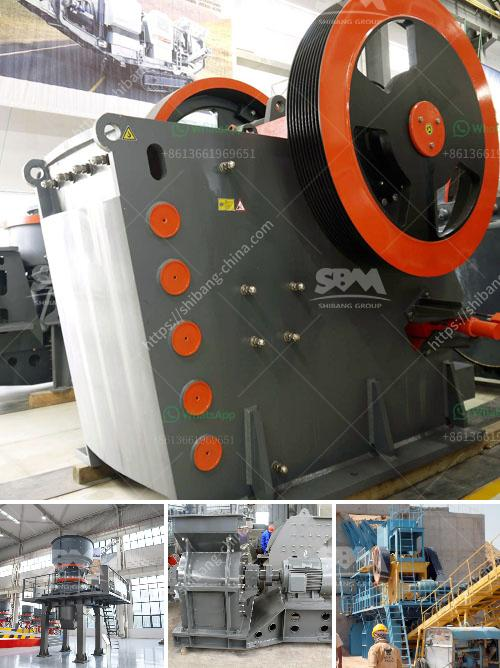

<h3>إقامة مصنع تكسير الفحم</h3>
يعتبر الفحم من أهم المصادر الطبيعية للطاقة، ويتم استخدامه بشكل واسع في الصناعات المختلفة حول العالم. ومع زيادة الطلب على الفحم، يصبح من الضروري إقامة مصنع تكسير الفحم لتحويله إلى شكل يسهل استخدامه.

إقامة مصنع تكسير الفحم يعتبر حلاً استراتيجيًا للعديد من الدول، حيث يمكن أن يكون لها العديد من المزايا الاقتصادية والبيئية. أحد أهم هذه المزايا هو إنشاء فرص عمل جديدة للمجتمع المحلي. سيتطلب تشغيل المصنع فريقًا متكاملًا من المهندسين والفنيين والعمال الماهرين، الذين سيستفيدون من دخل استقراري وفرص تدريب وتطوير مستقبلية. بالإضافة إلى ذلك، سيزيد إقامة المصنع من الاستثمارات في المنطقة ويحقق النمو الاقتصادي.

من الجانب البيئي، يمكن أن يسهم مصنع تكسير الفحم في تحسين جودة الهواء في المنطقة المحيطة. عندما يتم تكسير الفحم، يتم تحويله إلى شكل أصغر يمكن تحميله على وسائل النقل بشكل أسهل، وهذا يقلل من انبعاثات الغبار والجسيمات الدقيقة. يمكن تنفيذ نظام مراقبة بيئي متقدم في المصنع للتحكم في الانبعاثات ومراقبة جودة الهواء بشكل دقيق. هذا سيحسن صحة وسلامة السكان المحليين من حيث الحد من التلوث الهوائي.

ومن الناحية الاقتصادية، يمكن أن يؤدي إقامة مصنع تكسير الفحم إلى توفير مصدر طاقة محلية ورخيصة. بدلاً من استيراد الفحم من الخارج بأسعار مرتفعة، يمكن توفير الفحم المحلي بتكلفة أقل للشركات المحلية، مما يعزز التنافسية ويقود إلى تطوير المزيد من الصناعات في المنطقة. وعلاوة على ذلك، يمكن أيضًا بيع الفحم المنتج للدول الأخرى، وهو ما يسهم في زيادة الصادرات وتحسين الميزان التجاري.

باختصار، إقامة مصنع تكسير الفحم يعتبر خطوة حاسمة لتلبية احتياجات الطاقة المتزايدة في العالم، وتوفير فرص عمل جديدة وتعزيز النمو الاقتصادي في المناطق المحلية، وحماية البيئة وتحسين جودة الهواء المحيط. يجب أن تدعم الحكومات إقامة هذه المصانع وتحسين القوانين والتشريعات المتعلقة بها للتأكد من تشغيلها بطرق استدامة ومستدامة.
<h3>Contact us</h3><ul><li><strong>Whatsapp:&nbsp;<a href="https://wa.me/8613661969651">+8613661969651</a></strong></li><li><a href="https://swt.shibang-china.com/?git&amp;zhl&amp;إقامة مصنع تكسير الفحم"><strong>Online Service(chat now)</strong></a></li></ul><h3>Related</h3><ul><li><a href='معدات غسيل الذهب.md'>معدات غسيل الذهب</a></li><li><a href='مطحنة الكرة مطرقة مطحنة مطحنة أسطوانية آلة.md'>مطحنة الكرة مطرقة مطحنة مطحنة أسطوانية آلة</a></li><li><a href='تركيب مصنع صنع الرمل الاصطناعي.md'>تركيب مصنع صنع الرمل الاصطناعي</a></li><li><a href='كسارة الحجر المحجر.md'>كسارة الحجر المحجر</a></li><li><a href='معدات زراعية للبيع بأسعار مناسبة.md'>معدات زراعية للبيع بأسعار مناسبة</a></li></ul>