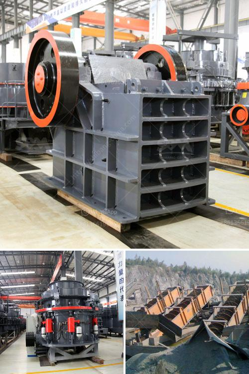

<h3>إنتاج الإسمنت الأبيض من مسحوق الرخام</h3>
يعد الإسمنت الأبيض واحدًا من أهم مواد البناء التي تستخدم في العديد من المشاريع الكبرى، سواء السكنية أو التجارية أو الصناعية. يتم إنتاج الإسمنت الأبيض عن طريق خلط مسحوق الرخام والمواد الخام الأخرى للحصول على الخواص المطلوبة.

يعتبر مسحوق الرخام هو المكون الرئيسي في صناعة الإسمنت الأبيض. فالرخام يُستخرج من المحاجر ويتم معالجته بعناية للحصول على مسحوق ناعم. يتم طحن المسحوق للحصول على حجم حبيبات صغيرة ومتناسقة، يجب أن تكون حبيبات المسحوق متساوية الحجم لتضمن جودة الإنتاج النهائية.

بعد طحن المسحوق، يتم خلطه مع المواد الخام الأخرى مثل الحجر الجيري والطين والألمنيوم والسيليكا. تتفاعل هذه المواد الخام مع المسحوق لتشكيل مزيج الإسمنت الذي يتم تسخينه في أفران خاصة. يتم تسخين الخليط إلى درجات حرارة عالية تتراوح بين 1400 و 1600 درجة مئوية لمدة معينة، تُسمى فترة الحرق.

خلال دورة الحرق، يتم تحويل المزيج إلى كلنكر الإسمنت، وهو مادة تحتوي على مركبات كلسية وسيليكاتية. يُضاف إلى الكلنكر المنتج مادة مساعدة تسمى الجبس، والتي تساهم في تنشيط وتنظيم عملية تجميع الإسمنت.

بعد ذلك، يتم تكسير الكلنكر للحصول على مسحوق الإسمنت النهائي. يتم تخزينه في مستودعات خاصة ويتم توزيعه في الأسواق للاستخدام في مشاريع البناء المختلفة.

تتميز الإسمنت الأبيض بعدة خصائص، مثل اللون الأبيض النقي والقدرة على التحمل العالي للتآكل والملوثات. يستخدم عادة في تطبيقات الديكور الداخلي والخارجي حيث يتم التركيز على الجمال البصري. كما يستخدم أيضًا في تصنيع البلاط والألواح والمنتجات الخرسانية الأخرى.

باختصار، يتم إنتاج الإسمنت الأبيض من مسحوق الرخام بعناية ودقة. يعد مسحوق الرخام المكون الرئيسي في صناعة الإسمنت الأبيض، ويتم معالجته وطحنه بعناية للحصول على حجم حبيبات مناسب. الكلنكر الناتج يتم تكسيره للحصول على مسحوق الإسمنت النهائي، ويتم تخزينه وتوزيعه للاستخدام في مشاريع البناء المختلفة.
<h3>Contact us</h3><ul><li><strong>Whatsapp:&nbsp;<a href="https://wa.me/8613661969651">+8613661969651</a></strong></li><li><a href="https://swt.shibang-china.com/?git&amp;zhl&amp;إنتاج الإسمنت الأبيض من مسحوق الرخام"><strong>Online Service(chat now)</strong></a></li></ul><h3>Related</h3><ul><li><a href='المعدات المطلوبة لتعدين الذهب على نطاق واسع.md'>المعدات المطلوبة لتعدين الذهب على نطاق واسع</a></li><li><a href='كسارات الحجر والرمل المحمولة على نطاق صغير.md'>كسارات الحجر والرمل المحمولة على نطاق صغير</a></li><li><a href='آلة معالجة الجبس بسعة طن واحد.md'>آلة معالجة الجبس بسعة طن واحد</a></li><li><a href='سعر مصنع كسارة محمولة في نيجيريا.md'>سعر مصنع كسارة محمولة في نيجيريا</a></li><li><a href='استخدامات الصناعية لمسحوق الرخام الأبيض.md'>استخدامات الصناعية لمسحوق الرخام الأبيض</a></li></ul>