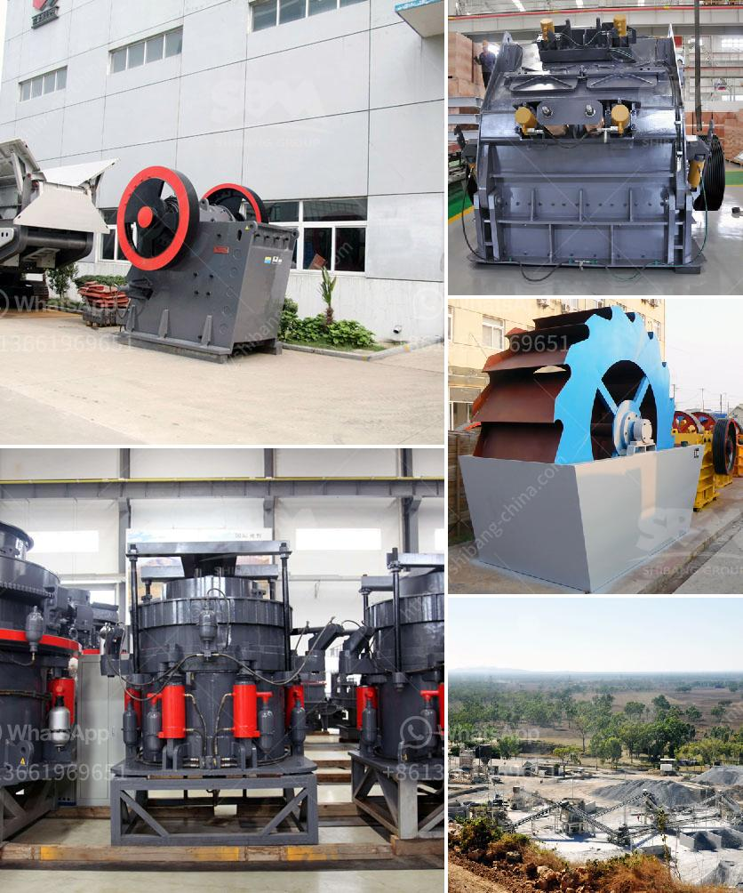

<h3>إنتاج الحصى الجيري</h3>
يُعتبر الحصى الجيري من أهم الموارد الطبيعية المستخدمة في مجالات عديدة، بدءًا من البناء وصولاً إلى صناعة الصلب والزجاج والأسمنت. إن إنتاج الحصى الجيري هو عملية معقدة تحتاج إلى العديد من الخطوات للحصول على المنتج النهائي بأعلى جودة.

تبدأ عملية إنتاج الحصى الجيري بالتعدين، حيث يتم استخراج الصخور الجيرية من المحجر باستخدام الحفارات وآلات الكسارة. يتم تحميل الحجارة الكبيرة في شاحنات ونقلها إلى منطقة المعالجة. بعد ذلك، يجب أن يتم فرز الحجارة حسب الحجم باستخدام الغرابيل والأشباك، وذلك للتخلص من الأوساخ والشوائب. يتم تجميع الحصى الجيري في حاويات كبيرة وتأخذ إلى موقع المصنع.

عند وصول الحصى الجيري إلى المصنع، يتم فحصه وتحليله لضمان احتوائه على الخصائص المطلوبة. بعد ذلك، يتم سحق وطحن الحصى الجيري باستخدام الكسارات والمطاحن للحصول على حصاة جيرية ناعمة ومتجانسة. هذه العملية تعتبر حاسمة للحصول على منتج نهائي عالي الجودة.

بعد طحن الحصى الجيري، يتم فرزه مرة أخرى حسب الحجم للحصول على فئات متناسبة. يتم استخدام الغرابيل والأشباك لفرز الحصى الجيري بناءً على حجم الحصى المطلوب. يتم غسل الحصى الجيري الناعم وإزالة الأتربة والشوائب الأخرى للحصول على جودة أعلى.

بعد عملية الفرز والتنقية، يتم تعبئة الحصى الجيري في أكياس أو حاويات أو تفريغه مباشرة في شاحنات النقل للتوصيل إلى العملاء. يتم تصنيع منتجات مختلفة من الحصى الجيري، مثل الركام الجيري والحجارة الزخرفية والحجارة الكبيرة، لتلبية احتياجات السوق المختلفة.

من المهم أن نشير إلى أن إنتاج الحصى الجيري يتطلب الامتثال للمعايير البيئية والصحية، حيث يجب تطبيق أفضل الممارسات في عملية التعدين والصناعة. يجب على المصانع اتباع إجراءات السلامة للحفاظ على صحة العاملين والحد من تأثيراتها البيئية على المحيط المحيط.

في الختام، إن إنتاج الحصى الجيري هو عملية مهمة ومعقدة تقتضي العديد من الخطوات والتكنولوجيات للحصول على المنتج النهائي عالي الجودة. يلعب الحصى الجيري دورًا حيويًا في العديد من الصناعات ويساهم في تحسين البنية التحتية وتطوير الاقتصاد. من المهم أن تتم هذه العملية بشكل مستدام وباستخدام أفضل الممارسات البيئية والصحية للحفاظ على البيئة وصحة العاملين.
<h3>Contact us</h3><ul><li><strong>Whatsapp:&nbsp;<a href="https://wa.me/8613661969651">+8613661969651</a></strong></li><li><a href="https://swt.shibang-china.com/?git&amp;zhl&amp;إنتاج الحصى الجيري"><strong>Online Service(chat now)</strong></a></li></ul><h3>Related</h3><ul><li><a href='الشركة المصنعة للكسارة الرئيسية من الرخام.md'>الشركة المصنعة للكسارة الرئيسية من الرخام</a></li><li><a href='مصنع تكسير المحاجر الكامل في جنوب أفريقيا.md'>مصنع تكسير المحاجر الكامل في جنوب أفريقيا</a></li><li><a href='كسارة الرخام في الصين.md'>كسارة الرخام في الصين</a></li><li><a href='آلات كسارة للبيع.md'>آلات كسارة للبيع</a></li><li><a href='تكلفة أعمال المحجر في الهند.md'>تكلفة أعمال المحجر في الهند</a></li></ul>