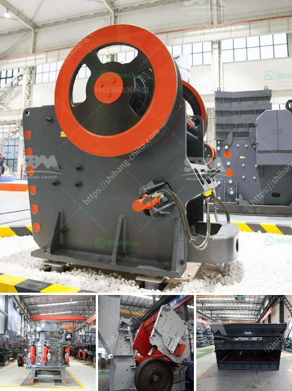

<h3>إنتاج الركام</h3>
يُعد الركام من الموارد الطبيعية الأساسية في صناعة البناء والتشييد. فهو يستخدم لتكوين الخرسانة والأسفلت والتربة المعبأة، ويعد جزءًا أساسيًا من البنية التحتية لأي منشأة. يُعرَف الركام بأنه أي مواد ذات حجم حبيبات صغيرة يتم استخدامها لتكوين المواد الإنشائية المختلفة، ويتم الحصول عليها عن طريق سحق الصخور والأحجار والركام الناتج من الهدم.

يتم إنتاج الركام بعملية سحق وغربلة الصخور الكبيرة إلى قطع صغيرة. يتم طحن الصخور في آلات السحق حيث يتم تكسيرها بفعل الضغط والاحتكاك. يتم بعد ذلك تمرير المواد الخام المكسورة عبر شاشات غربلة لفصل الحصى والرمل من الشوائب الأخرى. وبعد الانتهاء من عملية الغربلة، يحصل المنتج النهائي الذي يتكون من الركام ذو الحجم المطلوب.

تختلف خواص الركام المنتج باختلاف نوع الصخور المستخدمة في عملية السحق وكذلك طريقة التجهيز. قد يتم استخدام الصخور الجيرية أو البازلت أو الغرانيت أو الحجر الجيري وغيرها من الصخور. يتم اختيار هذه الصخور بناءً على خصائصها الميكانيكية والكيميائية والجيولوجية، حيث يكون الهدف الأساسي هو الحصول على ركام قوي ومتين يستطيع تحمل الضغوط والأوزان المتراكمة.

إنتاج الركام يتطلب استخدام معدات وآلات مخصصة لعملية السحق والغربلة. وتشمل هذه المعدات الكسارات الفكية والكسارات التصادمية والكسارات المخروطية والغرابيل والمناخل والناقلات والأجهزة الأخرى التي تسهم في تجهيز الصخور وفصل الحصى والرمل وتهيئتها للاستخدام في البناء.

تعتبر صناعة الركام من الصناعات البيئية المستدامة. حيث يتم إعادة تدوير الركام الناتج من الهدم واستخدامه كركام جديد في عمليات البناء. وبالتالي، يقلل إنتاج الركام من الاعتماد على الموارد الطبيعية الأخرى ويقلل من النفايات التي يتم تخليصها في الموقع.

في الختام، يُعد إنتاج الركام عملية حيوية في صناعة البناء والتشييد. فهو يعتبر جزءًا أساسيًا من المكونات الإنشائية ويستخدم في العديد من التطبيقات المختلفة. وتحافظ صناعة الركام على استدامتها من خلال إعادة تدوير المنتجات واستخدامها في البناء بشكل مستدام.
<h3>Contact us</h3><ul><li><strong>Whatsapp:&nbsp;<a href="https://wa.me/8613661969651">+8613661969651</a></strong></li><li><a href="https://swt.shibang-china.com/?git&amp;zhl&amp;إنتاج الركام"><strong>Online Service(chat now)</strong></a></li></ul><h3>Related</h3><ul><li><a href='آلات مصنع الحصى الكوارتز.md'>آلات مصنع الحصى الكوارتز</a></li><li><a href='مطاحن طحن أتا.md'>مطاحن طحن أتا</a></li><li><a href='موردين لمعدات التعدين في جنوب أفريقيا.md'>موردين لمعدات التعدين في جنوب أفريقيا</a></li><li><a href='وزير التعدين في غانا.md'>وزير التعدين في غانا</a></li><li><a href='استشاريو تحسين خام الحديد في الهند.md'>استشاريو تحسين خام الحديد في الهند</a></li></ul>