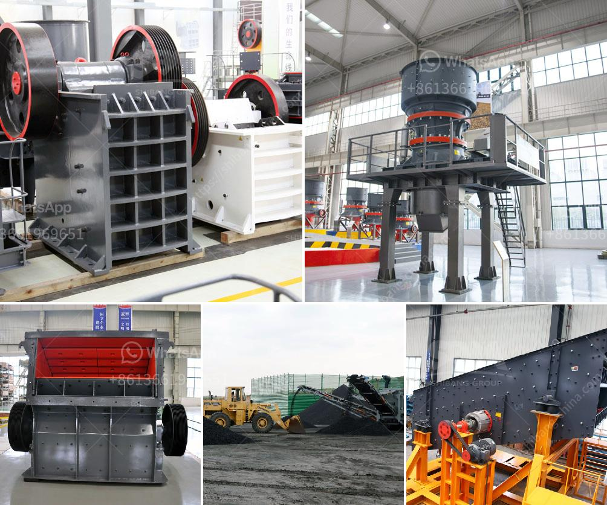

<h3>إنتاج الكاولين في إثيوبيا بتنسيق PDF</h3>
يعتبر الكاولين من المواد المعدنية التي تستخدم في العديد من الصناعات المختلفة، مثل السيراميك والأدوية ومستحضرات التجميل. وتحتل إثيوبيا مكانة مهمة في إنتاج الكاولين على المستوى العالمي.

تحتوي إثيوبيا على موارد كاولين غنية، والتي توجد في العديد من المناطق في البلاد. تعتبر مناطق إثيوبيا الجنوبية والوسطى والشمالية الغربية من أبرز المناطق التي يتم فيها إنتاج الكاولين. وتوفر البلاد بيئة مناسبة لنمو وتطور هذه الصناعة، حيث تضم العديد من العوامل المحفزة مثل المناخ المناسب والتضاريس المتنوعة.

يتم إنتاج الكاولين في إثيوبيا عن طريق استخراجه من الصخور والتربة التي يحتوي عليها. وتتم عملية الاستخراج بواسطة الحفر والتفتيت والتكسير، ثم يتم نقل المواد الخام إلى المصانع للمعالجة والتحضير. يتطلب عملية تحضير الكاولين إزالة الشوائب والمعادن الأخرى الموجودة في المواد الخام، وذلك من خلال عملية التنقية والفصل.

بعد إجراء هذه العمليات، يتم تجفيف الكاولين وطحنه إلى حجم الحبيبات المطلوب. وتختلف استخدامات الكاولين باختلاف حجم الحبيبات، فقد يستخدم الكاولين ذو الحجم الأكبر في السيراميك والطين، بينما يستخدم الكاولين ذو الحجم الأصغر في صناعة الورق ومواد التجميل.

تعد صناعة الكاولين في إثيوبيا من الصناعات الحديثة الناشئة، وتعتبر فرصة لتعزيز النمو الاقتصادي وتوفير فرص العمل في البلاد. وتعمل الحكومة الإثيوبية على تشجيع الاستثمار في قطاع الكاولين من خلال توفير المزيد من الدعم والتسهيلات للمستثمرين المحليين والأجانب.

بالنظر إلى الطلب المتزايد على الكاولين على المستوى العالمي، فإن إثيوبيا لديها فرصة كبيرة لتوفير هذه المادة الحيوية وزيادة إيراداتها الإستثمارية. كما يمكن للبلاد أن تعزز من تصدير الكاولين إلى الأسواق العالمية وتعزيز قدرتها التنافسية في هذا القطاع.

باختصار، يعتبر إنتاج الكاولين في إثيوبيا فرصة هامة لتحقيق النمو الاقتصادي وتوفير فرص العمل، إضافة إلى تعزيز قدرة البلاد على التصدير والتنافس على المستوى العالمي. وبفضل مواردها الطبيعية الغنية والتدابير الحكومية المدعومة، فإن إثيوبيا تستطيع أن تكون لاعباً رئيسياً في سوق الكاولين العالمية.
<h3>Contact us</h3><ul><li><strong>Whatsapp:&nbsp;<a href="https://wa.me/8613661969651">+8613661969651</a></strong></li><li><a href="https://swt.shibang-china.com/?git&amp;zhl&amp;إنتاج الكاولين في إثيوبيا بتنسيق PDF"><strong>Online Service(chat now)</strong></a></li></ul><h3>Related</h3><ul><li><a href='تكلفة مصنع كسارة خام الحديد.md'>تكلفة مصنع كسارة خام الحديد</a></li><li><a href='تكلفة مصنع الإسمنت الصغير بسعة 2000 طن يوميًا.md'>تكلفة مصنع الإسمنت الصغير بسعة 2000 طن يوميًا</a></li><li><a href='آلة معالجة البلانت.md'>آلة معالجة البلانت</a></li><li><a href='كسارة مخروطية قياسية قدم.md'>كسارة مخروطية قياسية قدم</a></li><li><a href='تستخدم لمطحنة رايموند.md'>تستخدم لمطحنة رايموند</a></li></ul>