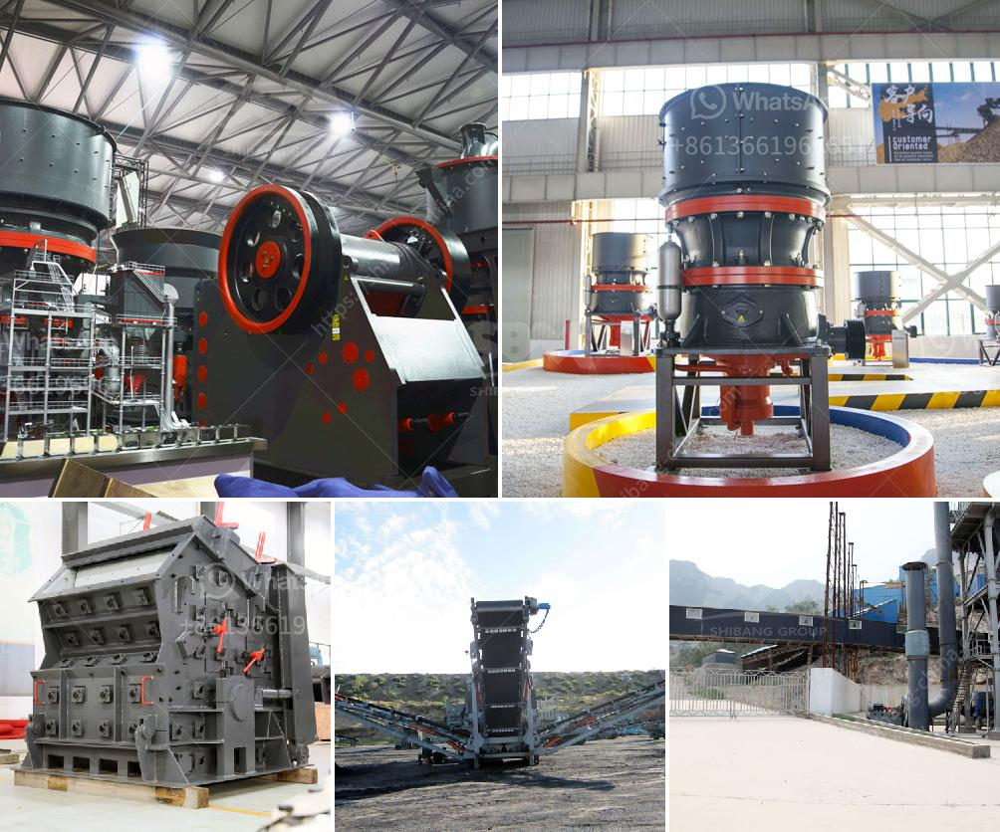

<h3>إنتاج خام الحديد حسب الولاية في الهند</h3>
تعد الهند واحدة من أكبر دول العالم في إنتاج خام الحديد. تشتهر الهند بمواردها الطبيعية الغنية، وخاصة خام الحديد الذي يعد من الموارد الحيوية للاقتصاد الهندي. تعد ولايات الهند القوية في إنتاج خام الحديد أكبر إسهام للهند في الانتاج العالمي، وسأعرض لك بعض المعلومات حول هذا الإنتاج حسب الولايات الهندية:

تعتبر ولاية تشهاتيسجاره أكبر منتج لخام الحديد في الهند، حيث تمتلك الولاية حوالي 18% من احتياطي الهند من خام الحديد. تحتوي الولاية على العديد من المناجم الكبيرة مثل ميتان كاتني و بوسخم و نمارا شجيموشاهو و غيرها. تساهم تلك المناجم بشكل كبير في الانتاج الهندي والعالمي للخام.

تعتبر ولاية أوديشا واحدة من أكبر المنتجين لخام الحديد في الهند. تحتل الولاية المرتبة الثانية بعد تشهاتيسجاره في إنتاج خام الحديد. وتتمتع الولاية بالعديد من المناجم التي تعتبر مصدراً رئيسياً لخام الحديد في البلاد، مثل جونك الكبيرة وجونك الصغيرة ونمجوندا وغيرها.

تأتي ولاية كارناتاكا في المرتبة الثالثة في إنتاج خام الحديد في الهند. تحتوي الولاية على العديد من المواقع المهمة لإنتاج خام الحديد، مثل حمتي وغونديامال ونيمكودا وماراجمالاي وغيرها. وتعمل تلك المواقع على توفير مصدر هام للاستخدام المحلي والتصدير.

تعتبر ولاية جهارخاند من أكبر ولايات الهند في إنتاج خام الحديد. تحتوي الولاية على العديد من المناجم الهامة للخام مثل نودا وجامشدبور ونوكاندي وراوركيلا وغيرها. تساهم تلك المناجم بشكل كبير في إنتاج الهند السنوي للخام.

تعد ولاية غوا من أكبر المنتجين لخام الحديد في الهند. تشتهر الولاية بمنجمي كودلي وناوكري وقارفايم وسوكليم. يتميز خام الحديد المنتج في غوا بجودته العالية ويعتبر من الخامات المرغوبة على مستوى العالم.

على الرغم من أن هناك العديد من الولايات الأخرى في الهند تساهم في إنتاج خام الحديد، إلا أن الولايات المذكورة أعلاه تعتبر الأكثر إنتاجاً وأكثر أهمية في هذا القطاع. يشكل إنتاج خام الحديد هذا دورًا حيويًا في تعزيز الاقتصاد الهندي وتوفير فرص العمل وزيادة الصادرات وخلق الثروة الوطنية.

باختصار، تستحوذ الهند على حصة كبيرة في إنتاج خام الحديد على مستوى العالم، وتعد ولايات تشهاتيسجاره وأوديشا وكارناتاكا وجهارخاند وغوا أبرز الولايات في إنتاجه. تعتبر هذه الولايات أعمدة الصناعة في توفير خام الحديد وتلبية الاحتياجات المحلية والعالمية منه.
<h3>Contact us</h3><ul><li><strong>Whatsapp:&nbsp;<a href="https://wa.me/8613661969651">+8613661969651</a></strong></li><li><a href="https://swt.shibang-china.com/?git&amp;zhl&amp;إنتاج خام الحديد حسب الولاية في الهند"><strong>Online Service(chat now)</strong></a></li></ul><h3>Related</h3><ul><li><a href='مصنعي معدات تعدين الذهب في الدنمارك.md'>مصنعي معدات تعدين الذهب في الدنمارك</a></li><li><a href='مطحنة كرات صغيرة لهنان الصين.md'>مطحنة كرات صغيرة لهنان الصين</a></li><li><a href='مصنع كسارة المطرقة.md'>مصنع كسارة المطرقة</a></li><li><a href='تجهيز مسحوق الكوارتز السيليكا.md'>تجهيز مسحوق الكوارتز السيليكا</a></li><li><a href='كسارة متنقلة لخام الحديد.md'>كسارة متنقلة لخام الحديد</a></li></ul>