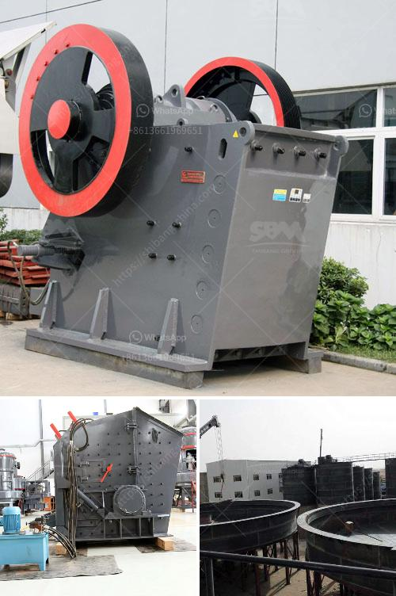

<h3>إنتاج خط الإنتاج لكسارة الطوب</h3>
يعتبر إنتاج خط الإنتاج لكسارة الطوب عملية مهمة لتلبية الطلب المتزايد على الطوب في العديد من الصناعات المختلفة. تعتبر الكسارة أداة أساسية في عملية تحويل الصخور الكبيرة إلى جزيئات صغيرة قابلة للاستخدام في صناعة البناء. يعتبر خط الإنتاج لكسارة الطوب وسيلة فعالة لزيادة الإنتاجية وتقليل التكلفة في هذه العملية الحيوية.

أول خطوة في إنتاج خط الإنتاج لكسارة الطوب هي تصميم النموذج الأولي للماكينة. يتم تطوير هذا النموذج الأولي باستخدام تكنولوجيا ثلاثية الأبعاد والحاسوب لضمان الدقة والكفاءة. تعتبر هذه العملية مهمة لضمان أن الماكينة يمكنها إنتاج الكمية المطلوبة من الطوب بسرعة وفعالية.

بعد تطوير النموذج الأولي، يجب إجراء عملية اختبار وتحليل للتحقق من قدرة الماكينة على معالجة مجموعة متنوعة من المواد الخام بشكل موثوق وسلس. يجب أن تكون الكسارة قادرة على تفتيت الصخور والأحجار بشكل فعال للحصول على حبيبات صغيرة قابلة للاستخدام.

بعد اجتياز اختبارات الأداء والفعالية، يجب تصنيع الكسارة باستخدام مواد عالية الجودة لضمان المتانة والقوة. يتم استخدام الفولاذ الصلب عادة لصنع الأجزاء الرئيسية للكسارة. تعتبر عملية التصنيع دقيقة ويجب الالتزام بالمعايير المحددة للجودة.

بعد تصنيع جميع الأجزاء المتكونة لكسارة الطوب، يجب تجميعها بعناية وضبطها بشكل صحيح. يتطلب هذا الإجراء الدقة والمهارة لضمان عملية تشغيل سلسة وفعالة. يجب أن يتم تثبيت جميع الأجزاء بإحكام واختبارها للتأكد من أنها تعمل بشكل صحيح.

يعتبر إنتاج خط الإنتاج لكسارة الطوب عملية حساسة تتطلب التخطيط والتنفيذ الجيدين. يجب أن يتم اتباع المعايير الصناعية المحددة واتباع الإرشادات الموجودة لضمان نتائج مرضية. يمكن أن يؤثر خطأ صغير في التصميم أو التصنيع على أداء الكسارة بشكل كبير وقد يتسبب في تأثير سلبي على الإنتاجية والجودة.

باختصار، يُعتبر إنتاج خط الإنتاج لكسارة الطوب عملية حيوية في صناعة البناء. يتطلب هذا العمل فهمًا عميقًا لعملية الإنتاج واستخدام التكنولوجيا الحديثة. يجب أن يتم تنفيذ العملية بدقة واهتمام للحصول على نتائج مرضية وتلبية احتياجات السوق.
<h3>Contact us</h3><ul><li><strong>Whatsapp:&nbsp;<a href="https://wa.me/8613661969651">+8613661969651</a></strong></li><li><a href="https://swt.shibang-china.com/?git&amp;zhl&amp;إنتاج خط الإنتاج لكسارة الطوب"><strong>Online Service(chat now)</strong></a></li></ul><h3>Related</h3><ul><li><a href='نظام طحن الحجر الجيري.md'>نظام طحن الحجر الجيري</a></li><li><a href='تجميع مصنع التكسير.md'>تجميع مصنع التكسير</a></li><li><a href='مطحنة الكرة لأضرار النشا.md'>مطحنة الكرة لأضرار النشا</a></li><li><a href='حول مصنع سحق الصخور.md'>حول مصنع سحق الصخور</a></li><li><a href='التكسير الصخور للبيع.md'>التكسير الصخور للبيع</a></li></ul>