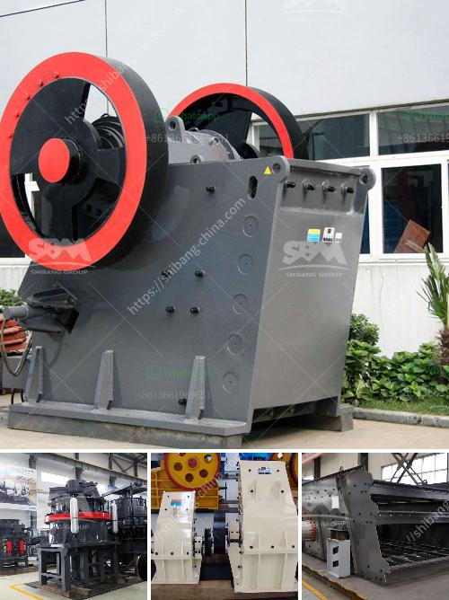

<h3>إنتاج مصنع الإسمنت في الجزائر</h3>
يعتبر إنتاج مصنع الإسمنت في الجزائر من الصناعات الحيوية والاستراتيجية في البلاد. تعد الجزائر واحدة من أكبر المنتجين للإسمنت في المنطقة، حيث تمتلك العديد من المصانع المتخصصة في إنتاج الإسمنت بكميات كبيرة تلبي احتياجات السوق المحلي وحتى العالمي.

من المميزات الرئيسية لإنتاج مصنع الإسمنت في الجزائر هي توفير فرص عمل للعديد من العاملين في هذا القطاع الحيوي. فضلاً عن ذلك، يعتبر الإسمنت من السلع الأساسية التي تستخدم في البناء والبنية التحتية، مما يساهم في دعم اقتصاد البلاد وتحقيق التنمية المستدامة.

تمتلك الجزائر العديد من المصانع المستقلة للإنتاج المتكامل والتخصص في الإسمنت. تعتمد طريقة إنتاج الإسمنت على استخراج الخامات اللازمة من مناجم الجبال المختلفة، وتكسيرها وطحنها للحصول على المواد الأولية اللازمة للعملية. بعد ذلك، يتمية تسخين المواد الأولية في فرن الحرق للحصول على الكلنكر الرئيسي، الذي يتم طحنه لاحقاً للحصول على الإسمنت النهائي.

توجد العديد من أنواع الإسمنت المنتجة في مصانع الجزائر، بما في ذلك الإسمنت العادي والإسمنت المقاوم للكبريتات والإسمنت المقاوم للماء والإسمنت الأبيض. وتتوفر هذه المنتجات بمختلف الجودة والمواصفات لتلبية احتياجات الزبائن في الداخل والخارج.

تعتمد جودة إنتاج مصنع الإسمنت في الجزائر على استخدام تقنيات حديثة ومتطورة في عملية الإنتاج. تهدف هذه التقنيات إلى ضمان حصول المنتج النهائي على الجودة المطلوبة والمطابقة للمواصفات القياسية العالمية. بالإضافة إلى ذلك، فإن مصانع الإسمنت في الجزائر تلتزم بتطبيق الممارسات البيئية المستدامة والحفاظ على المحافظة على البيئة والحفاظ على صحة العاملين في المصانع.

في الختام، يمثل إنتاج مصنع الإسمنت في الجزائر من المصانع الحيوية والاستراتيجية التي تساهم في تنمية اقتصاد البلاد وتوفير الفرص العمل. تعتمد الجودة والكفاءة على الاستخدام المتطور للتكنولوجيا والالتزام بالممارسات البيئية المستدامة، وهو ما يجعل المنتجات الجزائرية تنافسية في السوق المحلية والعالمية.
<h3>Contact us</h3><ul><li><strong>Whatsapp:&nbsp;<a href="https://wa.me/8613661969651">+8613661969651</a></strong></li><li><a href="https://swt.shibang-china.com/?git&amp;zhl&amp;إنتاج مصنع الإسمنت في الجزائر"><strong>Online Service(chat now)</strong></a></li></ul><h3>Related</h3><ul><li><a href='آلات تكسير الحصى.md'>آلات تكسير الحصى</a></li><li><a href='كسارة حجر ألمانية.md'>كسارة حجر ألمانية</a></li><li><a href='آلة نقل حجر الكوارتز.md'>آلة نقل حجر الكوارتز</a></li><li><a href='آلة كسارة الحجر للشراء السعر.md'>آلة كسارة الحجر للشراء السعر</a></li><li><a href='مصنع تكسير خام الحديد في ألمانيا.md'>مصنع تكسير خام الحديد في ألمانيا</a></li></ul>