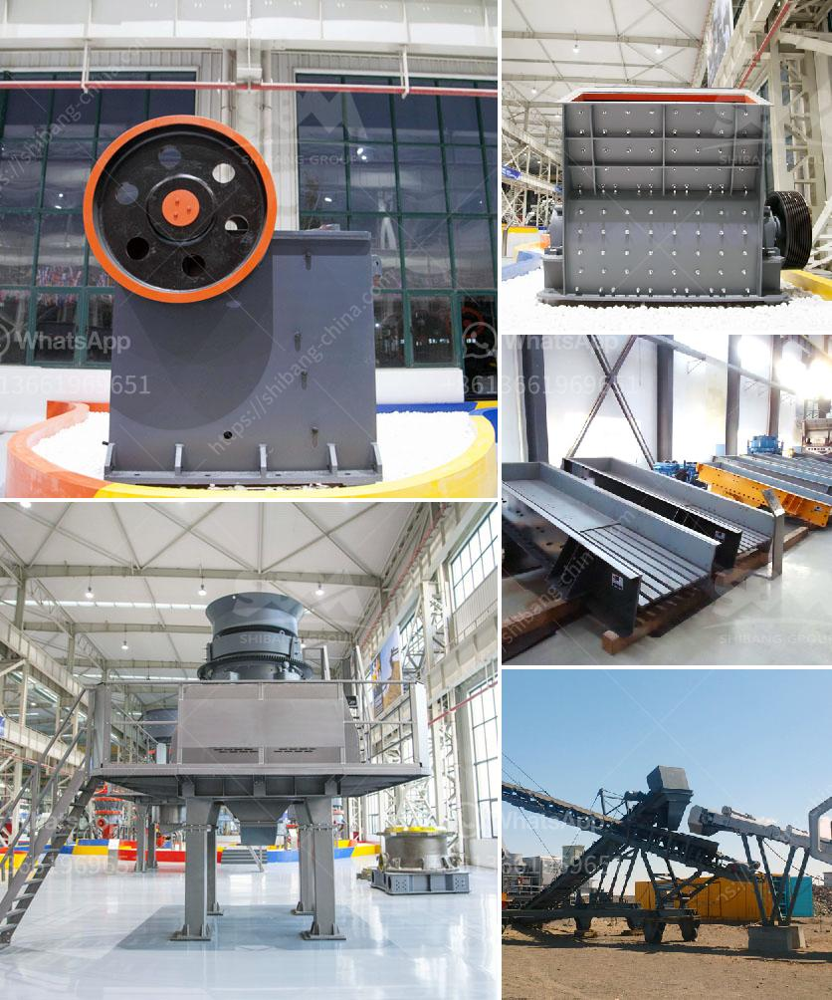

<h3>إنتاج مصنع الطحن للأسمنت</h3>
مصنع الطحن للأسمنت هو المكان الذي يتم فيه إنتاج الأسمنت النهائي من الخامات الأولية. ويعتبر الأسمنت أحد المواد الأساسية في صناعة البناء، حيث يستخدم في إنشاء المباني والجسور والأرضيات وغيرها من التطبيقات الهندسية.

يتم إنتاج الأسمنت في مصنع الطحن من مكونات رئيسية تشمل الكلنكر والجبس. يتم استخراج الكلنكر من خلال طهو خليط من الحجر الجيري والأتربة الطينية في فرن الأسمنت، ثم يتم طحنه إلى مسحوق ناعم. أما الجبس فيضاف إلى الكلنكر أثناء عملية الطحن للتحكم في زمن التصلب ومكافحة أي انكماش غير مرغوب فيه.

تبدأ عملية إنتاج الأسمنت في المصنع بالمواد الخام التي تتمثل في الحجر الجيري والأتربة الطينية. يتم سحق وطحن هذه المواد للحصول على مسحوق ناعم يعرف بالخليط الخام. يتم تخزين الخليط الخام في أكوام كبيرة في المصنع.

ثم يتم تغذية الخليط الخام إلى مطحنة الأسمنت حيث يتم طحنه إلى مسحوق ناعم. وتعتمد هذه العملية على عوامل مثل نسبة المكونات ودرجة الحرارة وسرعة الدوران للمطحنة. وتكون نتيجة هذه العملية هي مسحوق الأسمنت النهائي.

بعد طحن الأسمنت، يتم تخزينه في صوامع التخزين ذات السعة الكبيرة. ويمكن أيضًا إجراء تعبئة الأسمنت في أكياس ذات حجم محدد ووزن معين لسهولة النقل والتوزيع.

يجب أن يتم إنتاج الأسمنت في مصنع الطحن بجودة عالية لضمان استخدامها بشكل فعال في المشاريع الهندسية المختلفة. ولذلك، يتم فحص واختبار الأسمنت المنتج ضمن معايير محددة للتأكد من تلبيتها للمواصفات المطلوبة.

لخلاصة القول، يعد مصنع الطحن للأسمنت مكانًا حيويًا في صناعة البناء حيث يتم إنتاج الأسمنت النهائي من المواد الخام المستخدمة. وتتضمن عملية الإنتاج خلية العمليات الرئيسية مثل سحق المواد الخام، وطحنها، وتعبئة الأسمنت النهائي. يلتزم مصنع الطحن بمعايير الجودة لضمان توفير أسمنت عالي الجودة للاستخدام في العديد من التطبيقات الهندسية.
<h3>Contact us</h3><ul><li><strong>Whatsapp:&nbsp;<a href="https://wa.me/8613661969651">+8613661969651</a></strong></li><li><a href="https://swt.shibang-china.com/?git&amp;zhl&amp;إنتاج مصنع الطحن للأسمنت"><strong>Online Service(chat now)</strong></a></li></ul><h3>Related</h3><ul><li><a href='شاشة محمولة وكسارة.md'>شاشة محمولة وكسارة</a></li><li><a href='كيفية صنع كسارة فك صغيرة لنفسك.md'>كيفية صنع كسارة فك صغيرة لنفسك</a></li><li><a href='الكسارة المحمولة ١٥٠ طن في الساعة.md'>الكسارة المحمولة ١٥٠ طن في الساعة</a></li><li><a href='مصنع تكسير الخرسانة في تركيا.md'>مصنع تكسير الخرسانة في تركيا</a></li><li><a href='عملية تصنيع لوح الجبس.md'>عملية تصنيع لوح الجبس</a></li></ul>