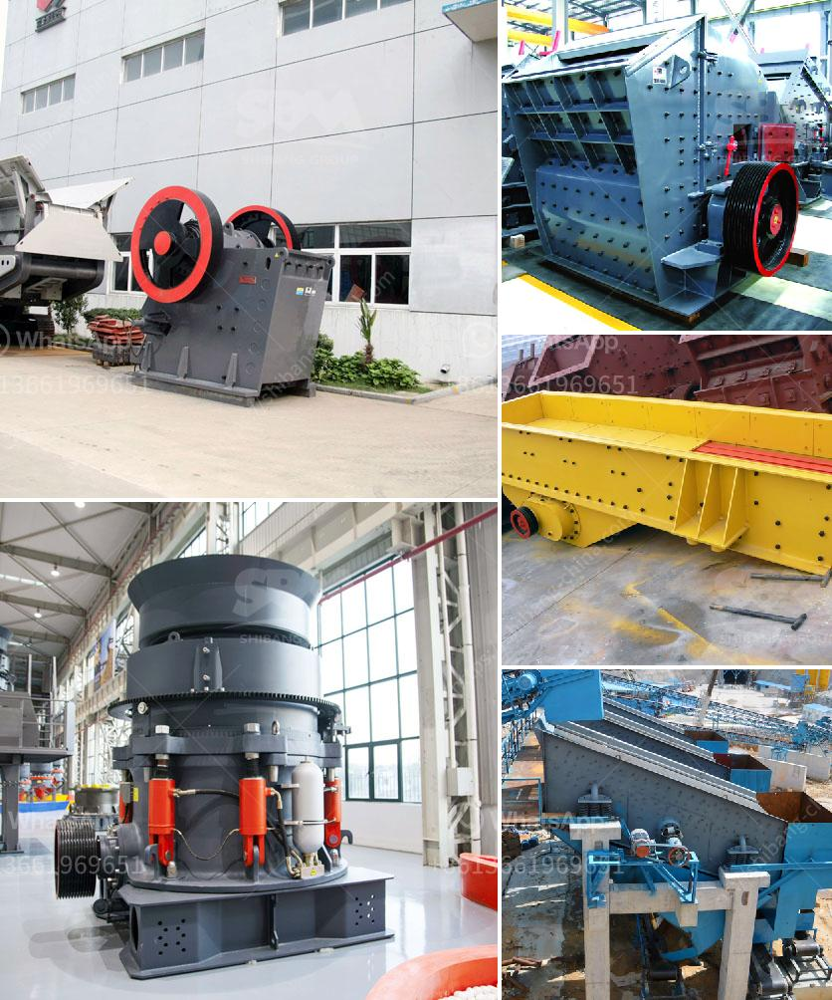

<h3>إنتاج مطحنة الأسمنت في أفريقيا</h3>
تُعتبر صناعة الأسمنت من الصناعات الأساسية والحيوية في قارة أفريقيا، حيث تُعد مطاحن الأسمنت من المشاريع الكبرى التي تسهم في تحقيق النمو الاقتصادي وتوفير الوظائف في المنطقة. يتطلب إنتاج مطحنة الأسمنت توافر عدة عوامل، بدءًا من المواد الخام وانتهاءً بالتكنولوجيا المتقدمة.

يعد استخراج المواد الخام أحد أهم الأسس في صناعة الأسمنت. تعتمد معظم دول أفريقيا على الحجر الجيري كمادة خام أساسية لإنتاج الأسمنت. وتحظى الدول التي تتواجد فيها هذه المواد الخام بميزة تنافسية واضحة في توفير الأسمنت بأسعار منخفضة.

بعد استخراج المواد الخام يتم نقلها إلى المصنع الذي تُطحن فيه للحصول على الحبيبات الناعمة. يعمل المطحنة على طحن المواد الخام إلى مسحوق ناعم، الذي يسمى الكلنكر. هذه الخطوة تعد أحد العوامل الحاسمة في جودة الأسمنت النهائي.

بعد عملية الطحن، يتم خلط الكلنكر مع بعض المكونات الأخرى مثل الجبس والرمل والطين والبوكسيت للحصول على مزيج متجانس. هذا المزيج يتم تسخينه عند درجة حرارة عالية في الأفران الدوارة. تدور الأفران ببطء وتتحركم لتجنب حدوث فقاعات هوائية ومعظمها يحترق بكفاءة، مما يتيح إنتاج الكلنكر بجودة عالية.

بعد عملية التحميص، يتم تبريد الكلنكر ببطء وثم يتم سحقه لتكوين الأسمنت النهائي. يتم تغليف الأسمنت في أكياس أو استخدامه في صناعة الخرسانة، حيث يتم نقله عبر الطرق البرية أو المائية إلى الأسواق المحلية أو للتصدير.

يعتبر قطاع إنتاج مطاحن الأسمنت من القطاعات الحيوية في اقتصاد أفريقيا. تعمل هذه المطاحن على توفير فرص عمل مهمة وتساهم في تنمية البنية التحتية. كما أن إنتاج الأسمنت المحلي يُساهم في توفير الأمن الغذائي للدولة وتقليل الاعتماد على الاستيراد.

وفي الختام، تظل مطاحن الأسمنت في أفريقيا مساهمة كبيرة في تحقيق التنمية الاقتصادية والاجتماعية. يعد إنتاج الأسمنت المحلي أحد الأساسيات للنمو العمراني والإنشائي، مما يعزز التنمية المستدامة في القارة.
<h3>Contact us</h3><ul><li><strong>Whatsapp:&nbsp;<a href="https://wa.me/8613661969651">+8613661969651</a></strong></li><li><a href="https://swt.shibang-china.com/?git&amp;zhl&amp;إنتاج مطحنة الأسمنت في أفريقيا"><strong>Online Service(chat now)</strong></a></li></ul><h3>Related</h3><ul><li><a href='البحث عن آلات معالجة الكاولين.md'>البحث عن آلات معالجة الكاولين</a></li><li><a href='آلة كسارة البنتونيت.md'>آلة كسارة البنتونيت</a></li><li><a href='آخر آلة معالجة ذهب في إندونيسيا.md'>آخر آلة معالجة ذهب في إندونيسيا</a></li><li><a href='مطحنة الفحم لطحن الأسطوانة.md'>مطحنة الفحم لطحن الأسطوانة</a></li><li><a href='عملية سحق الكسارة.md'>عملية سحق الكسارة</a></li></ul>