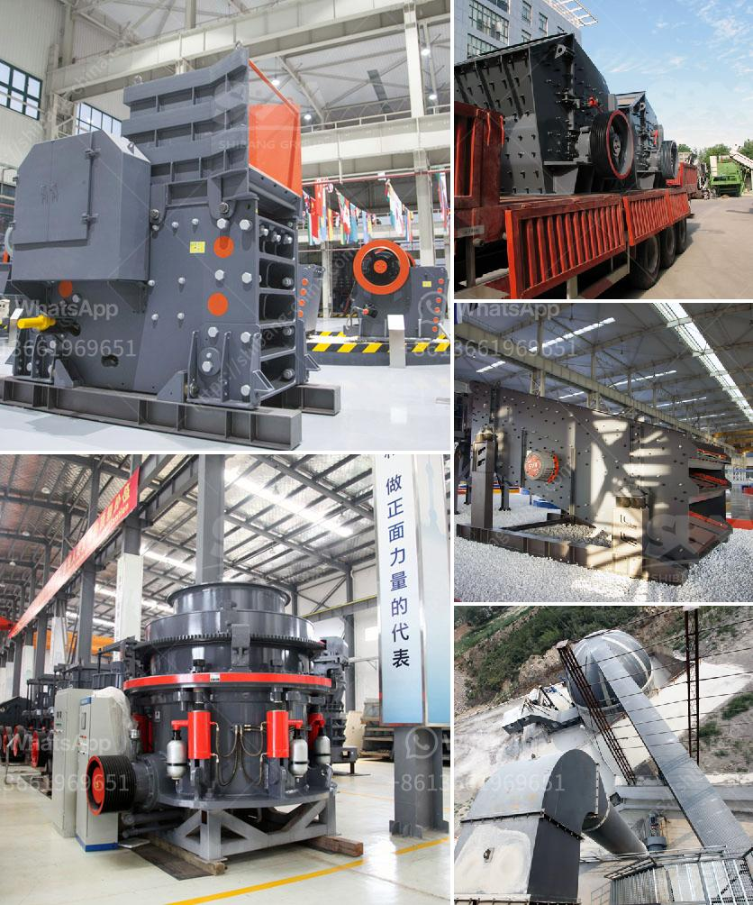

<h3>إنتاج ٣٠٠ طن سنوياً من خط إنتاج مسحوق الجبس</h3>
تعتبر صناعة مسحوق الجبس من الصناعات الهامة التي تستخدم في العديد من التطبيقات المختلفة. والجبس هو مادة تستخرج من الصخور وتستخدم في صناعة العديد من المنتجات مثل الجدران الجبسية والأسقف المعلقة والأرضيات الرقائقية.

لإنتاج 300 طن سنوياً من خط إنتاج مسحوق الجبس، يجب أن يتم التخطيط لعملية الإنتاج بعناية. أولاً، يجب أن يتم اختيار موقع مناسب للمصنع يتوافر فيه مصادر الجبس بكميات كافية وسهولة الوصول إليها. يجب أن يتم اختيار موقع قريب من الموقع الذي سيتم تسويق المنتج فيه، لتقليل تكاليف النقل وضمان توفير المواد الخام بشكل مستدام.

بعد اختيار الموقع المناسب، يجب تخطيط عملية الإنتاج بدقة. يجب أن يتم توفير أحدث التقنيات والمعدات لتحقيق أعلى درجات الكفاءة والجودة في إنتاج المسحوق. يتضمن ذلك استخدام المعدات المتطورة لسحق الجبس إلى حجم مطلوب ومن ثم تجفيفه وطحنه إلى مسحوق ناعم.

عملية إنتاج مسحوق الجبس تشمل أيضاً مراحل تحضير المواد الخام وتنقيتها وتجفيفها. عادةً ما يتم استخدام مجففات لإزالة الرطوبة من الجبس، ومن ثم يتم طحنه وتصنيفه وتعبئته في أكياس للتخزين والتوزيع.

وبما أن الإنتاجية المطلوبة هي 300 طن سنوياً، فإنه يجب توجيه الموارد اللازمة لتحقيق هذا الهدف. يجب تخطيط جدول زمني لعملية الإنتاج وتحديد كمية الجبس المطلوبة يومياً وشهرياً. يجب أيضاً توظيف العمال المهرة وتدريبهم على استخدام المعدات وتنفيذ العمليات بشكل صحيح.

بالإضافة إلى ذلك، يجب أن يتم مراقبة عملية الإنتاج بشكل دقيق لضمان الجودة العالية للمنتج والامتثال للمعايير الصناعية. يجب أيضًا توفير إجراءات السلامة والصحة المهنية لضمان سلامة العمال أثناء الإنتاج.

باختصار، إنتاج 300 طن سنوياً من خط إنتاج مسحوق الجبس يتطلب التخطيط الجيد ومنهجية العمل الفعالة. يجب توفير الموارد اللازمة والاستثمار في التقنيات الحديثة وتوظيف العمال المهرة. وبالاستفادة من التخطيط الجيد ومراقبة الجودة وتنفيذ العمليات بشكل صحيح، يمكن تحقيق إنتاجية عالية وجودة ممتازة لمسحوق الجبس.
<h3>Contact us</h3><ul><li><strong>Whatsapp:&nbsp;<a href="https://wa.me/8613661969651">+8613661969651</a></strong></li><li><a href="https://swt.shibang-china.com/?git&amp;zhl&amp;إنتاج ٣٠٠ طن سنوياً من خط إنتاج مسحوق الجبس"><strong>Online Service(chat now)</strong></a></li></ul><h3>Related</h3><ul><li><a href='مصنع دوامة للبيع لخام الكروم.md'>مصنع دوامة للبيع لخام الكروم</a></li><li><a href='كسارات الحجر المستعملة في كوريا الجنوبية.md'>كسارات الحجر المستعملة في كوريا الجنوبية</a></li><li><a href='مطحنة رايموند في ماليزيا.md'>مطحنة رايموند في ماليزيا</a></li><li><a href='مطحنة ريموند للبنتونيت.md'>مطحنة ريموند للبنتونيت</a></li><li><a href='أنواع كسارات الحجر الجيري.md'>أنواع كسارات الحجر الجيري</a></li></ul>