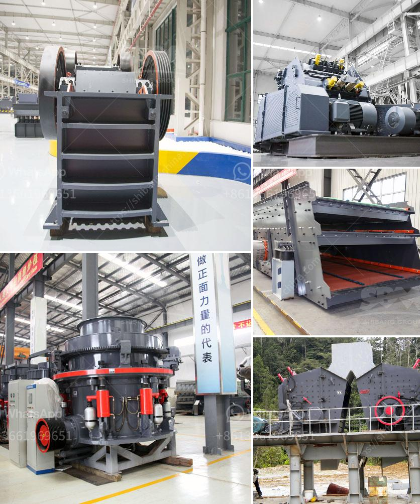

<h3>إنشاء محجر في نيجيريا</h3>
تعد نيجيريا واحدة من أكبر الدول في إفريقيا من حيث السكان والموارد الطبيعية. وتتمتع البلاد بثروات طبيعية غنية مثل البترول والغاز الطبيعي والذهب والفحم. ولكن رغم هذا الثراء الطبيعي، فإن قطاع التعدين في نيجيريا لم يستغل بالشكل الأمثل.

قد يعزى ذلك جزئياً إلى العمليات الصناعية الضعيفة وقلة الاستثمارات في قطاع التعدين. ومن أجل تعزيز هذا القطاع الحيوي وزيادة فرص العمل وتحقيق التنمية الاقتصادية، يجب إنشاء محاجر في نيجيريا.

إن إنشاء محاجر في نيجيريا سيكون له العديد من الفوائد الاقتصادية والاجتماعية. أولاً وقبل كل شيء، ستوفر الوظائف للعديد من الناس، مما سيقلل من معدلات البطالة والفقر. ستعمل هذه المحاجر على توفير العديد من الوظائف المباشرة وغير المباشرة في مجالات مثل التعدين والهندسة المعمارية والنقل واللوجستيات والمصرفية والمالية والتجارة.

ثانيًا، ستعزز محاجر نيجيريا الإنتاج المحلي وتخفض الاعتماد على الواردات. حالياً، يتم استيراد العديد من المواد البنائية والأحجار الطبيعية من الخارج، مما يؤدي إلى تكاليف عالية ونقص في الموارد. بإنشاء المحاجر المحلية، ستتمكن نيجيريا من تلبية احتياجاتها المحلية وتقليل الاعتماد على الاستيراد، مما يعزز الاستدامة الاقتصادية.

ثالثًا، ستساهم المحاجر في تنمية البنية التحتية للبلاد. ستحتاج المحاجر إلى تطوير الطرق والمواصلات لنقل المواد والتصدير إلى الأسواق العالمية. ستساهم الاستثمارات في هذا القطاع في تحسين البنية التحتية للبلاد وزيادة فرص التنمية في المناطق النائية.

من المهم أن يتم إنشاء المحاجر وفقًا للمعايير البيئية والاستدامة. يجب ضمان حماية البيئة والحياة البرية والحياة البحرية من التلوث والتدمير. يجب أن تتم تقنين المحاجر وتنفيذ آليات رقابة صارمة للحد من الآثار السلبية المحتملة.

في النهاية، إن إنشاء محاجر في نيجيريا سيكون له تأثير إيجابي على الاقتصاد والتنمية. ستساعد في توفير فرص العمل، وتعزيز الإنتاج المحلي، وتعزيز البنية التحتية للبلاد. وبالتالي، يجب أن تكون هناك مبادرات حكومية وخاصة لتعزيز قطاع التعدين في نيجيريا والاستثمار في إنشاء المحاجر.
<h3>Contact us</h3><ul><li><strong>Whatsapp:&nbsp;<a href="https://wa.me/8613661969651">+8613661969651</a></strong></li><li><a href="https://swt.shibang-china.com/?git&amp;zhl&amp;إنشاء محجر في نيجيريا"><strong>Online Service(chat now)</strong></a></li></ul><h3>Related</h3><ul><li><a href='مطاحن الكرة الفلسبار.md'>مطاحن الكرة الفلسبار</a></li><li><a href='توازن المواد والطاقة لكسارة الفك.md'>توازن المواد والطاقة لكسارة الفك</a></li><li><a href='آلات إنتاج الجبس.md'>آلات إنتاج الجبس</a></li><li><a href='آلة كسارة حجر صغيرة.md'>آلة كسارة حجر صغيرة</a></li><li><a href='خط إنتاج مسحوق الجبس منتجون في ألمانيا.md'>خط إنتاج مسحوق الجبس منتجون في ألمانيا</a></li></ul>