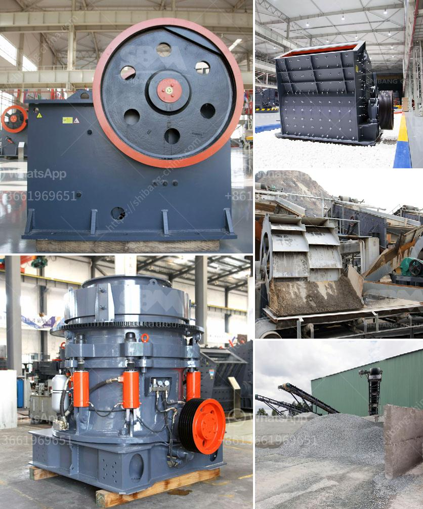

<h3>اتصالات أحزمة الناقلات</h3>
تعتبر أحزمة الناقلات واحدة من أهم وسائل الاتصال في العالم الحديث. تعد هذه التكنولوجيا أحد أهم الابتكارات التي نمشي عليها يومياً، حيث تساعدنا في تحقيق اتصال سريع وموثوق به في جميع أنحاء العالم.

تعتمد أحزمة الناقلات على استخدام شرائح رقيقة من المواد الموصلة مثل الزجاج أو البلاستيك التي تحمل الإشارات الضوئية. وتعمل هذه الأشرطة كوسيلة لنقل البيانات بسرعة عالية جداً. وتتميز هذه الشرائح بكونها رقيقة ومرنة مما يسمح بتمديدها على أنحاء طويلة بين المدن والقارات دون تأثير سلبي على جودة الإشارة.

تعتبر أكبر ميزة لأحزمة الناقلات هي سرعة نقل البيانات. بفضل التكنولوجيا الضوئية، يمكن نقل كميات ضخمة من المعلومات بسرعة تصل إلى مئات الغيغابت في الثانية. هذا يتيح للأفراد والمؤسسات إرسال البيانات بسرعة كبيرة وتحميل الملفات الكبيرة في ثوانٍ معدودة. وهذا بدوره يعزز التواصل ويعطي فرصة أوسع لتبادل المعلومات والتعاون.

بالإضافة إلى السرعة، فإن أحزمة الناقلات لديها أيضاً قدرة على حمل كميات كبيرة من المعلومات. يمكن لكل كابل أن يحمل العديد من الشرائح، وبالتالي يمكن رفع سعة الشبكة بسهولة عن طريق إضافة المزيد من الشرائح. هذا يتيح إمكانية التوسع في الشبكات وتلبية الطلب المتزايد على المعلومات والاتصال.

علاوة على ذلك، فإن أحزمة الناقلات تعتبر أيضًا موثوقة ومستقرة. نظرًا لأن الشرائط تكون محمية داخل أنابيب الألياف البصرية، فإنها تحمي البيانات من التدخل والتشويش الخارجي. وبالتالي، توفر الحماية المثلى للبيانات وتقليل فرصة حدوث توقف في الاتصال.

باختصار، فإن اتصالات أحزمة الناقلات أحدثت ثورة في عالم الاتصالات بتوفير سرعة عالية وقدرة كبيرة وموثوقية في نقل البيانات. إنها تعد وسيلة مهمة لضمان تقدم المعلومات وتطور الاتصالات في جميع أنحاء العالم.
<h3>Contact us</h3><ul><li><strong>Whatsapp:&nbsp;<a href="https://wa.me/8613661969651">+8613661969651</a></strong></li><li><a href="https://swt.shibang-china.com/?git&amp;zhl&amp;اتصالات أحزمة الناقلات"><strong>Online Service(chat now)</strong></a></li></ul><h3>Related</h3><ul><li><a href='تاجر شاشة اهتزاز في الفلبين.md'>تاجر شاشة اهتزاز في الفلبين</a></li><li><a href='سعر معدات معالجة الكاولين.md'>سعر معدات معالجة الكاولين</a></li><li><a href='شاشة محمولة وكسارة.md'>شاشة محمولة وكسارة</a></li><li><a href='عملية تصنيع كسارة الطين المكلس.md'>عملية تصنيع كسارة الطين المكلس</a></li><li><a href='كسارة الحجر في هيماتشال براديش.md'>كسارة الحجر في هيماتشال براديش</a></li></ul>